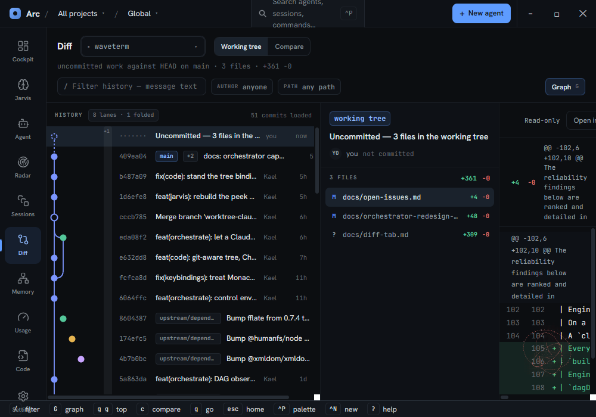
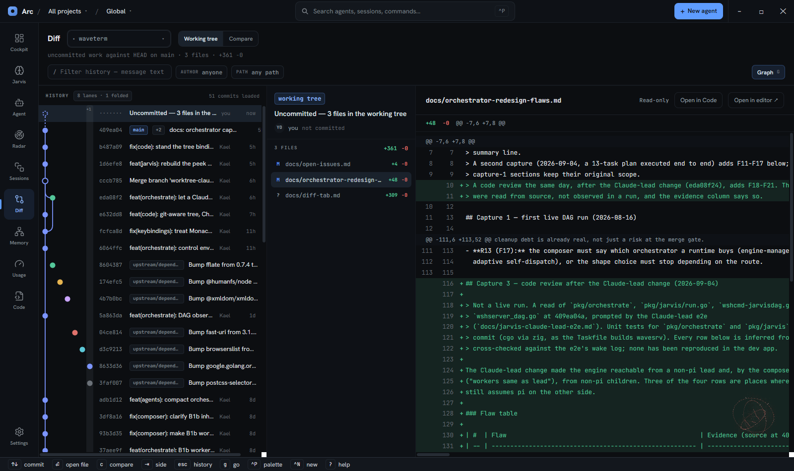
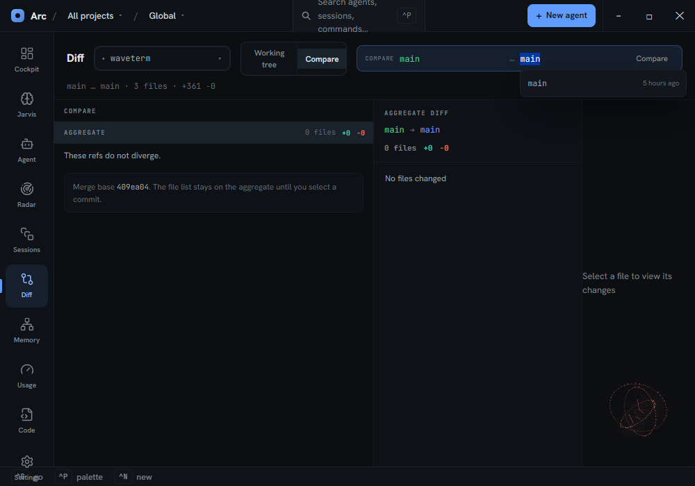

# The Diff tab — end to end

How to use the Diff surface: what every control does, in the order you would reach for it. The
companion reference for Jarvis is [`docs/jarvis-tab.md`](jarvis-tab.md); this file plays the same
role for Diff, and folds the tour into itself because the surface is small enough not to need two.

Source of truth for behaviour is the code: `frontend/app/view/agents/filessurface.tsx` and the
stores beside it (`filesstore.ts`, `githistorystore.ts`, `comparestore.ts`). Keybindings come from
`frontend/app/store/keybindings/bindings.ts` (`buildFilesBindings`).

**One sentence:** the Diff surface is a read-only Git review pane — pick a repository, pick a range,
walk its commits, and read one file's changes at a time. It never writes to the repository.

Every screenshot below was driven against the **live dev app** over CDP on 2026-09-04, scoped to this
repository with three files dirty in the working tree. Nothing is mocked.

- [1. Getting there](#1-getting-there)
- [2. The subject bar — what you are looking at](#2-the-subject-bar--what-you-are-looking-at)
- [3. Ranges](#3-ranges)
- [4. The three panes](#4-the-three-panes)
- [5. Filtering and paging history](#5-filtering-and-paging-history)
- [6. Compare two refs](#6-compare-two-refs)
- [7. Reading the diff pane](#7-reading-the-diff-pane)
- [8. When something is wrong](#8-when-something-is-wrong)
- [9. Keyboard](#9-keyboard)
- [10. Arriving from elsewhere](#10-arriving-from-elsewhere)
- [11. The other diff — the Code surface](#11-the-other-diff--the-code-surface)
- [12. What it deliberately cannot do](#12-what-it-deliberately-cannot-do)

---

## 1. Getting there

| Gesture | Effect |
|---|---|
| Nav rail → **Diff** | The sixth item in the rail |
| `Ctrl`+`6` | Jump by position (`SURFACE_ORDER` index 5) |
| `g` `f` | Chord: go → Diff |
| `]` / `[` | Cycle to the next / previous surface |

The surface unmounts when you leave it. That is deliberate and mostly invisible: scroll position,
filters, the selected commit and the selected file are all kept in module-level atoms, so returning
puts you back where you were rather than at row zero.

---

## 2. The subject bar — what you are looking at

Three controls on one line, then a quiet summary under them.

**The source picker** (the dropdown next to the "Diff" title) chooses *whose repository* you are
reading. It lists two groups:

- **Agents** — every running agent, each with its state dot. Picking one also moves the cockpit's
  focus to that agent, so you can inspect a diff without bouncing back to the Agent surface first.
- **Projects** — every entry in the project registry, resolved straight from its configured path.
  No agent needs to be running.

A third kind of subject exists but is not in the list: a **run**. You get there by opening a diff
from a finished run's evidence, and the picker then shows that run's own label rather than falling
back to "Select a source".

Once a source is picked, the surface follows the focused agent *only while the scope is an agent*.
Pin a project, or arrive from a run, and changing focus elsewhere no longer drags this surface with
it.

**The range strip** is the chip row beside the picker — see the next section.

**The summary line** under the bar is text, not a control. It restates the range in git's own terms
plus the totals, e.g. `uncommitted work against HEAD on main · 12 files · +340 −86`. In compare
mode it reports **the comparison's** totals — `main … feat · 3 files · +30 −0` — and names the two
refs in the same `base … head` order as the chip beside it. It reads whichever change list the panes
are showing (`summaryLine` in `diffscope.ts` picks the compare store in compare mode, the history
store otherwise), so the line and the aggregate row below it can no longer disagree.

---

## 3. Ranges

A range is *which slice of history* the surface is showing. Which chips appear depends on the source:

| Chip | Shown when | Means |
|---|---|---|
| **Working tree** | Always | Uncommitted work against `HEAD` |
| **Since session start** | Source is an agent | The worktree against the commit that was `HEAD` when the agent's session began |
| **This run** | Source is a run | The run's base commit … `HEAD` |
| **Compare** | Always | Two refs against each other — see [section 6](#6-compare-two-refs) |

A chip that could apply but currently cannot is drawn **disabled with a tooltip explaining why**
rather than hidden — "Since session start" greys out with *no session-start commit recorded yet*
until the agent's transcript has yielded one. A chip that can never apply to this source is absent
entirely.

Switching range relabels the history divider and the synthetic top row without re-reading the commit
list, so it is instant.

---

Picking a source loads the change list, the first page of history, **and** a first file — you land on
a populated diff rather than an empty pane. The working-tree row is selected, and within it the first
changed file.

---

## 4. The three panes

Left to right, all on one time axis.



*The three panes at the app's default window size. Note the diff pane on the right: it is roughly 240px,
so `@@ -102,6 +102,10 @@` wraps across four lines and the header buttons are clipped off the edge.
This is [section 12](#12-what-it-deliberately-cannot-do)'s point, in a picture.*



*The same state at 1600×950 — the width the surface was designed against. The diff pane now carries its
full header (path, **Read-only**, **Open in Code**, **Open in editor ↗**), the stats bar
(`+48 −0 @@ -7,6 +7,8 @@`), and readable lines.*

### Pane 1 — history (460px)

Commits newest-first. Each row is: short hash, ref chips (branch/tag; extras collapse into `+2`),
subject, author, relative time. The pane header states what you are looking at — how many lanes the
graph is drawing and how many it folded (`8 lanes · 1 folded`), and how much history is loaded
(`51 commits loaded`, which is the working-tree row plus one page).

- **Row zero is the working tree** — hash renders as `·······`, subject in the warning colour, time
  reads *not committed*. Uncommitted work is a row in the history, not a separate mode.
- **A divider band** marks the range anchor — "session start" or "run base". Commits *before* the
  anchor are dimmed, so what is in-range is visible without counting.
- **The lane gutter** (the commit graph) draws behind the rows, up to 7 lanes; anything past that
  folds into one grey column. Toggle with `Shift`+`G`. It hides itself automatically while a filter
  is active, because a filtered set mostly lacks its own parents and the lanes would draw edges to
  commits that are not on screen.

### Pane 2 — the selected commit (300px)

Who, when, and which files. Hash chip (or "working tree"), ref chips, subject, author with initials,
then a file count with `+adds −dels`, then the changed-file list. Each file row shows its status
letter (colour-coded), the path, and its own `+/−` counts. Click a file to load it into pane 3.

Read-only by design: there is no stage control, no message box, nothing that authors a commit.

### Pane 3 — the diff

The selected file's changes. Covered in [section 7](#7-reading-the-diff-pane).

---

## 5. Filtering and paging history

The filter row sits above the three panes (hidden in compare mode and in the two failure states).

- **Free text** — matched against commit subjects (`git log --grep`).
- **Author** chip — click it to turn it into an input (`git log --author`).
- **Path** chip — a pathspec (`git log -- <path>`).
- **Clear all** appears with a summary chip: `2 filters · 31 matching commits`.
- **Graph** toggle lives at the end of this row.

Typing is debounced 250ms — each settled keystroke is one git invocation, not each keypress.
Clearing is immediate, because clearing is a decision rather than typing.

History loads **50 commits per page** and appends when you scroll within 200px of the bottom.

**The "Restored" banner.** If you were away from the surface for more than two minutes and it puts
you back on a remembered selection, a green banner names what it restored, then dismisses itself
after six seconds. Below that threshold it restores silently.

---

## 6. Compare two refs

Press `c`, or click the **Compare** chip. The subject bar swaps in a ref expression you can edit in
place; the same control serves both gestures.

**The ref picker.** Two free-text fields in the order **base … head** — the order `git diff
base...head` reads in, and the order the summary line below it prints — each with branch suggestions
(local branches, most recently committed first, with their age). Free text is accepted alongside the
suggestions, so a tag or a raw SHA works.

- It opens pre-filled with the **current branch on both sides**, and focus lands on **base**, the
  first field — head is where you already are, base is the ref you came to change. So the first thing
  you see is *"These refs do not diverge"*; type over the highlighted base field.
- `Enter` applies. `Escape` cancels **the edit only** — leaving compare is `Escape`'s job once the
  picker is closed. Closed, the control collapses to a chip reading `base … head`; click it to reopen.



*Compare, freshly entered: the picker open on `main … main`, the aggregate as row zero reporting
`0 files`, the merge base named at the foot of the column, and the diff pane waiting for a file.*

**The compare column** replaces the history pane:

| Row | What it is |
|---|---|
| **Aggregate** (row zero) | Everything head introduces relative to base, anchored at their merge base |
| **`head` group** | Commits on head but not base — "N ahead", coloured green |
| **`base` group** | Commits on base but not head — "N behind", coloured blue |
| **Merge base** | Printed at the foot of the column |

Selecting the aggregate row shows the aggregate file list in pane 2; selecting a commit row shows
that commit exactly as the normal history pane would. "Back to the aggregate" is therefore just a
selection — no gesture, no hidden state.

`Tab` jumps between the two sides. `Escape` leaves compare and restores **the range comparison
interrupted**, rather than guessing a default. Comparing while comparing never nests: it keeps the
original range as the thing to return to.

---

## 7. Reading the diff pane

The header carries the path, a **Read-only** marker, and up to two buttons:

- **Open in Code** — opens the file in the Code surface at the first changed line (the first added
  line; for a deletion-only hunk, the context line the hunk starts on). Always available when a
  repository is scoped. The Code surface always shows the working-tree file and says so itself if
  the path is gone.
- **Open in editor ↗** — hands the path to the OS. Only offered on the working-tree row, since it is
  the only row whose file is guaranteed to exist on disk.

Below that, a stats bar (`+adds`, `−dels`, and the first hunk header), then the diff itself: old and
new line-number gutters, a sign column, and the line, tinted green for additions and red for
deletions.

**States that are not a diff**, each with its own sentence instead of an empty scroll area:

| State | What you see | Verified |
|---|---|---|
| Binary file | *Binary file — git reports a change but has no text diff to show.* | Yes — a `.png` in `4dbca6b6` |
| Mode change only | *Nothing inside this file changed.* | Not reached |
| Pure rename | *Renamed. Nothing inside the file changed.* plus the old path | Yes — an `R100` rename of a 40-line file |

**Untracked files** have no `HEAD` blob, so git emits no diff — the backend hands over the raw
content and the pane renders it as an all-additions diff labelled **New file**, which is what it
morally is. Verified on an untracked file in the working tree: `+361 −0`, label **New file**, every
line green from line 1.

**Renames** cost the backend a second question. The pane reads one path (`git diff <base> <hash> --
<newpath>`), and git cannot pair that path with a source it was not asked about — it used to answer
`new file mode` plus every line as an addition, so a pure rename rendered as the whole file added
while the file list beside it read `+0 −0`. `pathDiff` (`pkg/gitinfo/gitinfo.go`) now watches for
that `new file mode` and only then asks the whole-diff `--name-status` question for a rename source,
re-reading with both paths. The pane gets its `rename from` header, `parseUnifiedDiff` sets
`renamedFrom`, and the *Renamed.* state fires. The extra call is skipped for every file that is not a
fresh add, which is almost all of them.

Related, by design: `nameStatusToStatusZ` deliberately rewrites a rename's `R` status to `M`, so a
renamed file shows an **M** in the file list, never an **R**.

---

## 8. When something is wrong

Two failure screens, deliberately different:

- **"This source is not a Git repository"** — a calm fact about the source you picked. Pick another
  with the source picker.
- **"Couldn't read this repository"** — a fault. It prints the failing git command, its exit code
  (or *no exit code* for a timeout or a missing binary), stderr verbatim in a selectable block, and a
  **Retry** button. Nothing was changed, so retrying is safe.

A repository whose read failed is checked *first*, because a failed read also reports "not a repo" —
showing it as absent would hide the reason behind a screen that reads like normality.

---

## 9. Keyboard

Diff-surface keys (live when the surface is active and you are not in a text field or modal):

| Key | Action | Available |
|---|---|---|
| `j` / `k`, `↓` / `↑` | Move the commit cursor — moving *is* selecting, so the panes follow | Always |
| `Enter` | Open the selected file in the OS editor | When a file is selected |
| `/` | Focus the history filter | History mode |
| `Shift`+`G` | Toggle the commit graph | History mode |
| `g` `g` | Jump to the top of history | History mode |
| `c` | Compare refs | Always |
| `Tab` | Switch compare side | Compare mode |
| `Escape` | Clear filters → else leave compare → else back to Cockpit | In that order |

`Shift`+`?` opens the full shortcut sheet. Note that `Shift`+`G` is deliberately not bare `g`, which
is the leader key for the go-to chords.

**The hints footer** along the bottom of the window is the live version of this table: it lists only
the keys whose bindings currently apply, so it changes as you move between history and compare. It
dims while focus is in a text field, since most of these keys are suppressed there.

Entering or leaving compare, and changing the filters, recomputes it in place — no focus change
needed. That runs through `whenVersionAtom` (`store/keybindings/whenstate.ts`): a counter bumped
whenever any atom a `when` predicate reads changes, which the footer subscribes to instead of
subscribing to each atom itself. **A predicate that starts reading a new atom must add it to
`PREDICATE_ATOMS` there**, or the footer goes stale again for that state; `store.test.ts` fails if a
predicate touches an atom the list is missing.

Not bound today: moving through the **changed-file list** with the keyboard. Commit navigation is
keyboard-driven; picking a file within a commit is mouse-only.

---

## 10. Arriving from elsewhere

Three places in the cockpit open this surface pre-scoped, and one of them can preselect a file:

| From | Gesture | Lands on |
|---|---|---|
| Cockpit agent card | Row menu → **Review changes** | That agent, "Since session start" |
| Agent details rail | Click a changed file | That agent, **with that file already selected** |
| Agent details rail | Click **+N more** under the file list | That agent, no file preselected |
| Run completion / evidence | The diff link on a finished run | That run, "This run" range, base commit … HEAD |

The file preselection is one-shot on purpose: it beats the remembered selection exactly once, then
stops — otherwise every later return to the surface would drag you back to the linked file.

---

## 11. The other diff — the Code surface

The Code surface (`Ctrl`+`9`, or `g` `b`) has its own diff, and it answers a different question.

| | Diff surface | Code surface's Diff mode |
|---|---|---|
| Question | "What changed in this commit / range?" | "What am I about to commit in this file?" |
| Renderer | Hand-rolled unified rows | Monaco diff editor |
| Right-hand side | The committed content | **Your unsaved draft**, so in-progress edits appear |
| Compares against | Any commit, or two refs | `HEAD` only |
| Split view | No | Yes, when the pane measures ≥ 900px |
| Scope | Whole repository | The one open file |

Press `d` in the Code surface to toggle it (the mode toggle in the path bar reads
`preview` / `source` / `diff`; **preview** is markdown-only).

Practical rule: use the Code surface's diff while writing, the Diff surface while reviewing.

---

## 12. What it deliberately cannot do

Current, honest limits — not bugs:

- **Read-only.** No staging, no checkout, no cherry-pick, no revert. Repository-mutating actions are
  a separate, unwritten spec.
- **No syntax highlighting, no word-level highlighting, no side-by-side, no in-diff search, no
  whitespace-ignore.** The pane renders plain unified rows.
- **No keyboard navigation of the changed-file list** (section 9).
- **No "viewed" marker** — nothing tracks which files of a branch you have already read.
- **No refresh.** The change list is read when the surface mounts and never again, so files edited
  while you are looking at them keep their old counts. Leave the surface and come back to re-read.
  (`filesstore.reloadChanges` exists for exactly this and has no caller — see `docs/open-issues.md`.)
- **It is cramped at the default window size.** The app opens at 1000×700
  (`src-tauri/tauri.conf.json:14`) and the two left columns are fixed at 460px + 300px, leaving the
  diff roughly 240px — about 30 characters. Maximize the window before a real review.
- **Local host only.** SSH/WSL workers run their git elsewhere; those commands are not registered on
  the remote route.

Most of the first three are addressed by an approved but unstarted plan —
`docs/superpowers/specs/2026-09-04-git-compare-viewer-parity-design.md` and the plan beside it —
which swaps this pane for Monaco and makes the history column collapsible.

---

## Coverage of this document

What was exercised in the live dev app on 2026-09-04, and what was not:

| Exercised live | Not exercised |
|---|---|
| Source picker (project), range chips, summary line | Agent source, and the **Since session start** range (no agent was running) |
| Working tree as row zero; selecting a historical commit | Run scope, and the **This run** range |
| Untracked file → **New file** all-additions | Mode-change-only file |
| Binary file → the binary sentence | The `Restored` banner (needs a two-minute absence) |
| Pure rename → the *Renamed.* state | **Open in editor ↗** (spawns an OS application; deliberately skipped) |
| Text filter, author filter, `Escape` to clear | Deep link from the agent details rail |
| Paging (51 → 101 rows), `g g`, `Shift`+`G` | |
| `j`/`k` moving cursor and panes together | |
| **Open in Code** → lands on the Code surface | |
| Compare against a diverging branch, `Tab` between sides, `Escape` restoring the prior range | |
| Not-a-repo and read-failure panels (via `task verify:ui -- git-history`, 10/10) | |

---

## Verifying

The surface has no jsdom render tests by design. Check it in the live dev app:

```bash
task dev                       # Vite on :5174 inside WebView2, CDP on :9222
node scripts/cdp-shot.mjs out.png
task verify:ui -- git-history  # paging, filtering, Escape, persistence, the range chips
task verify:ui -- surface-smoke
```

`git-history` (`scripts/cdp/scenarios.mjs`) builds three throwaway repos — a healthy one with 61
commits, one with its object store emptied to force the failure panel, and a plain directory for the
not-a-repo panel — registers them as projects, and drives the surface through them.

**What that scenario cannot catch.** Its fixtures are single-branch with **clean working trees**, so
the history store and the compare store both read zero and agree by accident — every compare-vs-
working-tree defect is invisible to it, and so is anything needing a second ref. Checking that class
of behaviour by hand needs a fixture with two diverging branches *and* a dirty tree, so the two
stores hold visibly different numbers; likewise a rename needs its own two-commit fixture, since a
rename cannot exist in a working-tree-only repo.

Pure logic is unit-tested beside its module: `diffscope.test.ts`, `gitdiff.test.ts`,
`githistorystore.test.ts`, `comparestore.test.ts`, `filesstore.test.ts`, `agentdiffnav.test.ts`.
