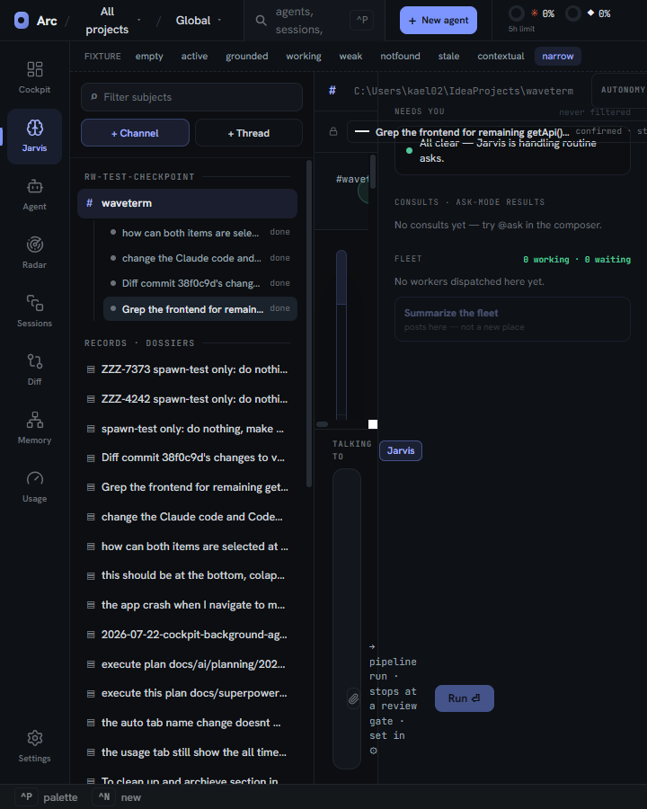
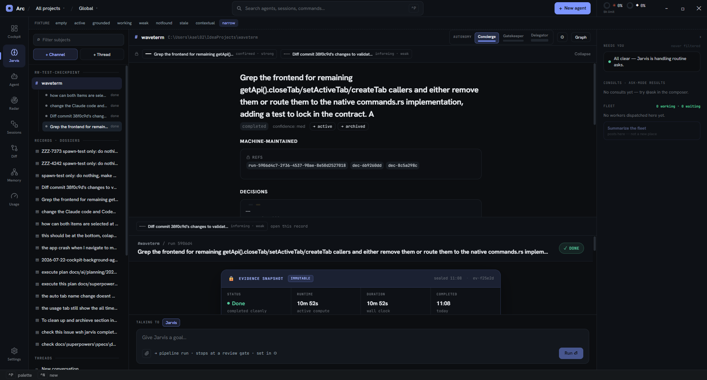
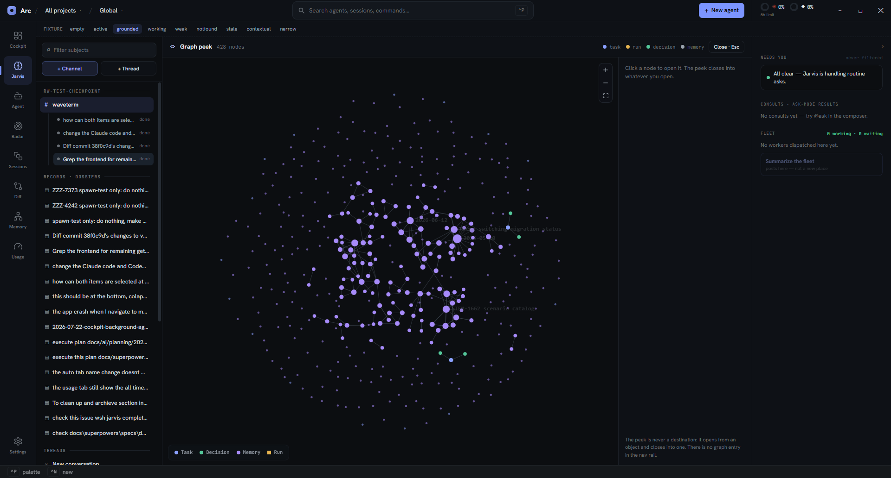
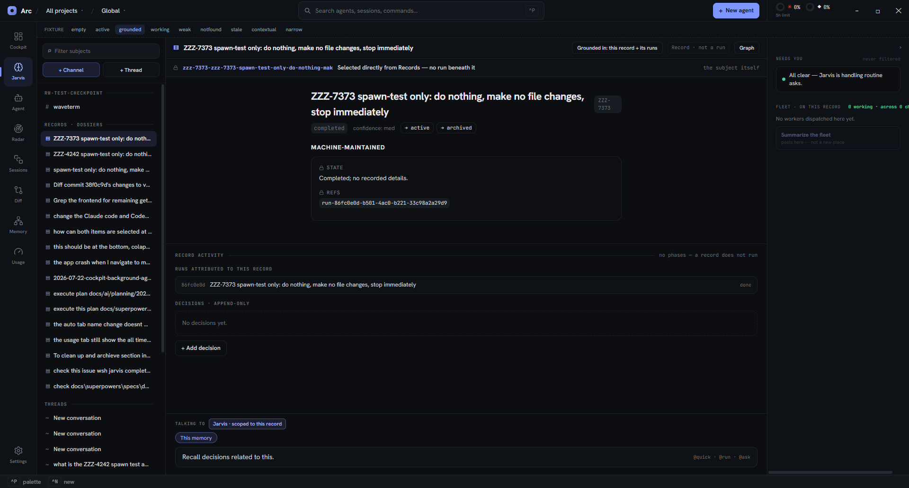
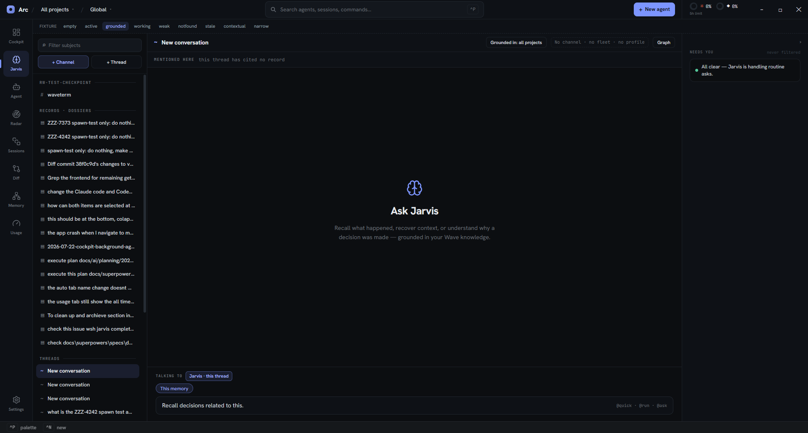
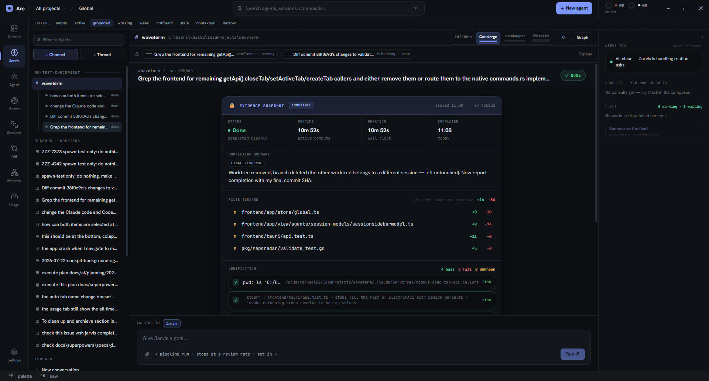
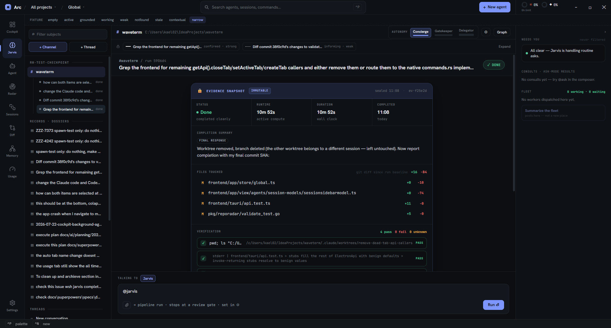

# Jarvis consolidation — live CDP verification against the design handoff

**Date:** 2026-07-28
**Verified against:** `wave-handoff/wave/project/Wave-jarvis-consolidated.dc.html` — revision 2, 13 live states (Claude Design project `wave`), plus the spec that adapts it (`docs/superpowers/specs/2026-07-27-jarvis-consolidation-design.md`).
**Under test:** commits `60c71701 … 948e1bd8` (8 commits, the consolidation as shipped on `main`).
**Method:** live, against the running `task dev` app over CDP on `:9222` (WebView2), real dev profile — 1 channel, 17 dossiers, 15 threads, a 428-node vault graph. No mocks except the dev fixture bar, which is used only for the four Jarvis answer terminals (design states 4–7). DOM geometry and text were read back per assertion; every claim below cites what was actually measured.

## TL;DR

**20 of 22 live checks pass. Two real gaps, one of them a shipped-behaviour defect.**

- The consolidation's core structural claim holds: **one Stage, four bands, a thread slot that never swaps out.** The thread stayed mounted at a byte-identical 3316 characters through a record-band expansion and a graph-peek open/close.
- **Gap 1 (defect):** the design's §3 narrow-window collapse order is **not implemented at all**. No region is width-responsive, so the Stage absorbs the entire loss — 1270px → **70px** as the window goes 1920 → 720.
- **Gap 2 (minor):** the record band's expand/collapse affordance is a `div` with `onClick` — not keyboard-operable.
- Spec §18's gates are all green: `task verify:ui` **36/36**, `npx vitest run` **1353 passed / 2 skipped**, typecheck **exit 0**.

---

## The design's 13 states, live

The design file's `tabDefs` enumerates 13 states. Each row is what the live app does when driven into that state.

| # | Design state | Live result | Evidence |
|---|---|---|---|
| 1 | Live run | ✅ channel Stage, 4 bands, autonomy ladder, pipeline | [shot](images/2026-07-28-jarvis-consolidation-conformance/01-channel-subject.png) |
| 2 | Blocked ask | ⚪ not exercised — no pending ask in this profile (rail read "All clear") | — |
| 3 | Task + its runs | ✅ band expands in place to the machine-maintained panel + decisions | [shot](images/2026-07-28-jarvis-consolidation-conformance/05-recordband-expanded.png) |
| 4 | Answer + grounding | ✅ answer with `[n]` citations, rail lists 4 typed sources | [shot](images/2026-07-28-jarvis-consolidation-conformance/07-fixture-grounded.png) |
| 5 | Jarvis working | ✅ retrieval steps, rail "Reading the findings…" | [shot](images/2026-07-28-jarvis-consolidation-conformance/07-fixture-working.png) |
| 6 | Weak grounding | ✅ "treat as weak", 1 weak candidate in rail | [shot](images/2026-07-28-jarvis-consolidation-conformance/07-fixture-weak.png) |
| 7 | Not found | ✅ "Not found. No Wave source references…", rail "No grounding sources." | [shot](images/2026-07-28-jarvis-consolidation-conformance/07-fixture-notfound.png) |
| 8 | Radar handoff | ⚪ not exercised — needs a live Radar finding to draft from | — |
| 9 | Space focus | ✅ "FOCUS ON TASK" group + "Global (no focus)" + real task spaces | [shot](images/2026-07-28-jarvis-consolidation-conformance/13-space-switcher.png) |
| 10 | Fleet | ✅ roster + autonomy + summary button (`jarvis-fleet` scenario) | harness |
| 11 | Graph peek | ✅ overlay, 428 nodes, Esc closes, nav never leaves Jarvis | [shot](images/2026-07-28-jarvis-consolidation-conformance/06-graph-peek.png) |
| 12 | Subject: conversation | ✅ `~`, "No channel · no fleet · no profile", Fleet section absent | [shot](images/2026-07-28-jarvis-consolidation-conformance/03-conversation-subject.png) |
| 13 | Subject: dossier | ✅ `▤`, "Record · not a run", "Fleet · on this record" | [shot](images/2026-07-28-jarvis-consolidation-conformance/02-dossier-subject.png) |

Plus the design's three non-state sections: **§2 first use** — the copy matches (`stage.tsx` renders the design's "Point me at some work." verbatim) but was not driven live, since a subject is always auto-selected in this profile; **§3 narrow window** (see Gap 1); **§4 entry points** — partially, `@jarvis` verified, Radar handoff not.

---

## Gap 1 — the narrow-window collapse order does not exist

The design devotes a whole section to it, with a numbered order: **1.** context rail → 44px, **2.** Subjects column → status dots, **3.** record band → one-line chip, **4.** nav rail → 56px, and **5. never the thread and the composer.** Spec §12 restates rule 5 as "a hard constraint, not a preference."

Measured, driving `Emulation.setDeviceMetricsOverride` across five widths on a channel subject:

| Viewport | nav | Subjects | **Stage** | rail | chrome total |
|---|---|---|---|---|---|
| 1920 | 78 | 272 | **1270** | 300 | 650 |
| 1440 | 78 | 272 | **790** | 300 | 650 |
| 1100 | 78 | 272 | **450** | 300 | 650 |
| 900 | 78 | 272 | **250** | 300 | 650 |
| 720 | 78 | 272 | **70** | 300 | 650 |

Not one of the three chrome regions gives a single pixel. Rule 5 is satisfied only in the letter — the thread and composer are still *mounted* (that assertion passes) — while the spirit inverts: **the thread and composer are the only things that lose space.** At 720px the composer's footer wraps to one word per line and the transcript is an unreadable sliver.



**Root cause:** `CollapsibleRail`'s `forceCollapsed` prop — the mechanism the plan nominated for this — is wired to exactly one input, `profileOpen` (the ⚙ drawer), at `frontend/app/view/jarvis/stagerail.tsx:241`. There is no `matchMedia`, `ResizeObserver`, or `innerWidth` read anywhere in `frontend/app/view/jarvis/*.tsx` outside `jarvisgraph.tsx`'s canvas sizing. The Subjects column is a hard `w-[272px]` (`subjectscolumn.tsx:141`) and the nav rail never drops to 56px.

**How it got missed:** the surface plan's spec-coverage table (`…-consolidation-surface.md:1481`) maps §12 to Task 7 with the note *"`CollapsibleRail` supplies 300/44 and `forceCollapsed`"*. That is true of the primitive and says nothing about driving it from viewport width — the row records that the ingredient exists, not that the behaviour was built. No task step ever wires it, and because rule 5 was encoded as "thread and composer must survive", a check of that rule passes on a layout that violates the section's whole intent.

**Secondary finding in the same area:** the dev fixture bar's `narrow` button is a dead write. It sets `groundingRailOpenAtom` (`jarvisfixturebar.tsx:17`), but the merged surface's rail reads `stageRailOpenAtom` (`stagerail.tsx:238`). The `GroundingRail` *component* that owned the old atom is no longer rendered anywhere — only its `groundingSection()` helper survives, reused by `StageRail`. So clicking `narrow` collapses nothing (measured: rail stayed 300px), and `groundingrail.tsx`'s component export plus `groundingRailOpenAtom` are consolidation leftovers.

## Gap 2 — the record band's expand control is not keyboard-operable

The band's expand/collapse affordance is a `div` carrying `onClick` (`recordbandview.tsx:62`), with no `role`, no `tabindex`, and no `<button>`. Probing the collapsed band for buttons returns `[]`; the control is reachable by mouse only.

```
A11Y  {"onClickTag":"DIV","role":null,"tabindex":null,"buttonsInBand":4}
```

The four buttons that *are* in the band are the attributed-run cards inside it, not the expander. Worth fixing given this repo already has a keyboard-operability foundation (g-leader nav + which-key) — the record band is the one new primary control the consolidation added, and it is the one that can't be reached from the keyboard.

---

## What passes, with the measurement

### The shell (design §3)

```
N1  PASS  nav = ["Cockpit","Jarvis","Agent","Radar","Sessions","Diff","Memory","Usage"] + "Settings"
          Channels / Graph / Tasks absent — 11 entries → 8 chorded, exactly the design's navDefs
W1  PASS  nav 78px | Subjects 272px | Stage flex | rail 300px — the design's own numbers
```

`SURFACE_ORDER.slice(0, 8)` (`bindings.ts:71`) binds `Ctrl+1..8` to precisely the eight visible entries with no unchorded remainder; `GO_TARGETS` retargets `g c` to `jarvis` ("Jarvis (channels, records, recall)", `bindings.ts:32`); `ESC_HOME_SURFACES` carries `jarvis`, not `channels` (`bindings.ts:45`). All three match spec §14.

### The Stage is one Stage, not four sub-tabs

This is the claim the whole consolidation rests on — the spec calls the never-swapping thread "the single most important thing to preserve under later change."

```
B1  PASS  Stage has exactly 4 direct children, in order:
          [header "# waveterm …"] [band "Grep the frontend…"] [thread "#waveterm / run 5906d4 …"] [composer "TALKING TO | Jarvis"]
B2  PASS  thread is child index 2 — a direct child, sibling of both the band above and the overlay below
```

And it survives the two operations that would break it:

```
RB-X PASS  expand the record band:  band 126 → 1218 chars (machine-maintained panel + decisions appear)
                                    thread 3316 → 3316 chars  ← byte-identical, never remounted
                                    childCount still 4, [role=tab] count 0 — no tab strip
G1   PASS  open the graph peek:     Stage gains a 5th child, position:absolute, canvas present
                                    thread still 3316 chars underneath; active nav still "Jarvis"
G2   PASS  Esc:                     back to 4 children, canvas gone
```




### The subject model (design §4, addendum states A and B)

One flat grouped list of three kinds, measured off the live column:

```
SUBJ PASS  groupLabels: ["rw-test-checkpoint", "Records · dossiers", "Threads"]
           markCounts:  { "#": 1, "▤": 17, "~": 15 }        width: 272px
```

Stage composition per kind, which the spec calls "the spec's core claim; it must fail if a band appears on the wrong subject":

```
S-CH PASS  channel      autonomy ladder present: Concierge + Gatekeeper + Delegator
S-DO PASS  dossier      "Grounded in: this record + its runs" · "Record · not a run" · no autonomy
                        band always open ("the subject itself") · "no phases — a record does not run"
S-CV PASS  conversation "Grounded in: all projects" · "No channel · no fleet · no profile" · no autonomy
                        band = "MENTIONED HERE / this thread has cited no record"
```

The addendum's **correction 1** ("autonomy is a three-tier nested ladder, not a two-state toggle") is honoured — three rungs render, not the binary switch the original states drew.




### The record band (design §5, addendum correction 2)

The addendum's central complaint was that "on the collapsed one-line band the user cannot tell a confirmed attribution from a weak inferred one." Live, on a real run with two real edges:

```
RB-N PASS  edgeChips:  ["confirmed · strong", "informing · weak"]
           lineStyles: ["solid", "dotted"]        ← both read off the collapsed line
```

State *and* confidence *and* a colour-independent line weight, all before expanding. That is the correction, implemented.



### One rail, scoped by subject (design rail / spec §4)

```
R1 PASS  one CollapsibleRail at 300px, right of the Stage
R2 PASS  channel      "NEEDS YOU (never filtered) | CONSULTS · ASK-MODE RESULTS | FLEET  0 working · 0 waiting"
R3 PASS  dossier      "FLEET · ON THIS RECORD  0 working · across 0 channels"   ← the cross-channel rollup
R4 PASS  conversation "NEEDS YOU (never filtered)"  and nothing else — Fleet section absent, not zeroed
```

R4 is "absent rather than empty" enforced, and R3 is the new §15.2 derivation actually reaching the UI. "never filtered" renders as literal rail copy, matching spec §11's rule that attention beats focus.

### The composer retargets in place (design §7)

```
C1   PASS  "TALKING TO | Jarvis | → pipeline run · stops at a review gate · set in ⚙ | Run ⏎"
           chip colour rgb(163,181,255) — indigo, the design's "Jarvis hears you"
AT-J PASS  typing @jarvis leaves the active nav on "Jarvis" — no navigation
```

The design draws this state green (`impl-2 · run 4c`) because its mock run has a live worker; the run on the Stage here is `done`, so indigo/Jarvis is the correct target, not a deviation. **The green worker-target chip was not exercised** — it needs a live worker (see Not verified).

Behind it, spec §7's deletion is real: `channelactions.ts` no longer writes `surfaceAtom` at all (grep returns nothing), and `jarvisModeAtom` no longer exists in the tree. `pendingFleetSummaryAtom` survives, repurposed — `channelactions.ts:116` sets it and `stagerail.tsx:65` consumes it in place, with the comment "`@jarvis` must not move the user off the subject they are on."

> **Superseded later the same day.** That handoff turned out to be unreachable — no composer path could produce a leading `@jarvis` — so the atom, the branch and the `StageRail` effect were deleted rather than rewired. See finding 6 in [`2026-07-28-jarvis-tab-findings.md`](2026-07-28-jarvis-tab-findings.md). The screenshot below records behaviour that no longer exists.



### Deletions (spec §14)

All seven verified gone from the tree: `channelssurface.tsx`, `taskssurface.tsx`, `jarvisgraphsurface.tsx`, `fleetmode.tsx`, `historyrail.tsx`, `jarvis/composer.tsx`, `channelsmotion.ts` — plus `jarvisModeAtom`. `scripts/cdp/attach.mjs`'s `SURFACE_LABEL` is down to the 8 real surfaces + Settings, which closes the harness gap the 2026-07-27 second-brain handoff flagged (those keys stopped existing rather than being added).

---

## Spec §18 gates

```
task verify:ui                                            36/36 steps passed
  runs-lifecycle 5 · surface-smoke 7 · jarvis-states 10 · jarvis-fleet 1 · jarvis-ask 2
  jarvis-contextual 1 · jarvis-ambient 2 · jarvis-multiturn 2 · jarvis-vault-recall 1
  jarvis-continuity-resume 2 · jarvis-proactive 3

npx vitest run                    128 files passed, 1 skipped | 1353 passed, 2 skipped
node --stack-size=4000 node_modules/typescript/lib/tsc.js --noEmit          exit 0
```

The 2 skipped tests are the pre-existing `motionhooks.test.ts` pair (no `@testing-library/react`; covered by CDP). The step count moved 38 → 36 because `surface-smoke` lost the deleted `channels` surface and `jarvis-fleet` collapsed two mode-switch steps into one now that Fleet is a rail section rather than a mode.

`recordband.test.ts` is 13/13 and does cover the band case this profile can't reach live — including *"states the absence when a run has no attributed record"* and *"draws medium dashed and weak dotted so strength is legible without colour."*

---

## Deviations from the design that are intentional

These differ from the `.dc.html` on purpose; the spec records the reasoning. Listed so a future reader doesn't file them as bugs.

| Design draws | Live does | Why |
|---|---|---|
| Jarvis badge tooltip "3 need you — 2 from channel workers, 1 from a standalone agent" | Jarvis counts only channel-dispatched asks; Cockpit keeps standalone, disjoint | Spec §10 — the Cockpit badge survives, so merging would double-count standalone asks and inflate a number the user is asked to trust |
| Header chip "Grounded in: all projects **▾**" (a control) | Static text, no caret | Spec §16 — Spaces already own scoping; a second scope control is two sources of truth |
| Record band copy "the most common case today" | States the absence without ranking frequency | Spec §5 — that ranking is unverified and shouldn't ship as a UI claim |
| Acceptance-drift proactive card on the dossier Stage | Absent | Spec §17 — in the design but new behaviour, not consolidation; explicitly deferred |

## Not verified this pass

- **Design state 2 (blocked ask)** and the **rail's populated Needs-you list** — no worker is currently blocked in this profile; the rail correctly reads "All clear". Needs a dispatched run driven to an ask.
- **Design state 8 (Radar handoff)** — the drafted-run card + pre-filled `@run` via `pendingRunDraftAtom`. Needs a live Radar finding.
- **The composer's green worker-target chip** — needs a run with a live worker on the Stage. The indigo Jarvis target was verified; the retarget *rule* (`resolveComposerTarget`) is unit-tested in `composertarget.test.ts`.
- **Record band zero case, live** — this profile's only channel has attributed runs on every row checked. The logic is unit-tested (`recordband.test.ts`), but the rendered "No record attributed to this run" + *Attach a record* / *Create one from this run* band was never put on screen.
- **The narrow-window collapse order** could not be verified because it is not implemented (Gap 1) — the measurement above is of its absence, not of a passing behaviour.

## Suggested follow-ups

1. **Implement §12.** Drive `CollapsibleRail`'s `forceCollapsed` and the Subjects column width from a viewport-width hook, in the design's stated order. The primitive is already there; only the input is missing.
2. **Make the record-band expander a real `<button>`.** One-line fix in `recordbandview.tsx:62`.
3. **Delete the `GroundingRail` component export and `groundingRailOpenAtom`,** and point the fixture bar's `narrow` button at `stageRailOpenAtom` — or drop that fixture once §12 lands and the real thing is testable by resize.
4. **Add CDP scenarios for the four unexercised states** so they stop depending on whatever the dev profile happens to contain: a blocked ask, a Radar draft, a live-worker composer target, and an unattributed run.
