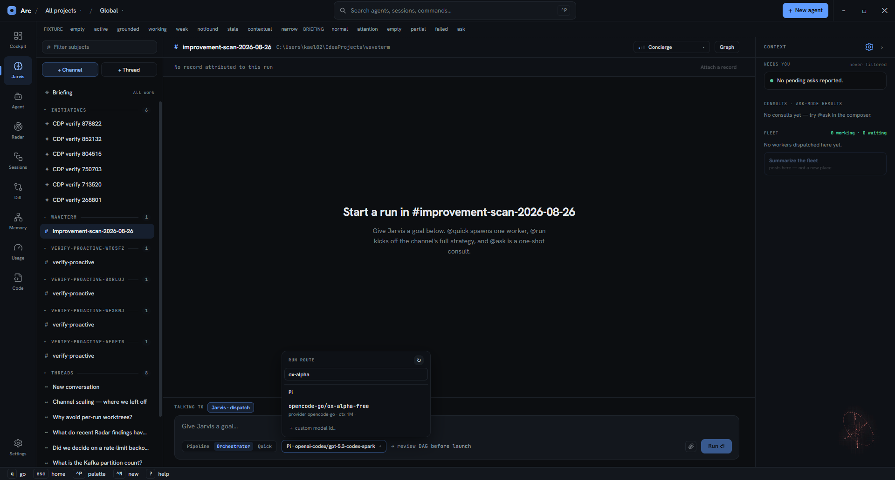
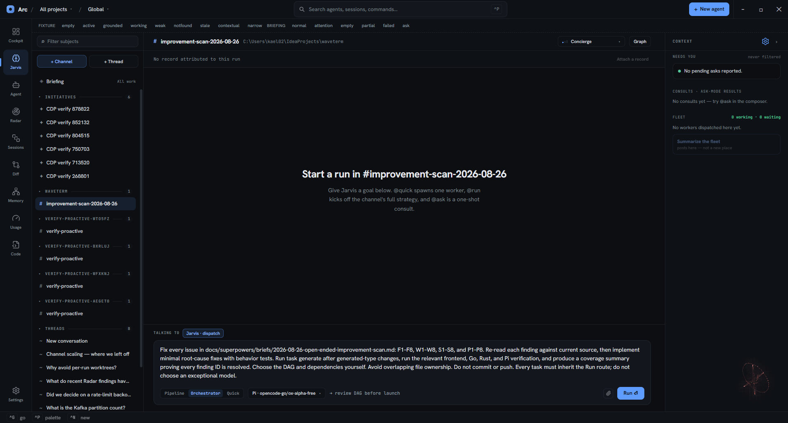
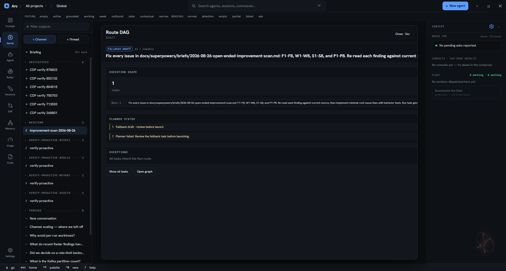
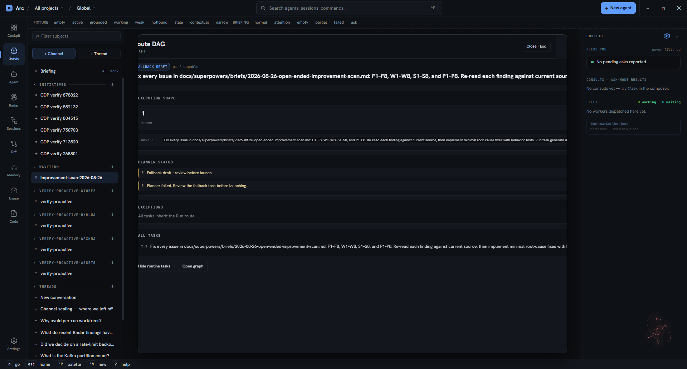

# Jarvis orchestrator: open-ended improvement scan run

**Date:** 2026-08-26
**Channel:** `#improvement-scan-2026-08-26`
**Project:** `C:\Users\kael02\IdeaProjects\waveterm`
**Requested route:** Pi · `opencode-go/ox-alpha-free`
**Outcome:** Not launched. Jarvis planning failed twice and returned a route-mismatched one-task fallback.

## Purpose

Exercise the real Jarvis orchestrator UI against an actual repository task: fix every finding in
[`docs/superpowers/briefs/2026-08-26-open-ended-improvement-scan.md`](../superpowers/briefs/2026-08-26-open-ended-improvement-scan.md).
The brief contains 32 findings across four areas:

| Area | Findings |
| --- | --- |
| Frontend cockpit | F1–F8 |
| Go backend core | W1–W8 |
| Rust shell and toolchain | S1–S8 |
| Pi integration | P1–P8 |

The goal was intentionally not decomposed by hand. The observation target was how Jarvis would choose tasks,
dependencies, and gates for this workload.

## Actual UI setup

A dedicated channel was created from the Jarvis surface. The composer was set to **Orchestrator** and the model
catalog was refreshed. Filtering for `ox-alpha` exposed the Pi route
`opencode-go/ox-alpha-free`.

The route was selected in the Jarvis composer before planning. The composer face showed
`Pi · opencode-go/ox-alpha-free` and the footer showed `review DAG before launch`.

### Submitted goal

> Fix every issue in docs/superpowers/briefs/2026-08-26-open-ended-improvement-scan.md: F1–F8, W1–W8,
> S1–S8, and P1–P8. Re-read each finding against current source, then implement minimal root-cause fixes with
> behavior tests. Run task generate after generated-type changes, run the relevant frontend, Go, Rust, and Pi
> verification, and produce a coverage summary proving every finding ID is resolved. Choose the DAG and
> dependencies yourself. Avoid overlapping file ownership. Do not commit or push. Every task must inherit the
> Run route; do not choose an exceptional model.

## Intended orchestration flow

The UI presents the orchestrator lifecycle as:

1. select **Orchestrator** and a Run route in the Jarvis composer;
2. ask Jarvis to create a one-to-eight-task execution DAG;
3. review the generated task graph, dependencies, gates, and route exceptions before launch;
4. launch a deferred owner Run and submit the approved DAG;
5. let DAG workers inherit the Run route unless a reviewed task exception overrides it;
6. observe worker status, asks, retries, gates, merges, and final evidence from the live graph.

For this run, both the orchestration route and inherited worker route were requested as
`Pi · opencode-go/ox-alpha-free`.

## Observed planner result

Jarvis did not produce a decomposition. Both the initial planning request and the modal's **Retry** action returned
the same fallback:

- **Planner status:** `Planner failed. Review the fallback task before launching.`
- **Execution shape:** one task in one wave.
- **Task:** the entire submitted goal copied verbatim into `t-1`.
- **Displayed route:** `pi / capable`, despite the composer showing `Pi · opencode-go/ox-alpha-free` immediately
  before planning.
- **Exceptions:** `All tasks inherit the Run route.`

Expanding all tasks confirmed that the fallback contained only `t-1`; no subsystem split, dependencies, or gates
were generated.

## Coverage outcome

No finding was assigned to a generated workstream because the planner failed before launch.

| Findings | Planned task | Execution status |
| --- | --- | --- |
| F1–F8 | None; collapsed into fallback `t-1` | Not started |
| W1–W8 | None; collapsed into fallback `t-1` | Not started |
| S1–S8 | None; collapsed into fallback `t-1` | Not started |
| P1–P8 | None; collapsed into fallback `t-1` | Not started |

## Safety decision

The fallback was **not launched**. Launching it would have defeated the observation goal:

- one worker handling 32 cross-subsystem findings is not meaningful orchestration;
- the modal did not confirm the requested ox-alpha route;
- there was no generated ownership or dependency plan to review;
- the task could have produced broad overlapping edits without the expected orchestration controls.

The modal was closed without creating the deferred Run or starting workers.

## What this usage revealed

1. **The pre-launch review gate worked.** The UI surfaced the planner failure before any worker started.
2. **Fallback is fail-safe for execution, but not useful for a broad backlog.** It preserved the goal as one task
   rather than inventing an unverified decomposition.
3. **The selected model was not reflected in the fallback summary.** The composer showed
   `opencode-go/ox-alpha-free`; the draft showed `pi / capable`. This must be resolved before claiming that both
   orchestrator and workers use ox-alpha.
4. **Retry was deterministic in this session.** A second UI planning attempt produced the same fallback state.
5. **No implementation evidence exists.** The source findings remain unresolved by this run.

## Resume criteria

Retry this observation through the Jarvis UI only after both conditions hold:

1. planning returns a non-fallback DAG with meaningful task boundaries; and
2. the draft and task routes visibly confirm `Pi · opencode-go/ox-alpha-free` or explicit inheritance from that
   exact Run route.

Before launch, map every finding ID F1–F8, W1–W8, S1–S8, and P1–P8 to at least one generated task. After launch,
capture the live DAG and worker cards as additional evidence in this document.
