# The Jarvis tab

Reference for the consolidated Jarvis surface (`frontend/app/view/jarvis/`). This describes how the surface
behaves; [Known gaps](#known-gaps) lists where it does not yet, and the full verification pass with
reproductions is a dated record at
[`docs/handoff/2026-07-28-jarvis-tab-findings.md`](handoff/2026-07-28-jarvis-tab-findings.md).

Jarvis is the merge of three former nav destinations — **Channels**, **Graph** and **Tasks** — into one
surface. Commits `edd49430`…`948e1bd8` did the consolidation; the nav rail went from 11 entries to 8.
The graph became an overlay, a record became a subject, and a thread became a subject. Nothing that used
to be a tab is a tab any more.

Entry point: `JarvisSurface` (`jarvissurface.tsx`), nav rail item **Jarvis** (`Brain` icon), keyboard
`g` `c`.

- [1. The shell](#1-the-shell)
- [2. Subjects column](#2-subjects-column)
- [3. The Stage](#3-the-stage)
- [4. Record band](#4-record-band)
- [5. Thread renderers](#5-thread-renderers)
- [6. The composer](#6-the-composer)
- [7. Context rail](#7-context-rail)
- [8. Autonomy control](#8-autonomy-control)
- [9. Profile drawer](#9-profile-drawer)
- [10. Graph peek](#10-graph-peek)
- [11. Grounding, citations, freshness](#11-grounding-citations-freshness)
- [12. Entry points from other surfaces](#12-entry-points-from-other-surfaces)
- [13. Keyboard](#13-keyboard)
- [13a. Motion](#13a-motion)
- [14. State and persistence](#14-state-and-persistence)
- [15. Dev fixtures](#15-dev-fixtures)
- [Known gaps](#known-gaps)

---

## 1. The shell

Three columns: **Subjects** (272px) · **Stage** (flex) · **context rail** (300px, collapsible to a
44px strip). The rail is always mounted; what it *contains* depends on the subject.

Width is not shared evenly. One `ResizeObserver` at the surface root feeds `collapseFor`
(`jarvislayout.ts`, pure) which yields chrome in the design's order, to protect the one thing the design
calls a hard constraint rather than a preference — the thread and the composer never give up space:

1. the context rail drops to its 44px strip;
2. the Subjects column drops to a 56px strip of status dots;
3. the context rail leaves the flow entirely and floats over the Stage's right edge (`railOverlay`), costing
   no inline width at all — worth 44px of surface floor, 740 → 696.

Each step stops as soon as the Stage clears its **640px floor** (`STAGE_MIN_PX` — derived, not picked: the
560px user bubble plus the conversation column's padding), so a wide window collapses nothing and the order
can never run backwards. Before this nothing was width-responsive and the order effectively inverted, with
chrome holding a constant 572px while the Stage absorbed every pixel of loss.

Step 4 of the design's order is the **nav rail**, which collapses itself: 78px → 56px below a 900px window,
dropping its labels and keeping each button operable through an `aria-label`. It lives in
`view/agents/navrailwidth.ts`, not here, because the nav rail is global chrome shared by every surface —
driving it from inside one surface would be the wrong layer. Jarvis needs no wiring for it: its own
`ResizeObserver` simply measures a wider surface once it fires.

Below a **696px surface** width (~752px window) the order runs out of regions and the Stage goes under the
floor anyway — rule 5 forbids taking it from the thread or the composer, so that residual stands. See gap 11b.

Narrowing writes the rail's open atom on the transition rather than overriding it while narrow, so a user
who reopens the rail on a narrow window can push the Stage under the floor themselves. That is deliberate:
overriding also disabled the collapsed strip's expand button, trading a broken layout for a dead control.

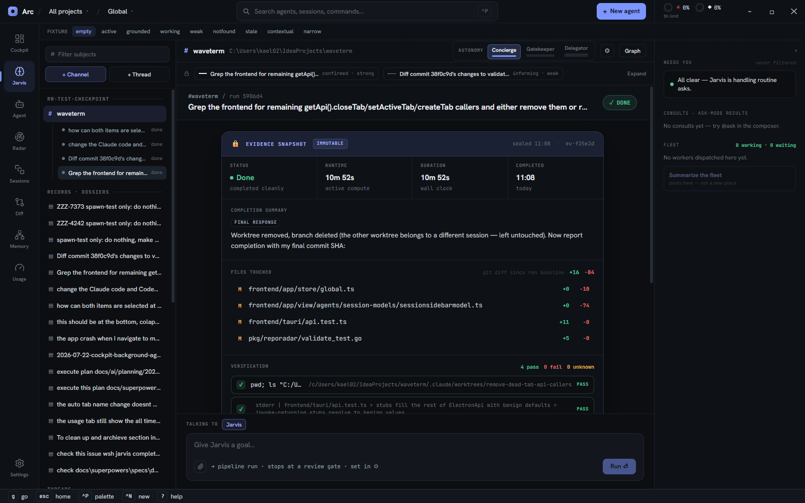

A **subject** is one of three kinds, and the kind decides everything the Stage draws
(`stagecompose.ts` — one table, so a control cannot drift onto a subject that cannot have it):

| | `channel` `#` | `dossier` `▤` | `conversation` `~` |
|---|---|---|---|
| Autonomy chip | yes | — | — |
| Profile ⚙ | yes | — | — |
| "Grounded in" chip | — | this record + its runs | all projects |
| Absence chip | — | `Record · not a run` | `No channel · no fleet · no profile` |
| Record band | attributed | subject | mentions |
| Pipeline | yes | — | — |
| Thread | run | record | turns |
| Composer target | worker-or-jarvis | jarvis-record | jarvis-thread |
| Fleet section | Fleet | Fleet · on this record | — |

The rule is **absent rather than empty**: a band a subject cannot have is not rendered, never greyed out
and parked.

With no subject selected the Stage shows its empty state, and the rail carries Needs you alone — every
other section is subject-derived, and an attention channel that waits on a click is not one.

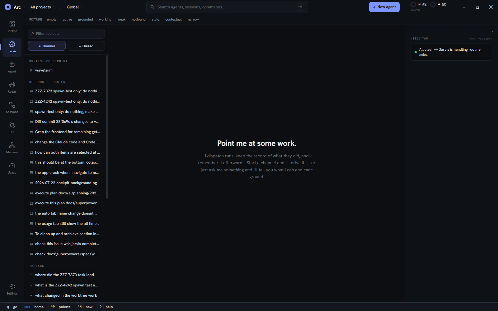

## 2. Subjects column

`subjectscolumn.tsx` + `subjects.ts`. One grouped list replacing ChannelRail, HistoryRail and the Tasks
list.

- **Grouping** — channels group by project name in first-seen order, then `Records · dossiers`, then
  `Threads`. A channel's project name is the registered project whose path matches `channel.projectpath`
  (separator-insensitive), else the path tail.
- **Filter** — free-text over subject labels across all three kinds, **and over run goals**
  (`runGoalMatches`): a channel whose run goal matches expands to those runs even while it is not selected,
  so a run can be found by what it was about. A run is not a subject and the switcher below is the only run
  list, so without this, finding one meant selecting every channel in turn. Groups that empty out disappear.
  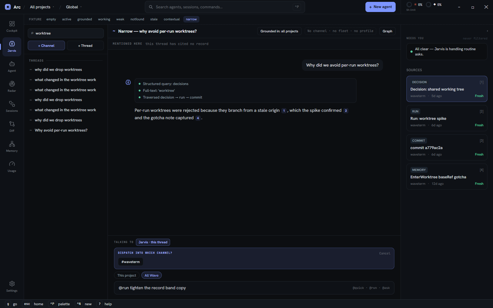
- **`+ Channel`** — pick a registered project, then name the channel (Enter creates, Esc backs out). With no
  project registered the picker offers **No projects yet — register one**, which opens the New-project modal
  in place; the first thing a new user clicks used to be prose pointing them at another surface.
  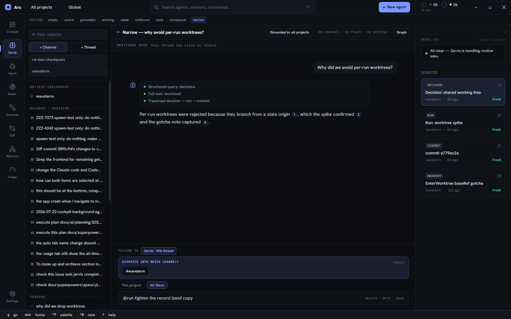
  A channel's group header comes from `projectNameFor`, which resolves by path — so two projects registered
  at one path used to file a channel under an arbitrary one of them. `CreateProjectCommand` now refuses a
  path already registered under another name, naming the project that holds it; the resolver stayed
  tie-break-free, because the fix for data that should not exist belongs at the boundary that admits it.
- **`+ Thread`** — creates an empty `all`-scope conversation and selects it. A thread nobody asked anything
  in is a false start and is dropped when you leave it (`pruneEmptyConversation`), so clicking `+ Thread`
  three times leaves one row, not three. Nothing durable is lost: the backend record is created by the
  *first* turn, so a turnless conversation has never reached the store.
- **One thread per source** — asking about the same Run, finding, note, record or graph node twice continues
  the same thread (`conversationForSource`, keyed by the source's oref) instead of minting a second identical
  row. Every "ask about this object" entry goes through it. The map is rebuilt from the persisted summaries'
  `attachedorefs` on load (`rehydrateSourceMap`), so it survives a restart; an in-session mapping always wins
  over a persisted one, because the session's thread is the one holding unsent state.
- **Channel lifecycle** — right-click a channel row for Rename (edits in place), Archive / Unarchive and
  Delete (behind `ConfirmModal`). The affordances lived on the deleted ChannelRail and came back here rather
  than into the header, because the header acts on the channel you are *on* and renaming one you are not is
  the point. Archiving moves the channel to a trailing `Archived · N` group — without somewhere to go, the
  menu item would have had no visible effect. Autonomy deliberately did not come back: the header chip
  owns it, and a second control would be a second source of truth.
- **Thread lifecycle** — right-click a thread row for Archive / Unarchive and Delete (behind `ConfirmModal`),
  mirroring the channel menu: a row you cannot remove is a permanent one. No Rename — a thread's title comes
  from its first turn. Archived threads join the **same** trailing `Archived · N` group as archived channels,
  which therefore holds both kinds: two "Archived" headers for two kinds would read as two different states.
  Archiving also patches the live in-session copy, which otherwise shadows its own summary and would leave the
  row in `Threads` until the next launch.
- **Row signals** — an `asking` dot and a `N▶` working count per channel, both from the same fleet
  snapshot the rail and the nav badge use, so a lit dot and a counted ask never disagree.
- **Run switcher** — the selected channel expands inline to its runs, each with a status dot and label.
  Clicking one sets that channel's active run. This is the only run list.
- **Space scoping** — all three kinds scope together via `filterChannelsBySpace` + `scopeToRecord`.
  A Space *is* a dossier, so a scoped record list shows that one record, and a scoped thread list shows
  threads that cited it. A `SpaceBanner` reports how many subjects were hidden and offers "show all".
- **Keyboard** — `j`/`k` move a single cursor over the whole column in render order
  (`useSurfaceListNav`).

## 3. The Stage

`stage.tsx`. Four stacked regions — header, record band, thread, composer — plus the graph overlay as a
**last child sibling**, never a wrapper, so expanding a record or peeking the graph cannot unmount live
worker output.

The header (`stageheader.tsx`) carries the subject mark, title, subtitle, the `Grounded in:` reach
statement (a statement, not a picker — Spaces own scoping), the absence chip, the autonomy chip (§8) and
**Graph**. The ⚙ is not here: it triggers a right-edge drawer, so it sits in the context rail's icon slot
beside the edge that drawer opens from (§9).

Two one-shot landings are consumed here:

- `pendingRunFocusAtom` — "open this run" from Radar or the graph peek: select the channel, then select
  the run once that channel's runs load. Bounded to **one** navigation by a `landed` flag: a run that never
  appears (channel load failed, run gone) otherwise re-fires on every subject change and yanks the user back
  with no way out but a reload. Landing on the channel is the useful half; silently giving up on the run is
  the right degradation.
- `pendingRunDraftAtom` — a Radar "start investigation" draft: move the Stage to the project's channel and
  hand the goal to the composer, which holds it under a `From Radar` banner until the user presses Start.
  The draft is a single value (one investigation at a time) but belongs to the channel its finding's project
  resolves to, so the composer renders and dispatches it only there — ungated, `Run ⏎` on any other channel
  dispatched the investigation into the wrong project while still carrying `radarOrigin`, writing the
  finding's outcome back against a run in a project it never touched. A finding whose project has no channel
  has nowhere correct to go: it stays visible and discardable wherever the user is, with the send blocked.

## 4. Record band

`recordband.ts` (pure case selection) + `recordbandview.tsx`. Docked above the thread, never a
destination. Its job is making attribution legible — a weak inferred link must not read like a confirmed
one.

Five cases:

| Case | When | Collapsed line |
|---|---|---|
| `none` | channel, no attributed record | "No record attributed to this run" + an **Attach a record** control |
| `one` | channel, one edge | 🔒 task id + edge chip + "Expand the record" |
| `several` | channel, many edges | 🔒 primary chip + `+N more`, ranked confirmed-first then strong>medium>weak |
| `subject` | dossier | 🔒 "Selected directly from Records — no run beneath it" |
| `mentions` | conversation | the dossier ids this thread cited (`mentions.ts`) |

Each edge chip draws its own line style — solid 2.5px (strong), dashed 1.5px (medium), dotted 1px (weak)
— and labels `state · bucket`. Unknown buckets rank below weak so an unrecognised value never presents as
stronger than it is.

The collapsed `several` row carries the primary edge and a count, never a chip per record: one chip each put
826px of content in a 790px box at 1440px and drew the trailing label over the rail. Deliberately **not**
`flex-wrap` — a band that changes height on selection pushes the thread.

**Attribution is correctable.** `pkg/jarvisattrib`'s lifecycle now reaches the frontend as three wshrpc
commands (`DetachDossierEdgeCommand`, `AcceptDossierEdgeCommand`, `ListDetachedEdgesCommand`), so the band
offers real controls rather than the sentence *"attribution is machine-maintained"* that stood in for them.
The `none` case offers **Attach a record** — a filtered picker over the record list (`recordpicker.tsx`)
rendered in place, not as a modal. `Accept` on a pair with no existing edge appends the override and hardens
the run into the record's refs block, so attach, confirm and restore are all one backend call.

Expanding renders `TaskDetail` in a 420px scroll region, then **one row per edge** — the primary included,
which previously had no row of its own and so was the one edge with nowhere to correct it from. Each row
carries an open-the-record button and an `EdgeControls` group (`edgecontrolsview.tsx`) whose buttons are
gated by the pure `edgeControls(state)` (`edgecontrols.ts`): an `informing` edge gets **Confirm** and **Not
this record**; a `confirmed` edge gets only **Not this record**, behind a confirm dialog, because detaching
one overrides a reference the worker itself wrote; a `detached` edge gets only **Restore**. Any unrecognised
state falls to the cautious case. Suppressed edges for the same run are listed beneath at 70% opacity, and
the list ends in **+ Attach another record**. Expanding never produces a tab strip. The expandable row is a
`<button>` carrying `aria-expanded`, so the band's one control is keyboard-reachable; the per-edge rows and
their controls are siblings below it, never nested inside a control, so nothing swallows anything else
(the structural rule JC19 established).

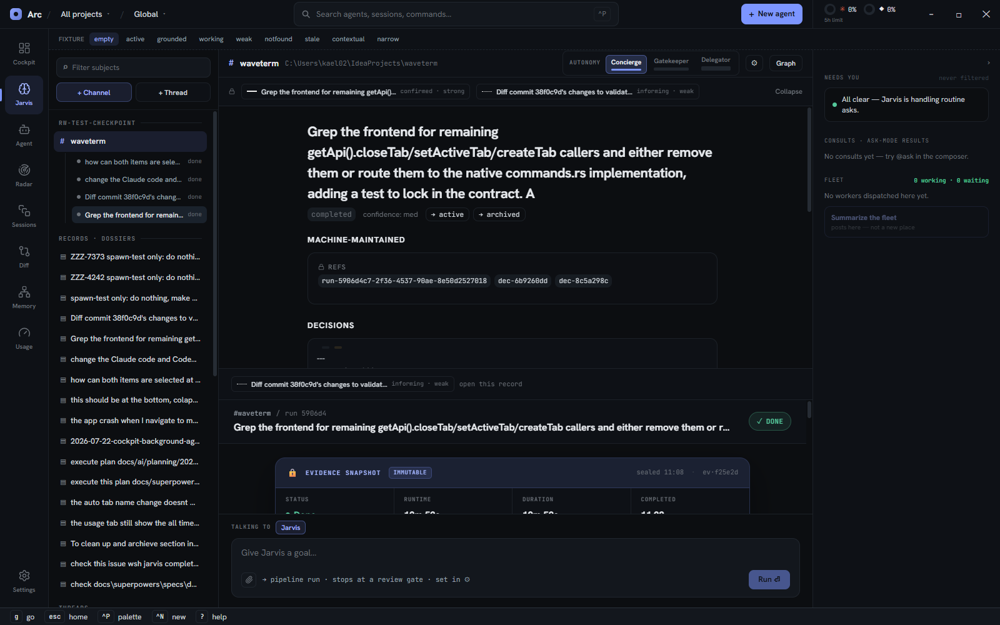

## 5. Thread renderers

One thread slot, three renderers:

- **`run`** — `RunBody` (shared with the old Channels surface): phases, evidence snapshot, files touched,
  verification, ask cards.
- **`record`** — `recordthread.tsx`: runs attributed to this record, the append-only decision log, and
  any Jarvis Q&A asked about the record. Each run row says what *that run* did rather than repeating the
  record's title: `recordrunrow.ts` (pure) prefers the run's evidence summary as the headline, falls back
  to the goal only when it genuinely differs from the record's objective (normalised for whitespace and
  case), and renders `null` otherwise. A meta line beneath carries age, duration and the change stat, each
  omitted rather than defaulted when there is no source for it — an unsealed run has no duration, and a
  zero would assert one. Every row also carries its own `EdgeControls`, and suppressed edges appear in a
  **Detached** group below the list where they can be restored. Controls on this side always pass
  `state="confirmed"`, so detaching from a record always asks first: a run reaches this list through
  `ResolveSpaceScope`, which does not carry the per-edge state, and the cautious path is the right default
  when the state is unknown. The band (§4) has the real state and uses it.
  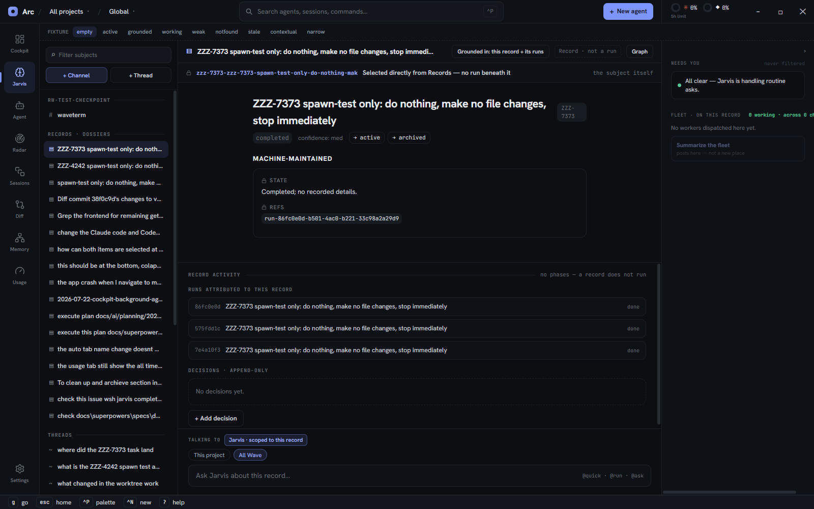
- **`turns`** — `conversationview.tsx`: alternating user turns and Jarvis answers.
  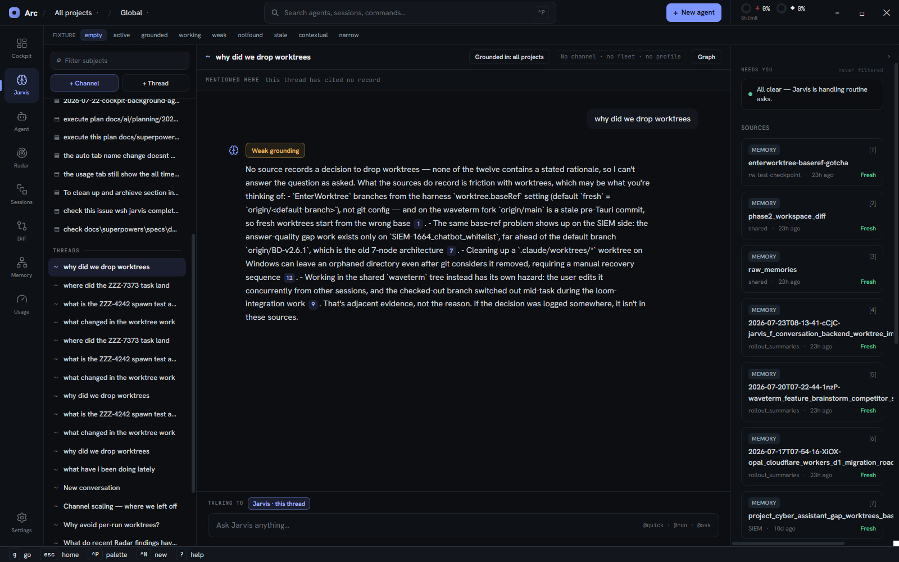

Answers are rendered by one shared component (`jarvisturn.tsx`) wherever they appear, so a Jarvis answer
inside a run's thread looks identical to one in a recall thread. An answer carries working steps, a
terminal badge, and prose with inline citation buttons.

| Terminal | Badge |
|---|---|
| `answered` | none |
| `weak` | "Weak grounding", warning tone |
| `notfound` | "Not found", muted — an absence is not a warning |
| `error` | "Couldn't reach Jarvis", **error** tone, plus a `Retry` on the turn |
| `cancelled` | "Cancelled", muted, plus a `Retry` — the user stopped it, so neither amber nor red |

`weak` and `notfound` are statements about the corpus; `error` is a statement about the request; `cancelled`
is a statement about the user. Every failure on the converse stream used to land as `weak`, so "I looked and
found little" and "the request died" drew the same amber badge, and a partly-streamed answer sat under a
warning that misdescribed it. `Retry` re-submits the same prompt into the same conversation, and only `error`
and `cancelled` offer it.

While the converse stream is open the turn carries `streaming: true` and draws a **`Cancel`** control above
the badge row (a streaming turn has no badge yet, so it cannot live inside it). Cancelling calls
`gen.return()` on the RPC generator, which sends the wire cancel and unwinds the server's streaming goroutine
through `ctx.Done()` — there is no separate abort protocol. Whatever already streamed is kept. The cancel flag
is set *before* `gen.return()`, because that call can surface in the stream's own `catch`, which would
otherwise overwrite `cancelled` with `error` and report a break to the person who chose it
(`terminalAfterStreamFailure`). `streaming` is cleared on every exit — completion, error and cancel alike —
so the control disappears exactly when the stream closes.

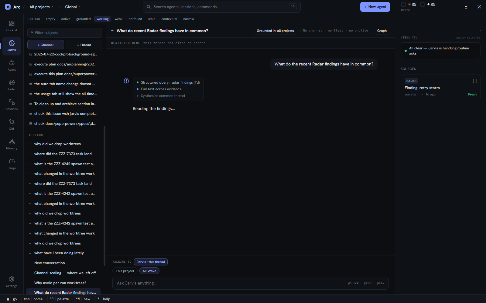
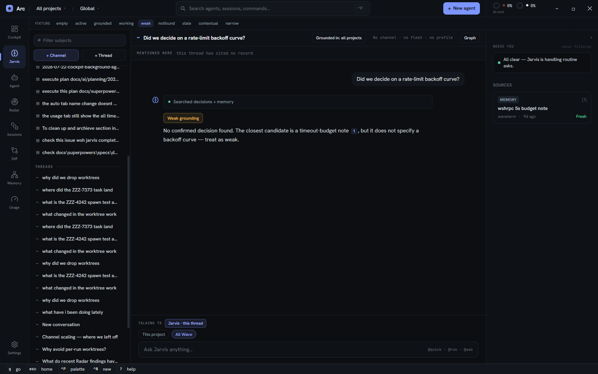
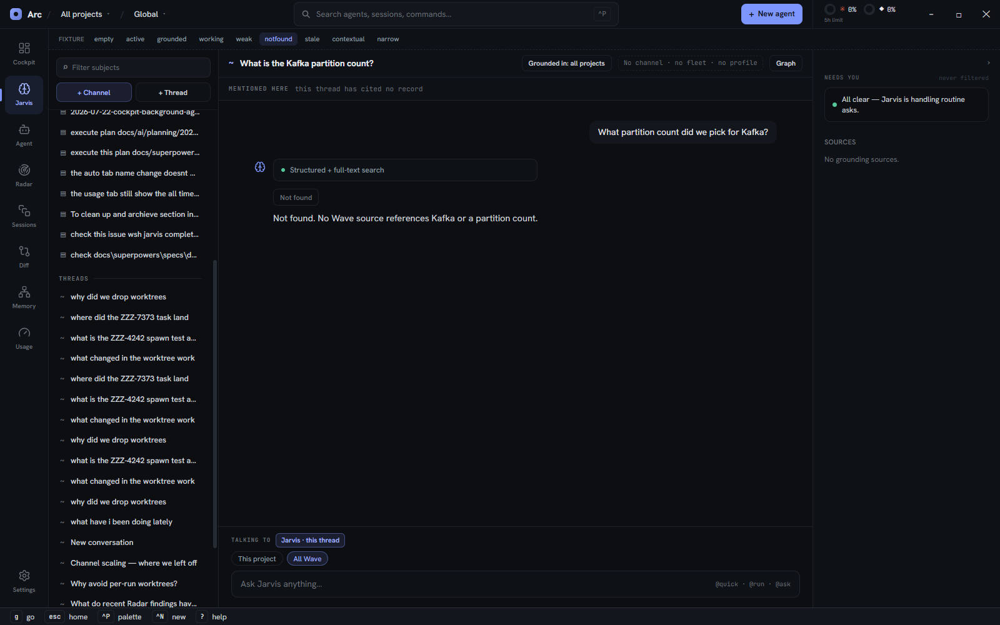

## 6. The composer

`stagecomposer.tsx` + `composertarget.ts`. **One** composer that retargets in place rather than being
replaced. The `Talking to` line above the input is the only thing telling the user whether a keystroke
reaches a running worker or Jarvis, so its tone carries the distinction: green for a worker, accent for
Jarvis.

On a channel it has **two faces**, chosen by `composerFace(run, agents)`:

- **Talk** — the selected run has a live worker. The box addresses that worker; sending injects a
  follow-up turn (what used to be called "Steer"). `＋ New run` in its header breaks back to Launch.
- **Launch** — no live worker, or `＋ New run` was pressed. A plain goal box with the channel's run strategy
  stated underneath (`→ pipeline run · stops at a review gate · set in ⚙`) and a `Run ⏎` action.

`＋ New run` sets `composingRunAtom` (keyed by channel id), which **forces** Launch until the user submits or
presses Cancel on the banner over the box. It has to be a sticky flag rather than a cleared run id:
`resolveActiveRunId` reads `undefined` as "pick one for me" and lands back on the most-recent non-terminal
run, which is the very run being steered — so the old clear-the-id version was a no-op whenever it was
visible. A Radar draft forces the face the same way.

**Creating a run** therefore means being on the Launch face, or going around it:

| Where | Input | Result |
|---|---|---|
| channel, Launch face | bare goal | managed run; the dispatch names no strategy and the server resolves it |
| channel, Launch face | `@quick <goal>` | one worker, no phases |
| channel, Launch face | `@run <goal>` | explicit managed run |
| channel, Launch face | `@ask <goal>` | one-shot consult — **no** run, lands in the rail's Consults |
| dossier / conversation | `@run …` / `@quick …` | asks which channel to dispatch into, then creates it |
| anywhere | `^P` + goal → `▸▸ Run` / `↯ Quick` | calls `createRun` directly, ignoring the composer face |

The run strategy is the channel's setting, never chosen per dispatch — and the frontend enforces that by
**sending no `mode`/`planGate` at all** for a plain run. `resolveRunPlan` falls back to the channel's
resolved profile only when the request's mode is empty, so any value the frontend echoes back *wins* over
the channel; a stale fetch was therefore how a just-saved ⚙ change got overridden by the value it replaced,
and the palette's Run row hard-coded `pipeline` + gate over a channel set to orchestrator. `@quick` stays
explicit: it is a per-dispatch override by design. The composer's footer still *labels* itself from the
resolved profile (`resolvedProfileAtom`, keyed by channel and refreshed by ⚙ Save, so the label flips
without a subject switch) — it just no longer feeds the dispatch, which makes a slow load cost a label
rather than the wrong run.

The palette's `↯ Quick` goes through `createRun` too. It used to post a channel mention instead, spawning a
bare agent tab with no Run object — so no `CaptureRunDispatch`, no dossier, no evidence seal: work
dispatched from the palette escaped the record system entirely.

Who a keystroke reaches:

| Subject | Draft | Chip |
|---|---|---|
| channel, live worker | anything | `<worker> · run <id>` (green) — steers the worker |
| channel, live worker | `@ask …` | `Jarvis · consult` — an explicit `@ask` beats the worker |
| channel, no worker | anything | `Jarvis · dispatch` — Enter spawns workers and spends money |
| dossier | anything | `Jarvis · scoped to this record` — `askAboutRecord`, one thread per record |
| conversation | anything | `Jarvis · this thread` — `submitJarvisQuery`, streamed |

Both Jarvis cases on a channel used to read a bare `Jarvis`, which put the composer's two loudest outcomes
— *spend money* and *ask a question* — behind one label, on the line the surface relies on to say where a
keystroke goes.

Off-channel a dispatch must be **typed**: `parseComposerCommand` defaults a bare goal to `@run`, which is
right on a channel but would make every plain sentence demand a channel elsewhere.

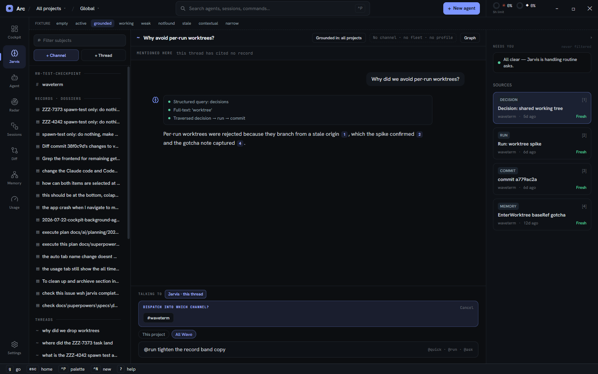

The draft and that picker are both **keyed by subject id** (`jarvisDraftAtom`, `channelPickingAtom`), so
neither follows the user off the subject it belongs to. The box is one box that retargets, but what is
half-typed in it belongs to the subject it was typed on — and an Enter on a carried-over `@run` would have
dispatched against the wrong subject.

Attachments go through `useComposerAttachments`; scope chips above the box show what a contextual entry
attached.

## 7. Context rail

`stagerail.tsx`. One rail, sections present only when they have content. The rail itself is mounted
**with or without a subject** (`comp` is nullable) — everything but Needs you is subject-derived and stays
absent, but Needs you must not wait on the user selecting something.

1. **Needs you** — always drawn, **never Space-filtered**, including on a fresh boot with no subject.
   Attention beats focus: an ask in a hidden channel still surfaces, labelled `outside focus`. The list is
   computed server-side and polled (§12); the rail only adds the `outside focus` label and the row markup.
   Clicking a need moves the Stage there — except a standalone agent's ask, which has no channel and no run
   to land on and so renders as static info.
2. **Consults** — channel only. Ask-mode results, with a "dispatch this" action per consult.
3. **Sources** — when the Stage's thread has answered. Grounding cards with source type, title, project,
   age and freshness; clicking one opens the source in its native surface.
4. **Fleet** — channel: `N working · M waiting · $cost`. Record: `N working · M channels`, rolled up across
   every channel owning an attributed run (`fleetscope.ts`), deduped by worker oref. Both come from
   `fleetCountsLine`, which keeps the record variant inside a ~24-character budget because the line shares
   its row with the section title in a 264px content box; the title truncates and the counts hold their
   line, since a clipped count (`…across 0 ch`) reads as a smaller fleet than the real one.
   `Summarize the fleet` streams a Jarvis summary **into the rail**, so the user never leaves the subject
   they are on. It is the only way to ask for one: the `@jarvis` handle the consolidation orphaned was
   deleted rather than rewired.

## 8. Autonomy control

`autonomyladder.ts` + `autonomyladderview.tsx`. Channel only. A fixed-width chip in the Stage header names
the current tier (`▮▮▮ Delegator · fanout`), and opens a popover holding the ladder itself. The tiers are
three **nested** rungs, not alternatives — delegator implies gatekeeper implies concierge
(`pkg/jarvis/resolve.go`) — drawn as accumulating fill so they read as accumulation; three separate buttons
would misrepresent the backend. The chip's glyph is the current tier's rung fill at 3px, so the header
states the tier without opening anything.

The chip's box is identical at every tier and every mode. That is deliberate: the dispatch strip used to
render inline at Delegator only, which grew the control ~140px and slid the rungs out from under the cursor
that had just clicked one (JC12's cause). The floor is a measurement, not arithmetic — 164px, the widest
natural state (`Delegator · fanout`) measured over CDP against 107px at Concierge — and the mode is capped
at its measured 52px so a non-canonical value clips instead of growing the box. It is also what brings the
control to the header's scale: 27px tall, like the `Graph` button beside it, where the old group was 41px in
a 43px band.

| Rung | Behaviour |
|---|---|
| Concierge | watches and narrates; every ask reaches you |
| Gatekeeper | + answers routine asks itself; real forks still escalate |
| Delegator | + dispatches follow-up work without asking first |

The dispatch mode (`report` / `manage` / `fanout`) appears in the popover at Delegator only — below that
tier it has nothing to act on. Picking a tier or a mode leaves the panel open, since setting the mode is the
obvious next click after landing on Delegator; Escape, an outside click, or the chip closes it.

Escape closes *only* the panel. On a deep surface Escape is also bound to "back to Cockpit"
(`bindings.ts` `surface:back-home`) and the app's dispatcher runs on **window capture**, ahead of any handler
the panel could register — so the panel publishes `autonomyPanelOpenAtom` and that binding stands down while
it is open, the same arrangement the graph peek uses. One caveat: picking a tier hands focus back to the
composer, and Escape with a field focused belongs to `jarvis:blur-composer` — so from there it takes a second
press to close the panel.

## 9. Profile drawer

`profilepanel.tsx`, opened by the ⚙ in the context rail's icon slot — stacked under the rail's own glyph
while it is collapsed, beside the collapse control in its header band while it is expanded (`extraIcons`
on `CollapsibleRail`), and shown only on a channel. Edits the Jarvis profile at two scopes:
**Global defaults** and **This project** (a per-channel override merged over global).

- **Playbook** — ordered run phases (`brainstorm` / `plan` / `execute` / `custom`), each with an optional
  skill, `GATE` and `FRESH-CTX` flags.
- **Principles** — injected into worker, orchestrator and quick prompts and into the Gatekeeper.
  Per-principle `override` / `disable` against the global list, with backend diagnostics.
- **Run defaults** — `pipeline` / `orchestrator`, plus the plan gate.

Each section badges `GLOBAL` or `PROJECT` with **customize** (copy the inherited section into the
editable override) and **reset to global** (drop it). Save is disabled until dirty.

Save also refreshes the shared `resolvedProfileAtom` so every reader flips at once — a project save
re-resolves that channel, a global save clears the whole cache because it re-resolves every channel. A
Stage-local copy went stale the moment the drawer wrote, and the composer went on labelling the run strategy
the user had just replaced.

The drawer shares the right-edge slot with the context rail: it has no collapsed strip of its own, and
the rail force-collapses while it is open, so the two never stack. Because of that force-collapse the
drawer must never outlive its trigger — selecting a non-channel subject closes it, and `Esc` dismisses it
(deferring to the graph peek, which sits above it and consumes `Esc` first). Scope is re-derived from the
channel on every open rather than latched, so a glance at a record cannot leave Save writing global
defaults.

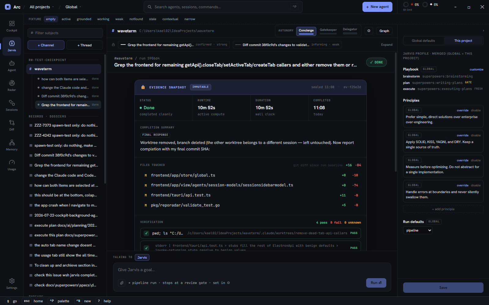

## 10. Graph peek

`graphpeek.tsx`. An overlay over the Stage, never a destination — there is no graph entry in the nav
rail. You enter it from an object and leave it by opening one; every action closes the overlay onto
something.

- Force-directed vault graph (`jarvisgraph.tsx`, lazy `react-force-graph-2d`), node kinds task / run /
  decision / memory. **One** legend, drawn by the canvas in its bottom-left, sitting with the nodes it
  labels — the header used to draw a second one in a different case and order.
- **What it opens on** is `peekFocus` (`graphfocus.ts`, pure), resolved by the Stage because the Stage
  already holds the run, the attribution and the thread's attachments:

  | Subject | Focus |
  |---|---|
  | `dossier` | that record |
  | `channel` | the record its active run is attributed to, then the run node itself |
  | `conversation` | its attached run or record, else the first record its answers cited |

  A run node exists only inside its record's attribution bloom — `VaultGraph` emits no runs — so focusing
  a run means blooming that record first and then selecting the run, which `selectBloomedRun` does only if
  the bloom actually returned it. The record it blooms for a channel is the one the record band already
  calls primary (`peekFocus` reuses `recordBandCase`, so the two cannot disagree about the same run).
- **Nothing to focus** is a real state: an unattributed run, a radar or memory thread (radar is not a vault
  collection, and a note's graph id is its vault path, not its oref), or no subject at all. The overlay says
  so and offers a **node filter** rather than guessing at an id — 400+ nodes with nothing selected was the
  reported defect. Selecting a match is enough to see it: the canvas recenters an off-screen selection.
- Selecting a node shows its kind, label, status and **edges**, each drawn with its attribution style
  (dashed/width/opacity) or marked `wikilink`.
- Actions: *Open run on the Stage*, *Open record*, *Ask Jarvis about this node* (starts an
  object-scoped thread attached to that node).
- `Esc` or **Close** dismisses it.

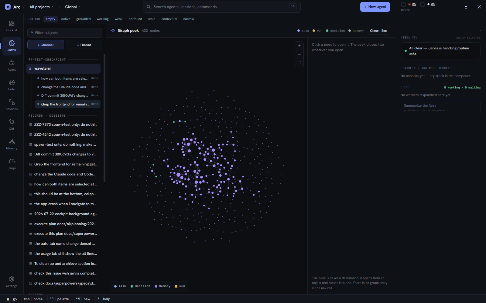

## 11. Grounding, citations, freshness

`jarviscontract.ts` is the view-model seam; `recallderive.ts` the pure helpers.

- A Jarvis answer is a list of segments — prose interleaved with citation refs. `parseCitations` turns
  `[n]` into a citation **only** when a grounding card with that `n` exists; unknown refs stay literal
  text, so a citation is never fabricated. It re-runs on every streamed chunk.
- A grounding card carries `sourceType`, title, project, age and freshness. Freshness is
  **surfaced, not hidden**: `Fresh` (green) / `Stale` (warning) / `Unavailable` (error).
- Clicking a citation or a card calls `openORef`, a pure-classifier + side-effect pair. `channel`, `run`,
  `task` and `agent` route to their native surface; everything else is a deliberate no-op, never an error.

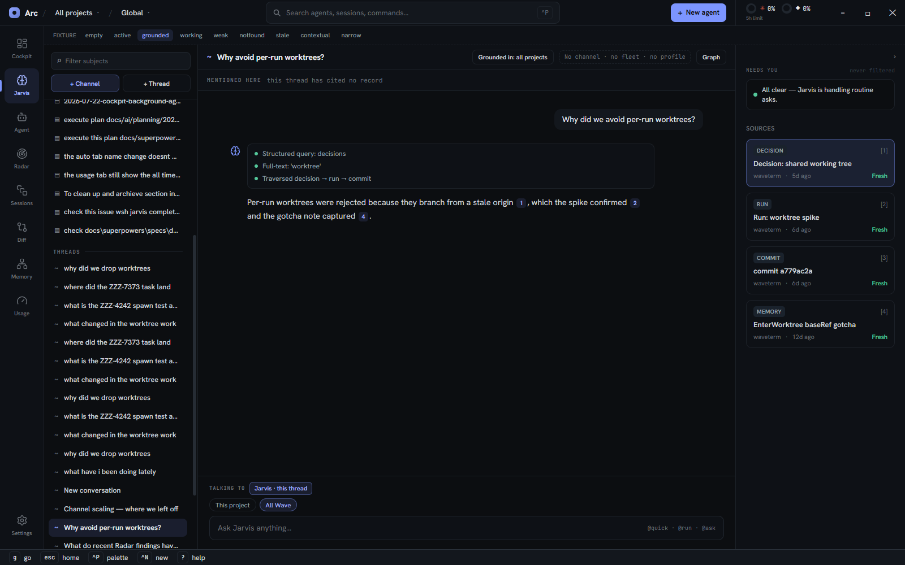

Streaming (`submitJarvisQuery`) runs at module scope under `fireAndForget` with a 130s RPC budget, so a
turn keeps accumulating even if the surface unmounts on a nav switch. A failed stream preserves what
arrived and marks the turn `error` (§5), not `weak`. Cancelling one **in flight** is still not possible —
it needs an abort path through the converse stream, which is its own piece of work.

## 12. Entry points from other surfaces

`contextualentry.ts` builds a `SourceRef`, opens the `attached`-scope conversation **for that source** with
a suggested prompt pre-filled, makes it the active subject, and flips to Jarvis. Opened, not created: the
thread is keyed by the source's oref, so asking about the same Run twice continues one thread instead of
leaving two identical rows, neither carrying the other's answers.

| From | Chip | Suggested prompt |
|---|---|---|
| a Run | This Run | "What changed in this Run and why?" (`RunHeader`, **and** the completion report's header) |
| a Radar finding | This finding | "Explain this Radar finding." |
| a Memory note | This memory | "Recall decisions related to this." |

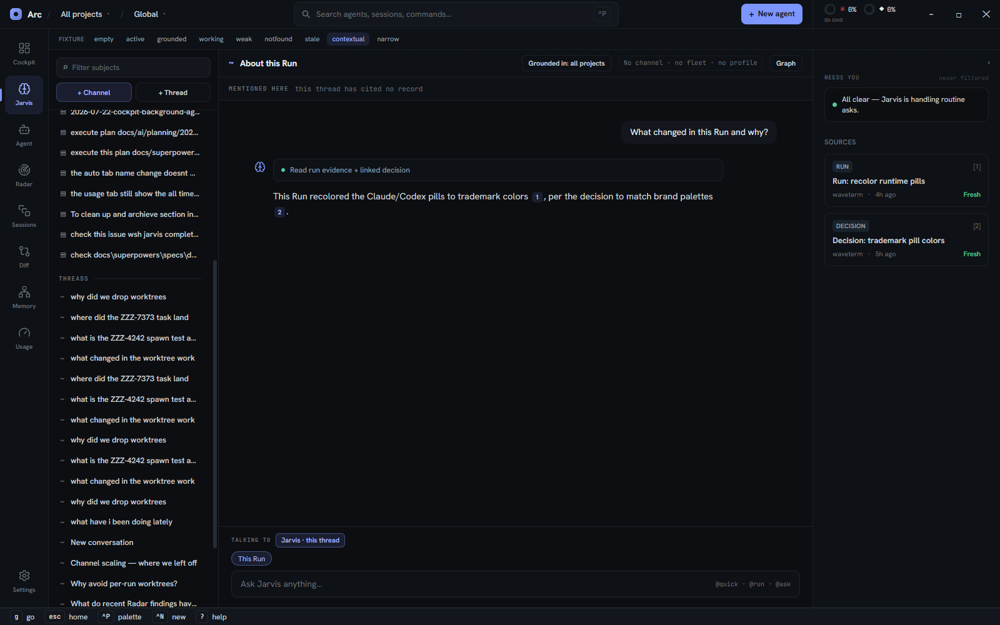

`AskJarvisButton` has to be in both Run places because `RunBody` early-returns the completion report once a
run is `done` with evidence, and that report draws its own header. With the button only in `RunHeader`, the
Run → Jarvis entry existed exclusively while a run was still unsealed — that is, never for the runs you
would actually want to ask about.

`openORef` is the reverse direction — a `task:` oref now has a surface for the first time, as a subject
on this Stage rather than a separate tab. The command palette also routes results here.

### The attention list is not rail-local

`GetAttentionCommand` (`pkg/wshrpc/wshserver/wshserver_channels.go`) returns one list of everything waiting
on the human across every channel — review gates, Gatekeeper escalations and blocked workers, gates first,
oldest first within a kind. `pkg/jarvis/attention.go` holds the rule (`BuildAttention` is pure;
`GatherAttention` fetches its inputs). `AttentionPoller`, mounted in `cockpit-root.tsx` and rendering
nothing, refetches it every 10 seconds into `attentionAtom`. Two consumers read that one atom: the nav-rail
badges (`splitAttention` sends items **with** a channel to the Jarvis badge and the rest to Cockpit, so the
two are disjoint by construction) and this rail's Needs-you list.

The point of moving it: **a run parked at a review gate in a non-active channel now lights a badge from
every surface.** Before, the list was derived on the frontend from `channelsAtom` — a snapshot refetched
only on channel create/delete/rename/archive — and rendered in exactly one place, so a gate outside the
active channel was invisible everywhere. Three frontend modules were deleted rather than duplicated
(`railneeds.ts`, `channelneeds.ts`, and the three counting functions in `channelderive.ts`), making Go the
only definition. `runmodel.reviewGate` survives because the run-detail view needs the gate per-phase.

Two limits, both by construction:

- **Up to 10 seconds of staleness.** A missed poll self-heals on the next tick, which is why this polls
  rather than listening for pushed events — a missed push goes stale while still looking live.
- **The pending-ask registry is in-memory** (`pkg/agentask`), so the list is authoritative for the current
  `wavesrv` lifetime, not absolutely: a restart empties it until agents re-raise their asks. It is also
  cleared only by the ask-clear hook, where the frontend additionally expires an ask once a newer
  working/idle status arrives — so an agent that resumes without its clear hook firing keeps counting.

A blocked worker whose question Jarvis escalated counts **once**, as the escalation. The two rows describe
one waiting thing, and a count that says two would be the same class of untruth this change removed.

## 13. Keyboard

Getting here and moving around (global registry, `buildGlobalBindings` / `buildListNavBindings`):

| Key | Action |
|---|---|
| `g` `c` | go to Jarvis |
| `Ctrl:2` | go to Jarvis (`SURFACE_ORDER` index 2 of 8; `Ctrl:1`–`Ctrl:8` cover every rail entry) |
| `[` / `]` | cycle the rail order |
| `j` / `k` | move the Subjects cursor (the *commit* is idle-debounced — see below) |
| `1`–`9`, `Enter` | answer the shown run's asking worker (channel subjects) |
| `Esc` | close the graph peek or the autonomy panel (§8); otherwise leave the surface for the Cockpit |
| `^P` | command palette |

`listnav.ts`'s `cursor == selection` contract is **unchanged** — five surfaces share it, and the same keys
meaning different things per surface is a worse cost than the one below. What changed is *when* the cursor
commits: moving it is now just a highlight, and `selectSubject` runs 150ms after you stop
(`subjectcursor.ts`, `CURSOR_COMMIT_MS`). Committing per keypress fired a `selectChannel` RPC, resolved a
record scope and pruned any unasked thread passed over, so holding `j` through thirty subjects cost thirty
round trips. A click cancels a still-pending commit, which would otherwise land afterwards and move you off
the row you clicked.

The controller deliberately does **not** register `activate`: `bindings.ts` only lets `Enter` pass through
while that is unset, so claiming it would swallow Enter across the whole surface — the composer's submit
included — to save the 150ms the pending commit was going to take anyway.

The surface's own controls (`buildJarvisBindings`, registered by `stage.tsx` so they exist before a subject
is selected). All are suppressed while the graph peek is open — acting behind an overlay changes a surface
the user cannot see — except the peek's own toggle:

| Key | Action |
|---|---|
| `d` | toggle the context rail (same letter the Agent surface uses for its rail) |
| `Shift:g` | toggle the graph peek — distinct from the `g` leader, which needs shift absent |
| `c` / `n` | new channel / new thread |
| `e` | expand or collapse the record band |
| `Shift:j` / `Shift:k` | next / previous run in the selected channel (the run switcher, keyboard-side) |
| `i` | focus the composer; `Esc` from inside it returns to the keys |

Two of these act by *pressing the control the surface already draws* (`[data-jarvis-new-channel]`,
`[data-jarvis-band-toggle]`) rather than holding their own copy of its state. Whether a band is expandable
is the band's derivation from the run's attribution; the button exists only when it can open, so clicking it
is exactly the mouse's contract and there is no second source of truth to drift. Each returns `false` when
its control is absent, so the key passes through instead of pretending to have acted.

**Known gap — the ask's `Enter`.** Leaving `activate` unset (above) buys pass-through for handlers that live
on the DOM, which is why the composer's submit still works. It does *not* help a handler that lives only in
the registry: with the Subjects cursor published and a worker asking, `list:activate` and `channels:submit`
both claim `Enter`, `matchBinding` returns only the first match, and the dispatcher does not fall through on
`run() === false` — so `channels:submit` is never reached and the ask card's `Enter` does nothing. Its `1`–`9`
badges still work, and the card's own button still submits. Pinned by a test in `store.test.ts` so it cannot
rot silently. Fixing it means either dispatcher fall-through (a global semantic change that also alters
`review:apply`) or an explicit precedence rule between the two — neither belongs in a keyboard-coverage
change.

## 13a. Motion

The surface follows the cockpit motion system (`motiontokens.ts`) — no local durations or easings:

| Moment | Treatment |
|---|---|
| Subjects rows, run rows, the band's own row, `+ Channel` / `+ Thread` | `transition-colors duration-[140ms]` (= `MOTION.durMicro`), matching the Agent tree and Files list |
| Context rail and ⚙ drawer width | already animated by `CollapsibleRail` (`motion.aside`, `durMacro` + `easeFluid`, `reducedMotion="user"`) — including inside the narrow-window overlay wrapper |
| Record band expand | `composerReveal` (height + fade) under `AnimatePresence initial={false}`, so a subject left expanded is simply open on return rather than replaying the reveal |
| Graph peek | `modalBackdrop` fade in *and out*, via `AnimatePresence` in `stage.tsx` — dropping it from the tree made the whole Stage snap back, which read as navigation rather than a peek closing |
| Graph canvas | its own eased node/link alpha + settle (`jarvisgraph.tsx`), `prefers-reduced-motion` honoured |

Still static, deliberately: the Stage's swap between subjects (a fade there delays the content the user just
asked for) and subject-list entrance (`computeEntrances` exists, but a rail whose rows arrive from a backend
load would cascade on first paint).

## 14. State and persistence

The surface **unmounts on nav switch** (only the Agent surface stays mounted), so every survive-worthy
value is a module atom, never component state.

| Atom | Shape | Persisted |
|---|---|---|
| `activeSubjectAtom` | `{kind, id}` | no |
| `persistedSubjectAtom` | `{kind, id}` — the last subject | localStorage |
| `recordBandOpenAtom` | keyed **by subject id** | no |
| `activeRunIdAtom` | keyed **by subject id** | no |
| `jarvisDraftAtom` | keyed **by subject id** | no |
| `channelPickingAtom` | keyed **by subject id** | no |
| `composingRunAtom` | keyed **by channel id** | no |
| `recordScopeAtom` / `recordRunsAtom` / `recordDetailAtom` | keyed by dossier id | no |
| `detachedEdgesAtom` | keyed by `"task:<id>"` **or** a run oref | no |
| `sourceConversationAtom` | source oref → conversation id | rebuilt from summaries on load |
| `subjectFilterAtom` | single value | no |
| `stageRailOpenAtom` | bool, default **open** | localStorage |
| `graphPeekOpenAtom`, `profileRailOpenAtom` | bool | no |
| `conversationsByIdAtom` / `persistedSummariesAtom` | conversations | backend |

Keying by subject id is deliberate: switching subjects must return each one to the state it was in. The
draft and the channel picker are in that list because they were not — a half-typed question followed the
user to the next subject, where one Enter would have dispatched it against the wrong one. One draft store
serves all three composer faces: on a channel the subject id *is* the channel oid.

`detachedEdgesAtom` takes two key shapes into one store because its two readers ask the inverse question:
a record's thread wants that record's suppressed runs (`"task:<id>"`), a channel's band wants that run's
suppressed records (the run oref). The answer to one says nothing about the other.

**One cache per record, one seam.** A record's detail used to live in two atoms — `recordDetailAtom` here
and a single-value `dossierDetailAtom` in `tasksstore.ts` — and only the second was invalidated on write,
so setting a record's status from the band appeared to do nothing. There is now one keyed atom, and every
mutation of a record goes through `recordactions.ts`, which ends in `afterRecordWrite(dossierId)`: it drops
the record's graph attribution bloom, re-reads the whole-vault ambient map (unawaited — that read carries a
30s budget and blocking a click on it would be worse than a tag that updates a beat late), and refetches
the record's detail and scope. `recordactions.ts` exists as its own module rather than living in either
store because a write must invalidate both, and putting it in either one would make the two stores import
each other. It imports the stores; only components import it. Mirrors `view/agents/runactions.ts`.

**Restoring the last subject.** The hard part is not persistence but validation: a stored id can name a
channel, record or thread that has since been deleted, and the three lists load asynchronously. So each
kind's list is `null` until it has loaded (`channelsAtom` already was; `taskListAtom` and
`persistedSummariesAtom` became so), and `restoreDecision` (`subjectrestore.ts`, pure) waits on **only the one
list** the stored subject needs — a stored channel must not be held up by a thread list that has not landed.
It then selects, or clears and degrades silently to the empty Stage: the surface's rule is absent rather than
empty. One attempt only, so an id that never resolves cannot retry forever.

`persistedSubjectAtom` passes `getOnInit: true`, and that is load-bearing rather than a tuning flag: without
it the stored value arrives one render *after* the first read, so the restore would see `null`, read it as
"nothing was stored", and latch its one-attempt guard before the real value ever landed.

## 15. Dev fixtures

`jarvisfixturebar.tsx` renders a row of buttons (`empty` `active` `grounded` `working` `weak` `notfound`
`stale` `contextual` `narrow`) that swap the rendered conversation without a backend. The CDP harness drives
these (`task verify:ui -- jarvis-states`).

The bar **and the fixture data** are gated on `import.meta.env.DEV`, so `jarvisfixtures.ts` leaves the
production bundle: a fabricated thread carrying fabricated citations and freshness badges is
indistinguishable from a real one, so it must not exist in a shipped build at all. `activeFixtureAtom` is
`FixtureState | null`, default `null` — "no conversation" is its own state, not the `empty` fixture, which
is what used to leak fixture scope chips onto records nobody had asked anything about.

---

## Known gaps

Open items only. Full reproductions, and the twelve findings closed on 2026-07-28, are in the dated record at
[`docs/handoff/2026-07-28-jarvis-tab-findings.md`](handoff/2026-07-28-jarvis-tab-findings.md).

| # | Gap | Severity |
|---|---|---|
| 11b | The collapse order (§1) now runs all four steps, but below a **696px surface** width (~752px window) it has nothing left to yield and the Stage drops under its 640px floor. Rule 5 forbids taking that from the thread or the composer, so the residual stands. The graph peek feels it first: its detail panel is a fixed 288px, so the canvas takes the whole loss. | low |
| 12b | Threads have Archive / Unarchive and Delete (§2), but still no **recency grouping**: a long-lived `Threads` group is one flat list. Revisit if the column grows past comfort. | low |

### Verifying

Unit tests cover the pure seams (`npx vitest run frontend/app/view/jarvis/`). They cannot see this surface's
most common defect class — a bad hop *between* atoms, which is what findings 1, 3, 4, 5 and 9 all were, live
while the unit suite was green. For those, drive the running app:

```
task verify:ui -- jarvis-states jarvis-drawer jarvis-fleet jarvis-subject-state jarvis-contextual \
                  jarvis-collapse-order jarvis-narrow
```

Five scenarios are the regression nets for that class, and each was checked by breaking the fix and watching
the right steps go red — a green scenario that cannot fail is not a net:

| Scenario | Covers | Checked against |
|---|---|---|
| `jarvis-drawer` | drawer scope + dismissal, Needs you with no subject | reverting the rail's mount guard turns steps 1–2 red, nothing else |
| `jarvis-subject-state` | draft + picker per subject, one legend, peek focus, fleet line, unasked threads, last-subject restore, thread archive | a global draft/picker reddens 1 and 3; restoring the header legend reddens 4; the old `across M channels` line reddens 7 at 77px past the rail; skipping the prune reddens 8; dropping `getOnInit` reddens 9; removing `restoreDecision`'s list check reddens 10; not splitting archived threads out of `Threads` reddens 11 |
| `jarvis-contextual` | one thread per source | minting per click makes the thread count climb |
| `jarvis-collapse-order` | the *order* — rail before Subjects, never inverted, no document overflow | the order itself; unchanged by this pass beyond a rail probe that no longer assumes the `<aside>` is a direct child of the surface row |
| `jarvis-narrow` | the two new steps' own widths: the overlay, and the nav rail collapsing itself | disabling `railOverlay` reddens both overlay steps; forcing `navRailCollapsed` false reddens the nav step **and** the overlaid-floor step — a true dependency, since 760px only clears the floor with both layers (the nav rail's 22px plus the rail's 44px) |

Both layout scenarios reset `jarvis.stagerail.open` in `arrange` and reload. That is not incidental: the
surface persists `railOpen=false` the first time it collapses, so a run that drove a narrow width leaves the
rail already collapsed at 1920px, where `jarvis-collapse-order` step 3 can no longer observe it yield. Without
the reset the pair passes once and then fails on every subsequent run.

`jarvis-subject-state` creates its **own** channel in `arrange` for the restore step rather than borrowing a
rendered row: the other scenarios delete their channels in teardown while the local list still shows them, so
borrowing one stores a doomed id and the restore correctly clears it — a false failure. Its step 9 also reloads
*first*, because step 6 selects a record, which leaves a Space active whose scope filters that channel out of
the column entirely.

Neither JC17 (the debounced cursor commit) nor JC8 (cancel) has a live step: both are unit-covered only
(`subjectcursor.test.ts`, `jarvisturnderive.test.ts`). Cancel needs an in-flight converse stream, and a real
turn runs a headless CLI up to 120s — too slow to arrange here. The same limit is why the archive step takes an
already-persisted thread and unarchives it afterwards rather than creating one; it runs against the user's real
workspace, so leaving a row archived would be a side effect, not a test.

What CDP does **not** cover here: the peek focusing a *channel* or a *thread* needs a run with a real
attribution edge in the vault, which cannot be arranged from a scenario — `peekFocus` and `selectBloomedRun`
carry that in unit tests, and step 6 guards the record path they share. Findings 1 and 2 are likewise
reasoning + unit only; both need a live worker to reproduce.

The Go side of finding 13 lives in `pkg/wconfig` (`ProjectNameAtPath`) and `pkg/wshrpc/wshserver`
(`CreateProjectCommand`); run `go test ./pkg/wconfig/ ./pkg/wshrpc/wshserver/` with the CGO flags the
Taskfile sets. A registration guard needs a **backend rebuild** (`task build:backend`) to take effect in a
running dev app.

One gotcha when writing assertions here: rail and section headings are Tailwind `uppercase`, and `innerText`
applies `text-transform`, so the DOM reads `NEEDS YOU`. Match case-insensitively. The rail's `aria-label` is on
the `<aside>`; the button carrying that label exists only in the collapsed strip.
