# Using the orchestrator

How to run work through Jarvis's orchestrator as it behaves after the 2026-09-14 redesign and the Agent
surface follow-ups. Every screenshot is from the dev app on 2026-09-17 or 18, taken while running the flow it
illustrates: a sandbox repo built to break on purpose (`orch-guide-demo`), a Quick run in the same repo, and
the backlog-cleanup initiative run through a goal-led orchestrator.

The design lives in `docs/superpowers/specs/2026-09-14-orchestrator-redesign-design.md`.
`docs/orchestrator-howto.md` is the record of the pre-redesign engine (plan gate, adaptive runs) and is
history, not instructions.

## Pick a flow

| You have | Use | What runs |
|---|---|---|
| One small change you can describe in a sentence | **Quick** | One fresh worker. No lead, no plan. It stops and asks if the goal turns out bigger. |
| A goal that still needs design decisions | **Orchestrator → A goal** | A lead brainstorms it with you in its terminal, then either does it itself or hands the engine a plan. |
| A plan already written in the plan format | **Orchestrator → A plan file** | The engine runs the plan at once. A lead is launched only when something needs judgment. |

Everything else in this guide is how to watch those three and what to do when they need you.

**The division of labor.** Code does the mechanics: scheduling, worktrees, Setup, merges, Verify, retries.
The lead only judges: questions, failures, conflicts, a failed Verify. You get what the lead cannot or should
not decide.

---

## Before you start

### 1. Register the project

+ Run lists projects from `projects.json`, not from anything you have talked about in Jarvis. Open the
project switcher in the app bar → **+ New project**, give it a name and the repo's local path, and
**Create project**. The command palette's "New project" opens the same modal.

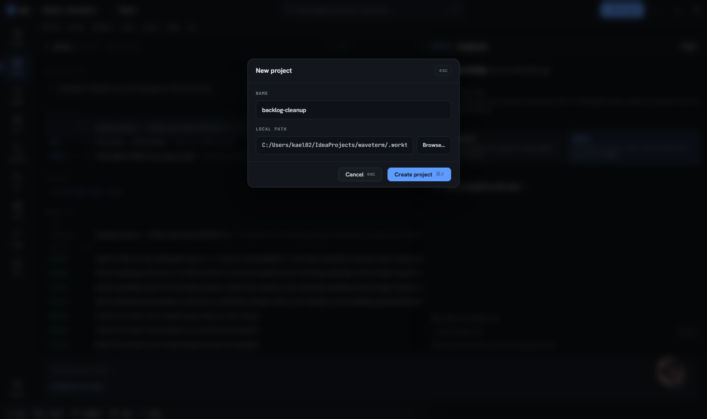

### 2. Give the run a branch it can own

Merges land on whatever branch the project checkout has checked out, and the merge path refuses a dirty
index. If you are working in that checkout yourself, give the run its own worktree and register *that* path:

```bash
git worktree add -b backlog-cleanup .worktrees/backlog-cleanup main
cd .worktrees/backlog-cleanup && task worktree:prepare
```

`task worktree:prepare` junctions `node_modules`, `src-tauri/target` and `dist/bin` from the main checkout,
so tests run in the new tree. Nothing lands on `main` until you merge the branch yourself.

For this repo there is a second reason: the dev app serves the frontend from the main checkout, so a merge
landing there triggers HMR reloads mid-run.

### 3. Know which app you are driving

The packaged app and the dev app keep separate stores. A run started in the dev app, its efforts and its
`wsh` calls all live in the dev store; `wsh` in a terminal of the packaged app talks to the packaged store.
Terminals the run spawns (the lead and every worker) get a `wsh` bound to the app that spawned them, so the
run's own commands always reach the right store.

### 4. Routes

Leads and workers run on **Claude Code** or **pi** only. A route is a harness plus an exact model; there are
no tiers. The launcher has two pickers, **Lead model** and **Workers model**; the workers inherit the lead's
route unless you pick one.

A pi lead needs the `@juicesharp/rpiv-ask-user-question` package (so its questions reach the cockpit) and the
superpowers package installed into pi itself (the lead plans with `brainstorming` and `writing-plans`).

---

## Flow 1: Quick

Open **+ Run** on the Jarvis Brief (or press `r` there). Pick the project, **Quick**, a route, write the
goal, **Start run** (`⌘⏎`).

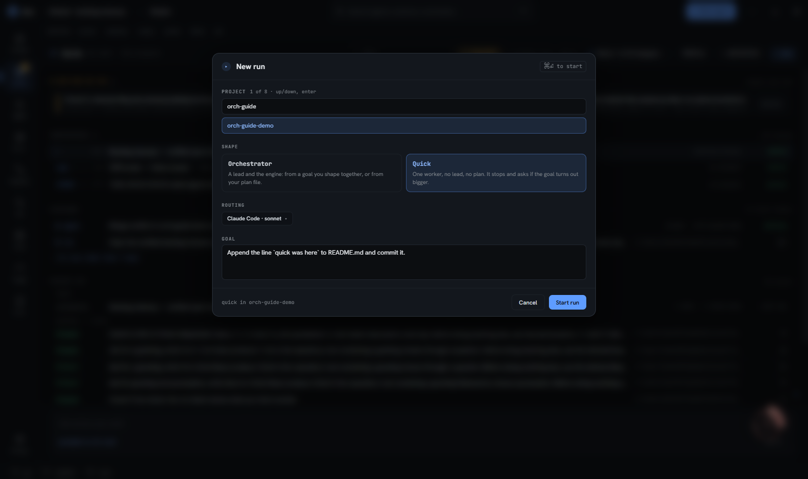

The Brief opens the run's sheet. A Quick run has no task graph; its worker's transcript is the whole run,
so **Open in Agent ↗** is where you watch it.

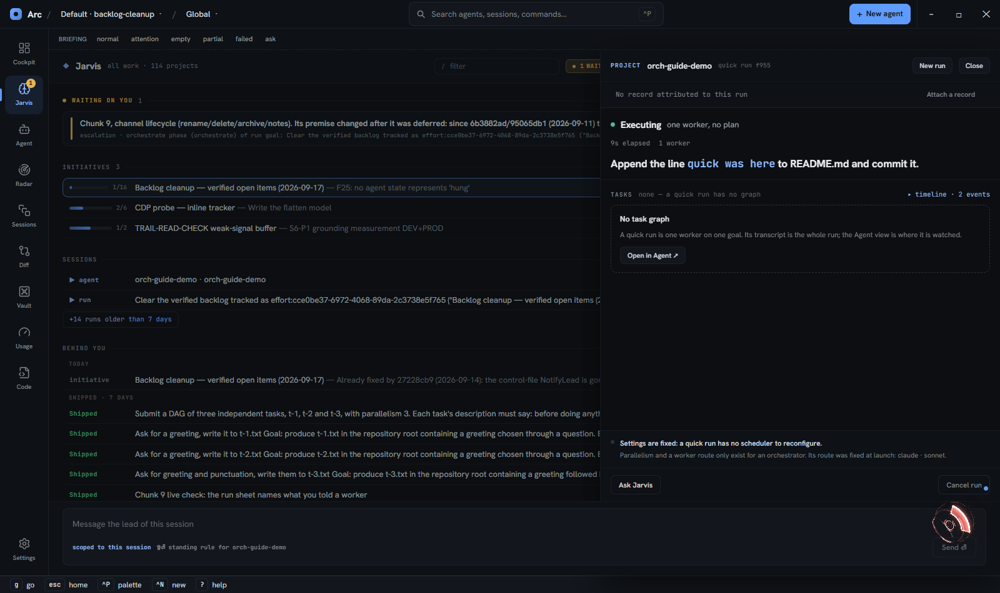

The worker is told that if the goal turns out to be more than one change or needs a design decision, it
should stop and ask instead of pushing on. That question arrives in **Waiting on you** like any other.
Settings are fixed for a Quick run: there is no scheduler to reconfigure.

This run appended one line to `README.md` and committed it; the sheet went to **Done** with its evidence
sealed.

---

## Flow 2: Orchestrator from a goal

### Configure the run

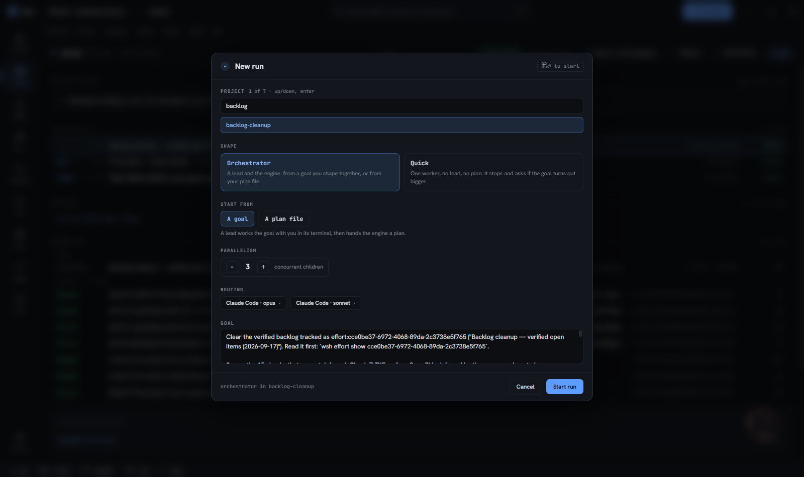

| Control | What it decides |
|---|---|
| **Project** | Where the lead works and where lanes merge. Type to filter. |
| **Shape → Orchestrator** | A lead plus the engine. |
| **Start from → A goal** | "A lead works the goal with you in its terminal, then hands the engine a plan." |
| **Parallelism** | How many lanes run at once, 1-8, default 3. Lowerable on a live run. |
| **Lead model** | The lead's route. It brainstorms, writes the spec and plan, and later judges wakes, so this is the model whose judgment a retry cannot recover. |
| **Workers model** | Every task worker's route. "Same as lead" unless set. Changeable on a live run for tasks not yet dispatched. |
| **Goal** | What the lead starts from. |

The route picker filters by harness (**All / Pi / Claude Code**) and accepts a custom model id:

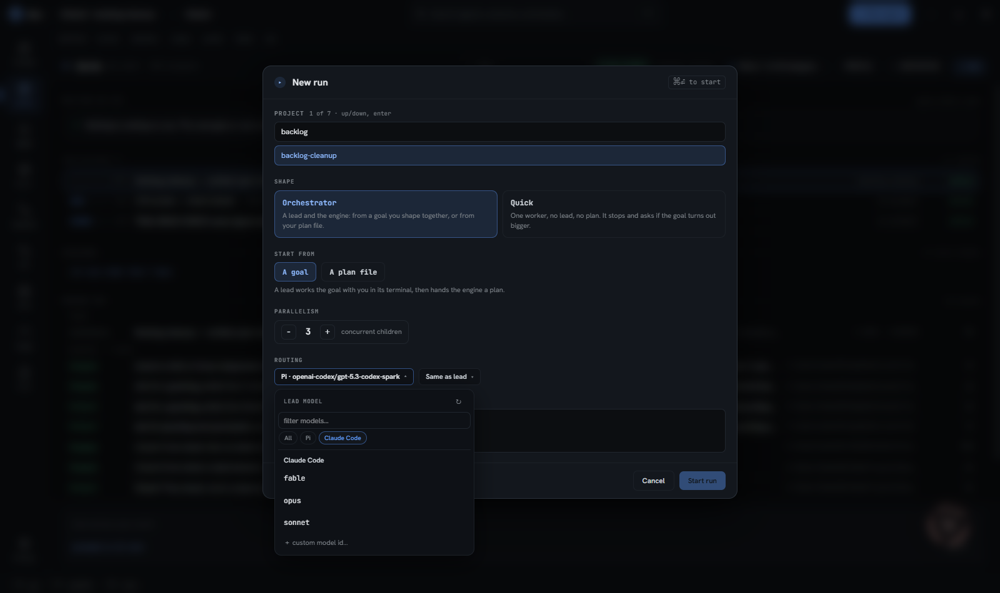

For the backlog run: lead **Claude Code · opus**, workers **Claude Code · sonnet**, parallelism 3.

### The lead brainstorms with you

**Start run** creates the run and opens its sheet at **Planning** ("the lead is writing the plan"). Nothing is
dispatched until the lead submits a plan.

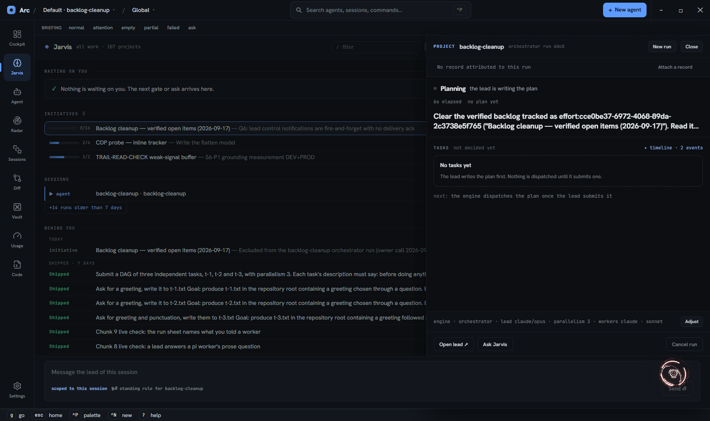

**Open lead ↗** takes you to the lead on the Agent surface. The lead runs `superpowers:brainstorming` against
the real code in the project checkout. The details rail's **Run** section reads "planning · no plan submitted
yet" until it submits.

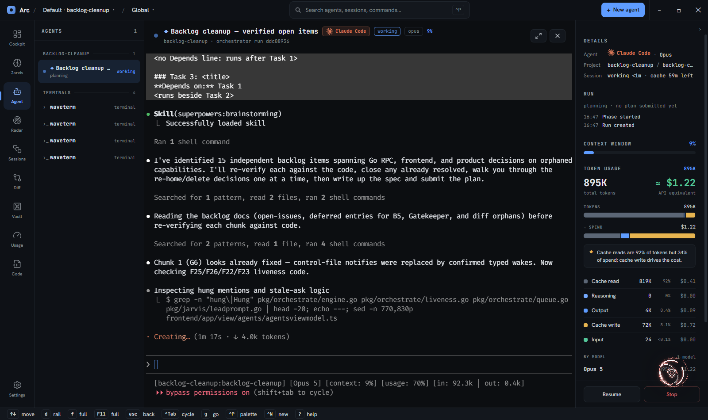

### Answering the lead

The lead is told to put every question and approval through its ask tool, so each one lands in **Waiting
on you** on the Brief instead of scrolling past in a terminal. The Jarvis nav icon carries the count.

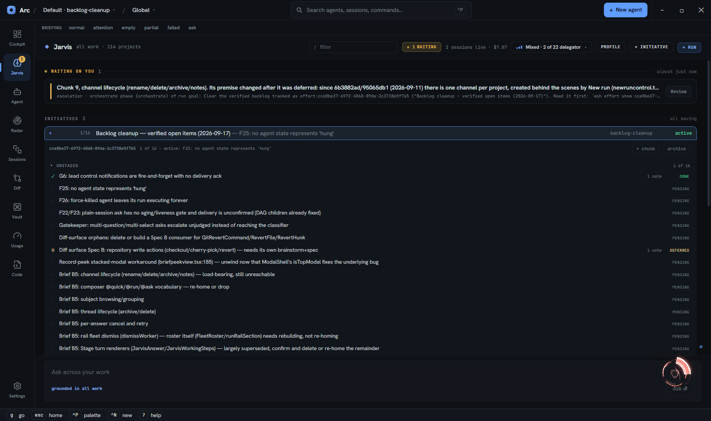

**Review** expands the waiting list; clicking the row opens the run's sheet with the question as a
**Clarifying question** card:

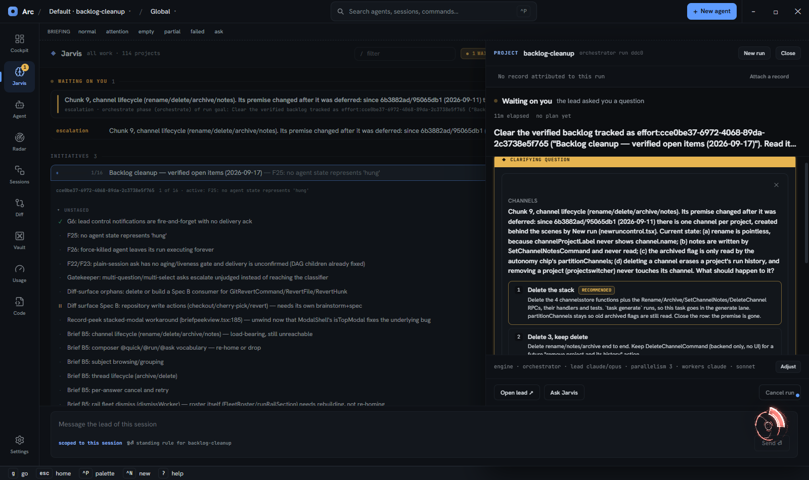

- **Pick an option:** click it. A single-question, single-select card sends on the click. Ignore the card's
  "Press 1–9" hint for a lead's question: the sheet's digit and Enter keys only reach a worker asking from
  inside a plan task, and a planning lead is not one.
- **Answer in your own words:** do it in the lead's terminal on the Agent surface (the harness's own picker
  has a free-text choice). The card's "or type your own answer…" field has no send action on the Brief
  sheet today; see [Rough edges](#rough-edges-found-while-writing-this).
- **✕** dismisses the question.

Push back when an option rests on something you know is wrong. On the backlog run the lead's first question
recommended deleting four channel RPCs; the answer "delete them, but grep `scripts/` for callers first" made
it find that `deletechannel` is the teardown of the CDP scenarios, and it came back with a narrower option.

### What the lead does with the goal

The brainstorming skill classifies the goal, and the lead finishes accordingly:

| Class | The lead | You see |
|---|---|---|
| **Spike** (a question to answer) | reports the answer, `wsh jarvis complete` | Done, with its answer as the summary |
| **Bounded** (one change) | asks for your yes, implements in the project checkout, tests, commits, `wsh jarvis complete --commit` | Done, with the commit |
| **Architectural** (needs a plan) | writes the spec, asks you to review it, writes the plan with `superpowers:writing-plans`, runs `wsh jarvis dag submit --plan <plan> --spec <spec>` and stops | the sheet moves from Planning to Executing and fills with tasks |

After `dag submit` the engine waits for the lead to go idle and types a `/compact` that keeps what you said and
drops code it read. Every compaction of a lead re-injects its orchestration rules (`wsh jarvis dag rules`), so
it knows it is the lead of a run when it next wakes. The spec and plan stay uncommitted until the first lane
merges; the engine folds both into that lane's squash commit.

A lead that exits before submitting fails the run with a **Lead exited** row.

### Writing the goal

The goal is the only thing the lead starts from. The backlog run's goal named the effort to read, the scope
and the one chunk excluded, where the verified facts live, and the constraints the plan must carry (Setup and
Verify commands, which tasks must share a lane, "locate by symbol, not line number", close the chunk before
`wsh jarvis complete`). Pre-answering decisions there saves a round of questions.

Check that the constraints don't force a serial plan. That goal also said "each task updates its tracker row
in the same commit" and "two tasks that edit the same file must not run in parallel". Every task would then
edit `docs/open-issues.md`, whose rows sit on adjacent lines that conflict when merged, so the tasks could
only run one after another. The lead caught it and proposed code tasks that never touch `docs/`, plus one
final task that depends on all of them and updates the rows from each task's chunk note. A shared file
that every task must edit is what sets a plan's width, so keep that edit out of the parallel tasks.

---

## Flow 3: Orchestrator from a plan file

### The plan format

```markdown
**Setup:** `task worktree:prepare`
**Verify:** `npx vitest run`

### Task 1: <title>
**Depends on:** none
...task text...

### Task 2: <title>
...no Depends line: runs after Task 1...

### Task 3: <title>
**Depends on:** Task 1, Task 2
```

- **Setup** runs in every new lane worktree before its first worker (2-minute limit). **Verify** runs in the
  project checkout after every lane merge (20-minute limit). Both are optional, both run in a POSIX shell
  (Git Bash on Windows).
- Headings are `### Task N` or `## Task N`, numbered 1, 2, 3… in order.
- `**Depends on:**` must be the first line after the heading. Left out, the task depends on the task before it,
  so a plan with no Depends lines is **serial**. `none` means independent. References must point backwards.
- There is no task cap.
- **A worker sees only its own task.** Its prompt is the engine's worker contract, which names the plan's path
  and Verify, followed by its task's section (`workerContract`, `engine.go`). Anything above Task 1 reaches no
  worker unless the worker opens the plan. The backlog plan's header said "Never edit `docs/`. Task 13 writes all
  docs." Five lanes edited `docs/open-issues.md` anyway, and two of them then conflicted on neighbouring rows.
  The same header held the exact `wsh effort chunk status …` command that every task's "Close the chunk"
  step relied on. Only t-4 closed its chunks, so the tracker read 3/16 when all 13 tasks had landed.
  Repeat every rule and command a worker needs inside each task that needs it.
- **Worker commit ids don't survive the merge.** A worker cites the commit on its lane branch, but the lane lands
  as a new squash commit. On the backlog run t-8's doc row cited `3f6d5814`, and what landed was `bd8f5461`.
  A later task that records commits should take them from `dag status` (its `landed` lines). A
  `git cat-file` check passes for either id while the lane branch exists.

The engine turns tasks into **lanes**: a chain where each task has one dependency and is its only dependent
shares one worktree and one branch, each task a fresh worker committing on top of the last, and lands as one
squash merge. Independent tasks and tasks after a fork or join start their own lane. Lanes are what
parallelism counts.

### Start it

Pick **A plan file** and paste the plan's absolute path. The launcher parses it as you type and will not
start until it parses:

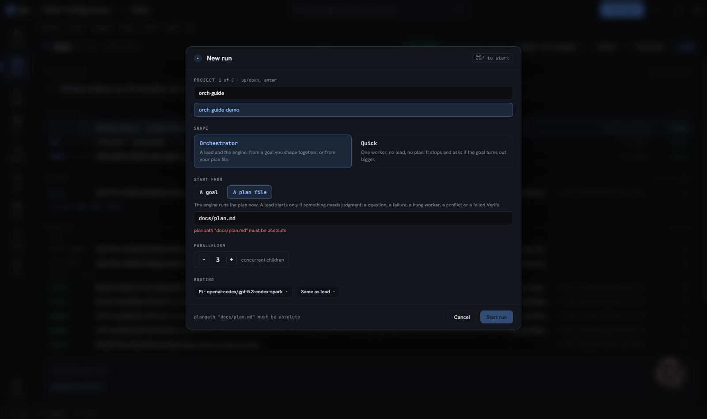

A plan with no Depends lines and no Verify is flagged **serial** and **unverified** before you start:

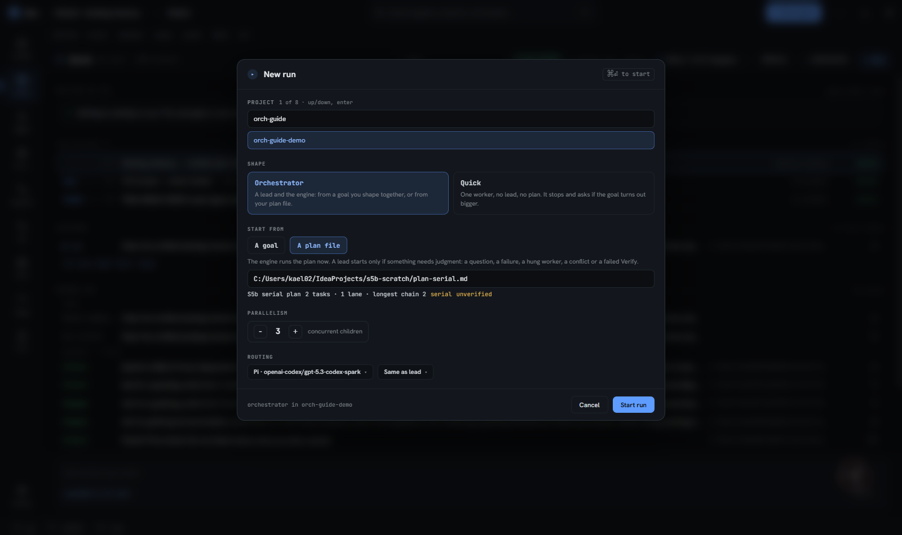

The sandbox plan: five tasks, five lanes, longest chain 2.

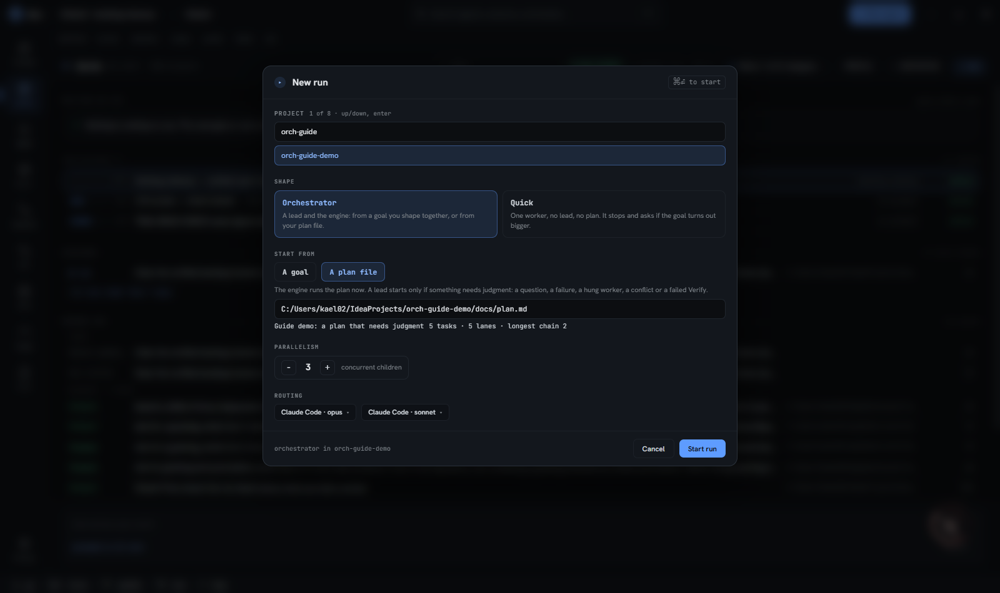

A real one, the backlog cleanup plan its own lead wrote and then handed back: 13 tasks, 13 lanes, longest
chain 6. The preview line under the path is the fastest check that the Depends lines say what you meant.

The longest chain also sets how a run ends. The backlog chain is Task 2 → 3 → 4 → 6 → 7 → 13. Once the eight
independent tasks had landed, the run went one task at a time, with two of its three slots empty. `dag status`
reports such a stretch as `dependency-wait`, naming the task each waiter needs (the rail's Run section reads
"… waiting on …"). `parallelism-wait` ("waiting for a slot") means every slot is busy. To shorten that tail, cut
Depends lines in the plan. Raising parallelism won't help.

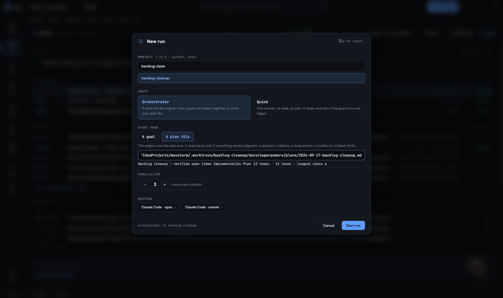

**Start run** submits the plan immediately. There is no approval step and no lead: the sheet goes straight to
**Executing** with the first layer dispatched. The launcher submits no spec, so the engine folds only the plan
file into the first squash commit. A spec sitting beside the plan stays untracked; commit it yourself.

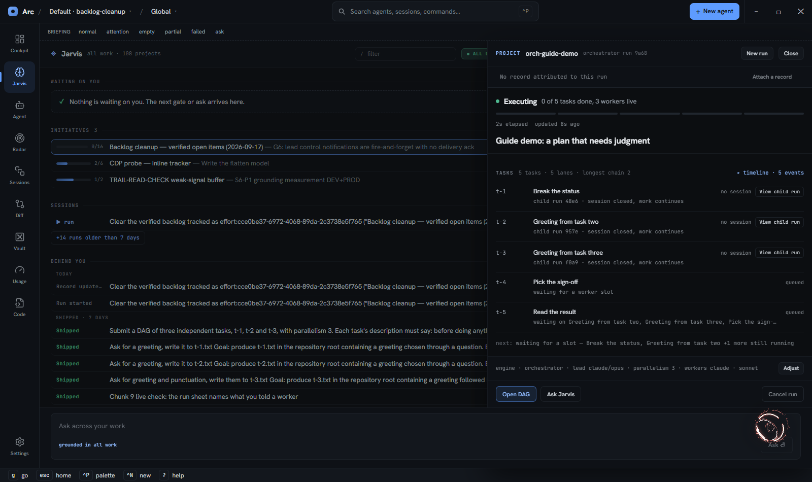

The engine launches a lead only at the first judgment event, with the orchestration rules as its prompt and
the event as its first line. A plan that lands and verifies with nothing to decide never gets a lead: the
engine closes the run and seals its evidence itself.

The sandbox plan (`orch-guide-demo/docs/plan.md`) was written to need judgment three ways, and the rest of
this guide uses what happened to it: task 1 sets `status.txt` to `broken` so Verify fails after it merges,
tasks 2 and 3 both rewrite the one line of `greeting.txt` so the second merge conflicts, and task 4 asks a
product question the plan's notes tell the lead to forward.

---

## Watching a run

### The run sheet

Open a run from **Waiting on you**, **Sessions**, or right after **Start run**. Top to bottom:

- **Verb** and subtext: Planning, Starting, Executing, Waiting on you, Landing, Blocked, Done, Cancelled.
- **Meter** (one segment per task) and chips: elapsed, worker minutes, landed, answered, forwarded,
  unverified, attention.
- **Questions for you**, when you hold any.
- **Tasks**: one row per task with its state and an action: **Open in Agent ↗** for a live worker, **View
  child run** for a finished one, **Open DAG ↗** for one blocked on a merge. Then a `next:` line saying what
  the run is waiting for.
- **▸ timeline**: every run event, newest first. **open the full timeline ↗** opens it in the DAG view.
- **Settings line**: `engine · orchestrator · lead … · parallelism … · workers …` with **Adjust**.
- **Dock**: **Open DAG**, **Open lead ↗**, **Ask Jarvis**, **Cancel run**.

A 13-task run a minute after its plan went in — every task listed with the reason it is not running yet
("waiting on …", "not dispatched yet"), the first three dispatched, and the settings line under them:

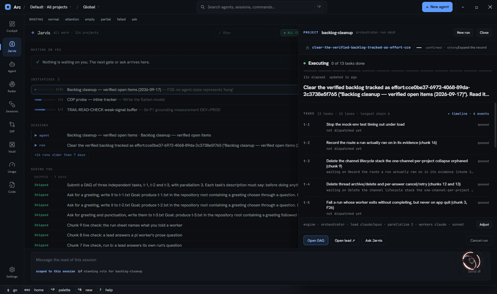

The timeline is the most useful thing on the sheet when a run needs you. This is the sandbox run recovering
from its conflict and failed Verify, then taking the answer to its question:

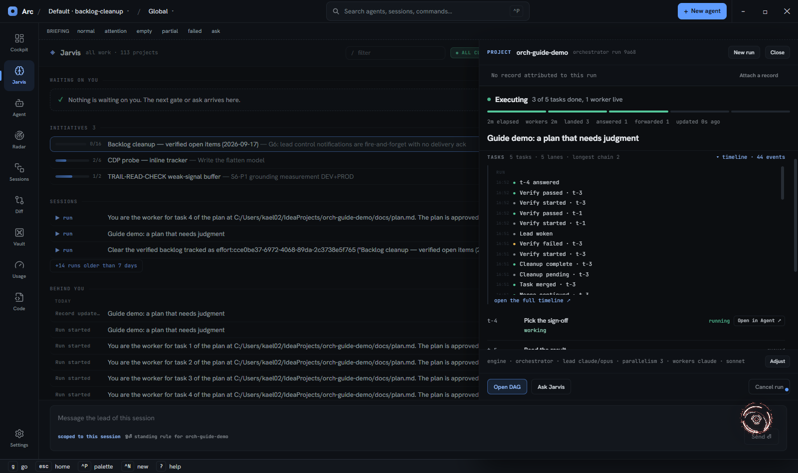

### The DAG view

**Open DAG** shows the task graph with a **Lifecycle** rail (filters All / Task / Attention). Selecting a node
shows its detail panel. Per-node buttons appear only when a node needs a decision: `retry` / `skip` /
`escalate` on a failed or stalled task, `resolve` on a blocked merge or failed Verify, `merge` on a lane end
the engine is not merging itself. **Cancel** in its header cancels the DAG.

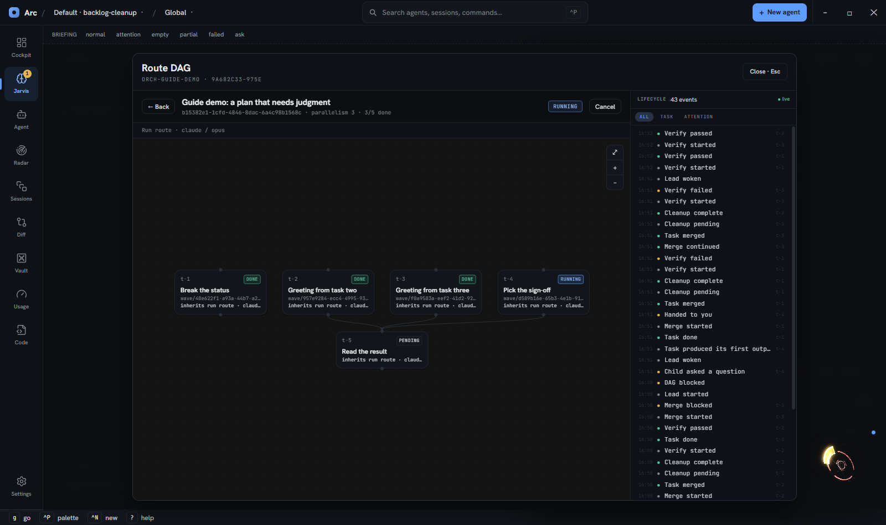

### The Agent surface

The Agent tree groups agents by project and nests a run's workers under its lead ("◆ name"), with a chip
for live workers or "N done". Finished workers fold under **✓ N done**. A worker row reads `t-4 · Pick the
sign-off` with its lane and state. Its header links back to the lead (**↑ lead**) and names its lane.

The details rail (`d`) carries a **Run** section for a lead (progress, lanes, health, the last timeline rows,
held questions) and a **Task** section for a worker (**plan · Task N ↗**, Lead, Lane, Depends on, Result).

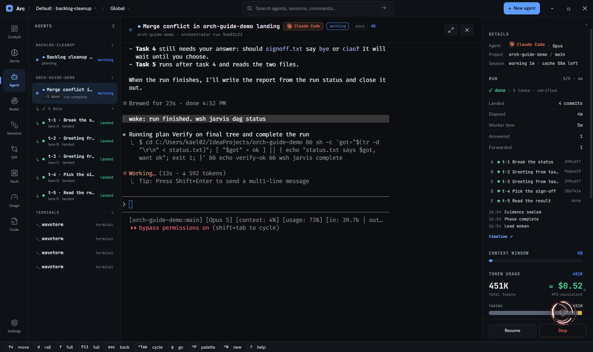

A goal-led lead reporting what it submitted, with its run row above it in the tree ("◆ backlog-cleanup ·
working · 0/13 done"). The lead stops there; the engine wakes it when it needs a decision:

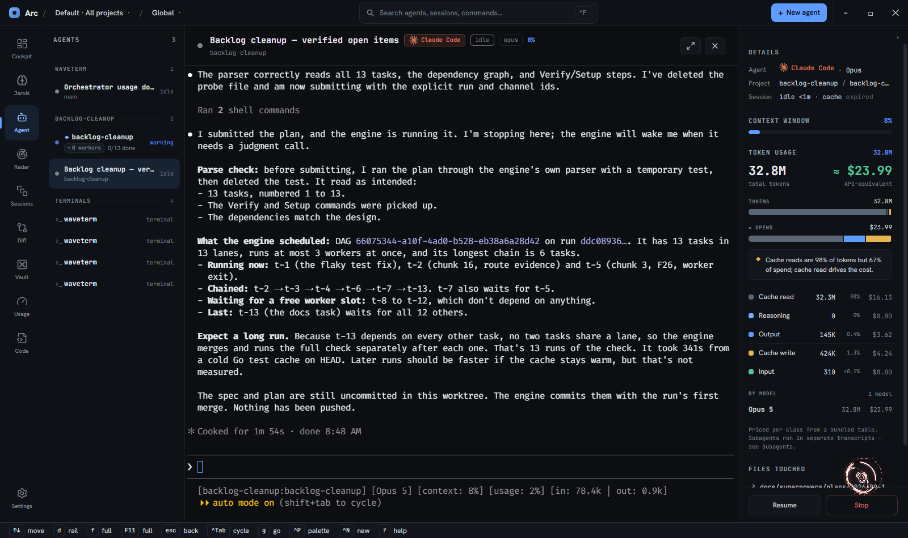

Between wakes the lead's conversation says nothing about the run, and the lead doesn't know about a task until a
wake names it. On the backlog run the lead's last turn was the t-9 merge conflict at 10:29. After that the engine
landed five lanes and dispatched t-6 without waking it. Watch the run in the rail's Run section or on the run
sheet, both of which read the DAG. The lead's row still says "working" the whole time. Claude Code's idle
notification sets the lead's status to `waiting`, and the roster shows `waiting` as working (`agentVMFromInput`,
`agentsviewmodel.ts`).

---

## When the run needs judgment

The engine wakes the lead by typing one self-contained line into its terminal (for example
`wake: Verify failed after merging task t-1 (exit 1). wsh jarvis dag status`). A wake that does not turn the
lead to working within 30 seconds is retried once; after that the lead counts as dead and its events come to
you.

| Event | The lead | What reaches you |
|---|---|---|
| **Merge conflict** at a lane merge | fixes it in the project checkout, commits, `wsh jarvis dag merge <task> --continue` | nothing, unless the lead forwards it or is dead |
| **Verify failed** after a merge | fixes it, commits, `dag merge <task> --continue` (re-runs Verify at HEAD) | same |
| **A worker's question** | answers from the spec, plan and code, or forwards a product call with a note | forwarded questions and any it does not answer within **10 minutes** |
| **Task failed** with its retry spent | `dag retry`, `dag escalate --model`, `dag skip`, or forwards | forwarded failures |
| **Worker hung** (15 min silent, process alive, no ask pending) | same as a failure | same |
| **Run finished** | writes the report, `wsh jarvis complete` | the Done face |

### Merge conflict and failed Verify

On the sandbox run, tasks 2 and 3 both landed, and the second merge conflicted. The sheet flagged it as
**blocked-merge** with a `resolve-merge` action, and the engine launched the plan run's first lead with the
conflict as its wake. Other lanes keep merging meanwhile:

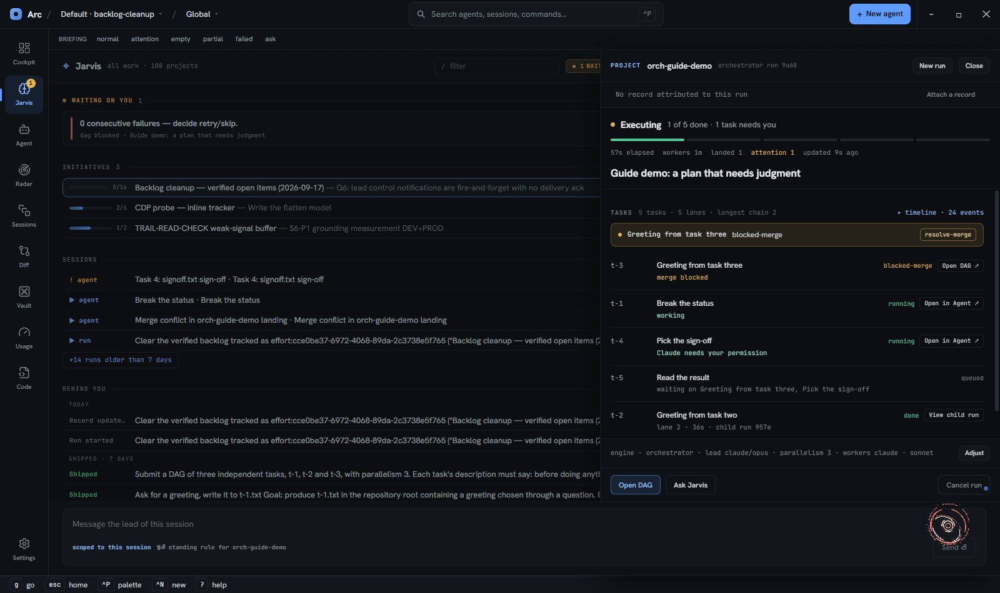

The lead resolved `greeting.txt` as the plan's notes said, committed and ran `dag merge t-3 --continue`. Task 1
had landed in the meantime with `status.txt` set to `broken`, so both merges' Verify runs failed; the engine
woke the lead with both lines in one message, it restored `status.txt`, committed, and continued both. The
timeline above records the whole sequence, conflict to **Verify passed**, in about two minutes.

To do it yourself: fix the tree in the project checkout, commit, then `resolve` on the DAG node (or
`wsh jarvis dag merge <task> --continue`).

### A worker asks a question

A worker's question goes to the lead first and stays off your Brief. While the lead holds it, the details
rail's **Run** section shows it with a countdown ("lead is answering · Nm left") and a **Take over** button
that moves it to you; the lead's `dag answer` is refused from then on.

A question the lead forwards, one it does not answer within 10 minutes, and one you take over all show up
under **Questions for you** on the run sheet, with the lead's note:

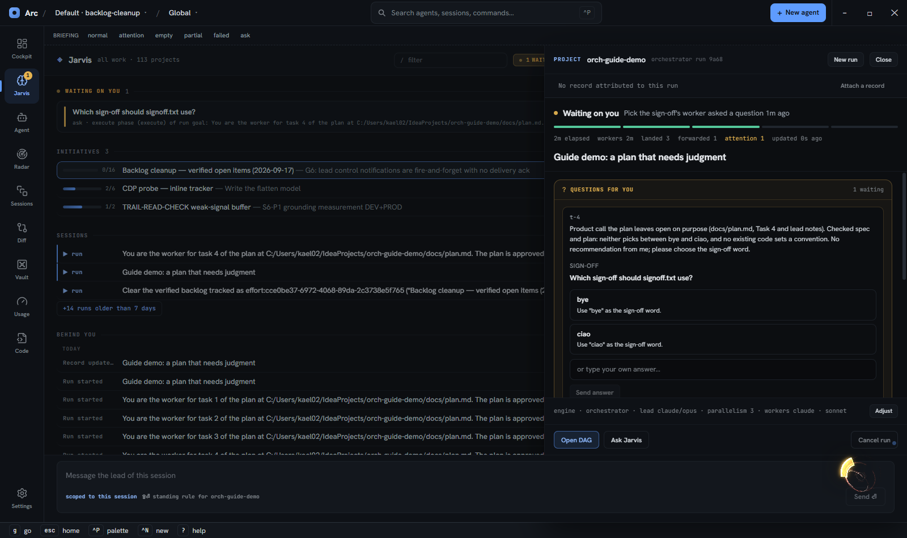

Pick an option or type an answer and **Send answer**. The worker continues, and the timeline records
`t-4 answered` (above). The sandbox worker wrote `ciao`, the option picked on this card.

### A task fails or hangs

A failed or stalled task shows on its row and in the DAG with `retry`, `skip` and `escalate`. The lead gets it
first; you see it when it is forwarded or the lead is dead. Retry and escalate stop the worker they
replace, so before you retry a stalled task, check its lane worktree under `.waveterm/worktrees/` for recent
writes: a worker that is still writing files is alive, and the stall signal is wrong.

To move a task to another model, use **escalate…** in the DAG's detail panel under the graph (it opens a
route picker, then **Re-queue on model**). Escalation is one hop per task.

### The lead is dead

Before `dag submit`: the run goes **Blocked** with a **Lead exited** row. Cancel it and start again.

After `dag submit`: the engine keeps merging and verifying, the timeline shows **Lead wake failed**, and every
judgment event and lead-held question comes to you. There is no relaunch-lead button; answer from the sheet
and act with the DAG buttons or `wsh jarvis dag`.

---

## Steering a live run

- **Talk to a worker.** Type into its terminal on the Agent surface. What you type is logged on the lead's run
  as a `you told t-2 · …` row and in `dag status`, so the lead sees it at its next wake. It wakes nobody.
- **Change parallelism or the workers' route.** **Adjust** on the settings line → **Worker parallelism**,
  **Worker route** → **Save settings**. It applies to dispatches from then on. **Save as project defaults**
  makes the next run start this way. Shape, machine and the lead's route are fixed at launch, and nothing
  already running changes.

  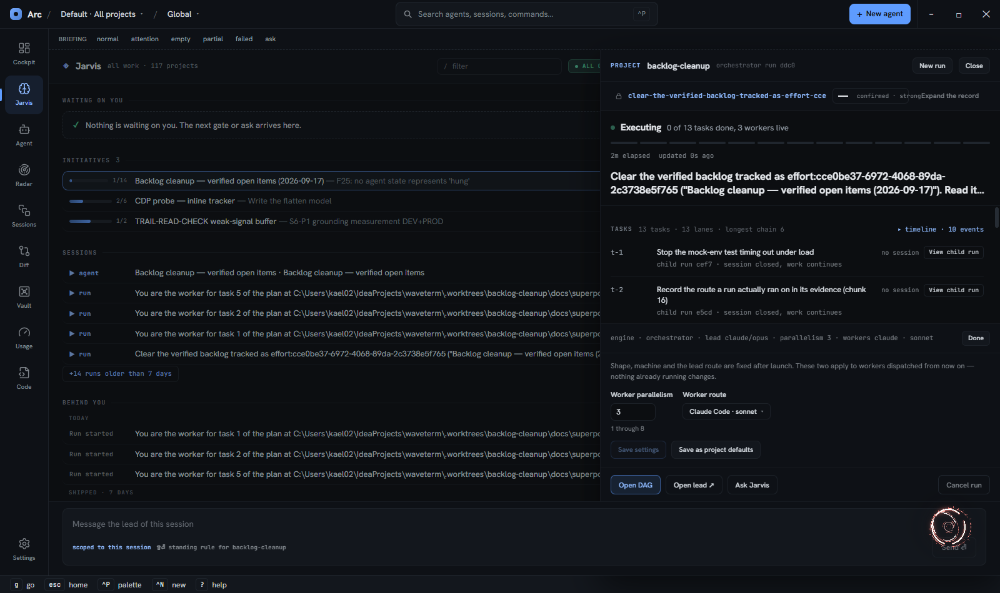

- **Cancel.** **Cancel run** is meant to confirm first ("Stop N running workers and cancel this run?
  Completed phases, transcripts, and artifacts are kept.", with **Keep running** to back out). On an engine
  run it does not: it cancels on the first click, kills the running workers and skips every task that had not
  started. See [Rough edges](#rough-edges-found-while-writing-this) — treat the button as immediate. If a
  worker survives the cancel, the sheet says so with **Take control** and **Stop** per worker.

---

## When the run ends

The sheet goes to **Done**: tasks, commits landed, wall clock, worker time, and **evidence sealed**. **What
landed** lists each task's commit; **Sealed evidence** has the diff stat and the lead's summary.

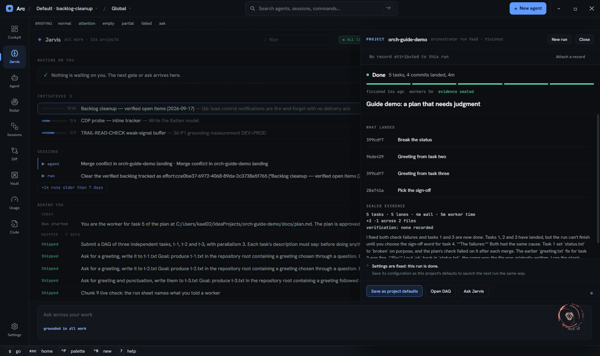

Finished workers stay on the Agent tree under **✓ N done**. Opening one shows its read-only transcript
("Session ended · landed `<sha>` · read-only transcript"), starting with the worker contract it was given,
and the rail names the branch it committed on:

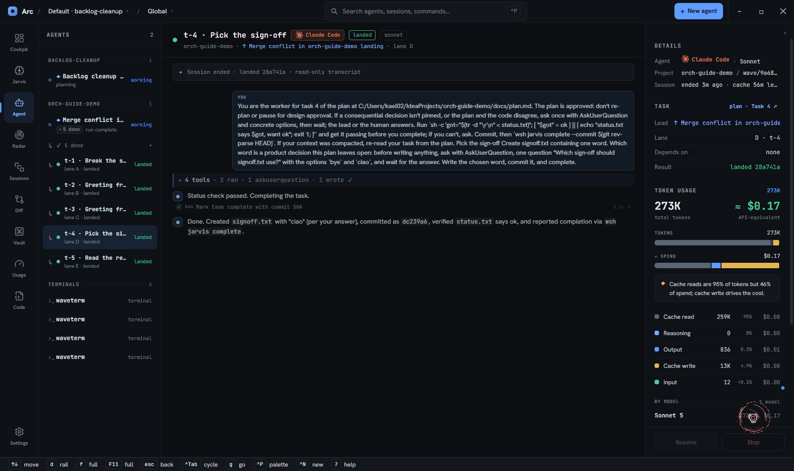

The run's commits are on the project checkout's branch. Review and merge that branch yourself.

The backlog run finished on 2026-09-18 after 3h12m of wall clock and 5h46m of worker time. All 13 tasks landed
as 13 squash commits on `backlog-cleanup`, and a merge Verify passed after every one of them. One earlier
attempt had timed out and been re-run. Its Done face:

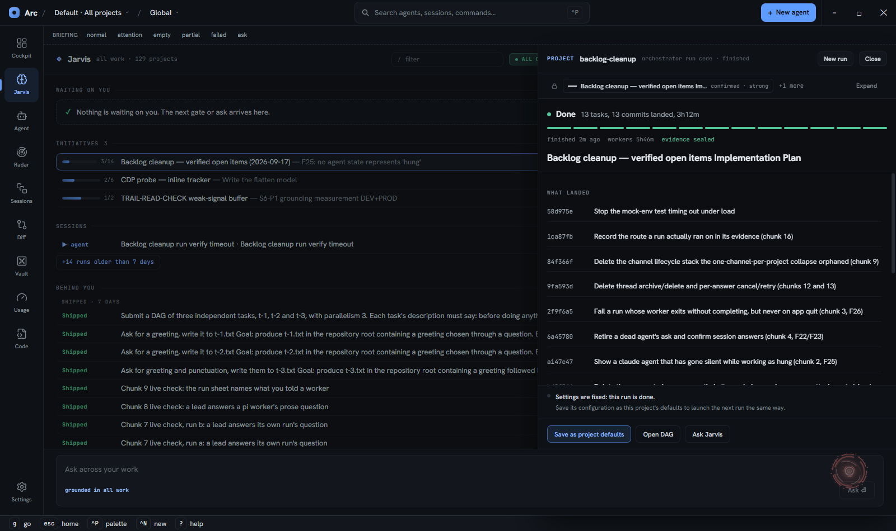

The finished DAG shows the plan's shape. Eight independent tasks ran up to three at a time, and the
t-3 → t-4 → t-6 → t-7 → t-13 chain ran one at a time behind them:

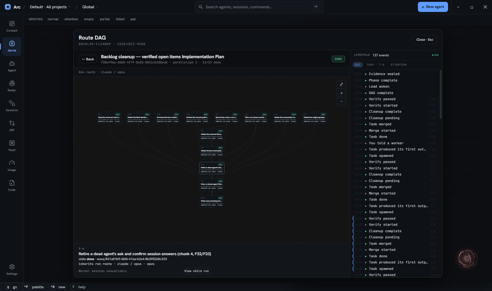

### Who wraps up

Done doesn't mean finished. The work after the last merge splits three ways:

| Work | Whose job | On the backlog run |
|---|---|---|
| The run's report | **The lead's.** Its rules say "run finished: write the report from `wsh jarvis dag status` (landed, unverified, answered, forwarded), then `wsh jarvis complete`" (`OrchestrationRules`, `leadprompt.go`). | Not written. The lead ran `complete` first, and the engine closed its tab before it could recover. The sandbox lead did the same, so expect it. |
| Closing the initiative's tracker chunks | **Nobody's.** The lead's rules never mention efforts, so it falls to whatever the plan says. | The plan gave it to workers through a header line they never see. The tracker read 3/16 with all 13 tasks landed. |
| Merging the branch, checking the fixes live in the app, committing anything | **Yours.** The engine lands work on the project checkout's branch and stops there. | Four fixes still need a live check once the branch is on `main` and running in the dev app. |

Until the first two are fixed, plan for them yourself:

- **Put "close the chunk" inside each task**, with the exact `wsh effort chunk status` command. Better still,
  close the chunks yourself after the run, using the landed commits from `dag status`.
- **Read the report from the lead's terminal, not the Done face.** If the sealed summary is a half-sentence,
  the lead ran `complete` before reporting. Its last full message is the closest thing to a report.

Two engine changes would close these gaps:

1. **Make the report impossible to lose.** `wsh jarvis complete` would take the report as an argument (for
   example `--report <file>`) and seal that. Closing the lead's tab only after its turn ends would also work,
   but the prompt already says "report, then complete" and two leads still got the order wrong. So carry
   the report in the command itself, rather than relying on the order.
2. **Let the engine close the tracker.** A plan task would name its chunk (a `**Chunk:**` line beside
   `**Depends on:**`), and the engine would mark that chunk done with the landed commit once the task's
   merge passes Verify. Closing chunks is deterministic bookkeeping, so it belongs in code. It also removes the
   lane-commit mix-up, since only the engine knows which commit landed.

### What the backlog run left open

The run merged to `main` as `5d87597b`. This list is the single record of what it left open; the rows it
closed in `docs/open-issues.md` point here.

- **Four fixes still need a live check in the dev app.** Restart `task dev` on the merged `main` first. Three
  of the four are backend changes, and a `wavesrv` started before the merge doesn't have them.
  - **F25, hung agents** (`a147e47d`): freeze a Claude Code agent mid-work, for example by suspending its
    process. After 3 minutes its row should read `hung · no output Nm`.
  - **F22/F23, questions and answers** (`6a457809`): answer a plain session's question while its agent is
    frozen. Within 30 seconds the card should come back noted "answer was sent but never confirmed". Also, an
    agent kept open after its process ended (`cmd:keeponexit`) should lose its pending question.
  - **F26, a killed worker** (`2f9f6a56`): kill a Quick run's worker process. The run should fail with a
    `worker-exited` event. Quitting the app mid-run should not fail it.
  - **Chunk 8, the record peek** (`b18487d0`, frontend only): open a record peek, raise its confirm and press
    Escape. Only the confirm should close, and focus should return to the peek.
- **Reopening a failed run's worker tab relaunches the worker** (F26's remainder). The run reads failed, but
  `ResyncController` restarts the block's persisted `cmd`/`args` as a fresh session whenever its terminal
  view remounts (`runworker.go`, `agentresumestore.ts`). After a quit, reopening that tab brings the worker
  back to life under a run the backend has already closed.
- **The hung overlay covers Claude Code only** (F25). pi is excluded until its TUI output is measured.
- **The frontend `deleteChannel` wrapper is gone.** It had no caller after `84f366fb` deleted the rest of the
  channel lifecycle stack. The `deletechannel` RPC and `DeleteChannelCommand` stay: `scripts/cdp/scenarios.mjs`,
  `scripts/cdp-e2e-runs-piece4.mjs` and `scripts/cdp-profile-verify.mjs` use it as their teardown.

---

## Tracking an initiative across runs

Big efforts live as initiatives (`wsh effort`, the Brief's **Initiatives** region). A run does not attach
itself to one: the goal names the effort, and chunks close only when an agent runs
`wsh effort chunk status <effort> "<chunk>" done --note "…"`. Nothing in the engine does it (see
[Who wraps up](#who-wraps-up)). To show a run against a chunk, attach it:
`wsh effort chunk attach <effort> "<chunk>" --run <run-oid>`. Expanding an initiative on the Brief shows each
chunk's status and note trail. On the backlog run the lead closed chunk 1 as already fixed, with its evidence,
before asking its first question. After that only t-4's worker closed any chunks.

---

## CLI: `wsh jarvis dag`

Inside a lead's or worker's terminal, the run is inferred. Elsewhere pass `--channel <id> --runid <id>`.

| Command | Does |
|---|---|
| `dag submit --plan <md> [--spec <md>]` | validate the plan and start the engine on it (one DAG per run) |
| `dag status` | per-task digest, the report numbers, landed commits, Verify and merge errors, what you told workers |
| `dag asks` | questions the lead holds, oldest first, with every option |
| `dag answer <task> <answers-json>` | answer as the lead |
| `dag forward <task> "<note>"` | hand a question, failure, stall or conflict to the human |
| `dag retry <task>` / `dag skip <task>` | retry or skip a failed or stalled task |
| `dag escalate <task> --model <id> [--runtime <rt>]` | re-queue on another model, once per task |
| `dag merge <task> [--continue]` | squash-merge a lane end, or finish a resolved conflict / re-run a failed Verify |
| `dag cancel <task>` | cancel the whole DAG (the task argument is required and ignored) |
| `wsh jarvis complete [--commit <sha>]` | finish the run or task; `--commit` scopes its evidence |

---

## Rough edges found while writing this

Seen live on 2026-09-17 and 18 or confirmed in code; none block a run.

- **Workers killed by a reboot are never noticed.** After the machine restarted mid-run, the backlog run's
  three workers were gone, but `dag status` still showed t-1, t-2 and t-5 `running` and the run `healthy`,
  waiting on them. Worker tabs are background tabs, so nothing relaunches them. Opening one would relaunch its
  block from the persisted `cmd:args`, which replays the original `--session-id` launch and full task prompt.
  Resume-on-reopen only bakes `--resume` into blocks that carry `agent:baseargs`, and engine-spawned workers
  don't (`agentresumestore.ts`). What worked: set each worker block's `cmd:args` to
  `--dangerously-skip-permissions --resume <its session id> --model <model> "<continue note>"`, then
  force-restart its controller (the `setmeta` and `controllerresync` RPCs). The worker keeps its tab, which is
  how the engine ties an exit or completion back to the task. Each worker found its uncommitted edits in the
  lane worktree and carried on, and all three completed onto their own tasks.
- **A slow Verify reads as a failed one.** Verify is capped at 20 minutes (`VerifyTimeout`,
  `pkg/orchestrate/plancmd.go`). The engine also writes the plan's Verify into every worker's contract ("Run
  `<Verify>` and get it passing before you complete", `engine.go`). So at parallelism 3 with a full-suite Verify
  (tsc, vitest, `go test ./pkg/...`), up to four copies of the suite run at once. The backlog run's first merge
  Verify ran past the cap. The task went to `verify-failed` with "timed out after 20m" and the tail of the output,
  in which every package shown had passed. The lead woke for it, timed the next package alone
  (`pkg/orchestrate`: 241s under that load), found nothing to fix and re-ran Verify with
  `dag merge t-1 --continue`. If your Verify is the full suite, lower parallelism or expect a timeout like this.
  The same load pushes a worker that is only waiting on its own test run past the stall threshold (t-9 went
  `stalled` after 17 idle minutes with its `go test` still using CPU). The lead checked the process and left
  it alone, and t-9 completed on its own about half an hour later.
- **Verify's output isn't shown while it runs.** It runs without a terminal, and its output is kept only when
  it fails. Streaming Verify's output live is still open.
- **A timed-out Verify keeps running on Windows.** The timeout kills only the Git Bash launcher
  (`exec.CommandContext` in `plancmd_windows.go`). The real `bash` under it and the `go test` it started are
  never killed. On the backlog run the first Verify's `go test` was still running 30 minutes after it
  started, competing with the re-run. Kill the orphan tree by hand; it is the `bash.exe -c "<Verify>"` whose
  parent has exited.
- **The sealed summary can be the lead's previous message.** The sandbox lead ran `wsh jarvis complete` in the
  same step as its final check, so the evidence captured its mid-run update, not a report. The backlog lead
  lost more. The engine closes a lead's tab as soon as its run and DAG are both terminal
  (`MaybeCloseOrchestratorLead`, `leadclose.go`), and `wsh jarvis complete` is what makes the run terminal. The
  lead ran it mid-turn, having just said it would check why the tracker read 3/16, and its tab was deleted
  before the command returned. It never closed a chunk or wrote a report. The sealed summary is that last
  line. Tell a lead to do every tracker update and write its report before it runs `complete`.
