# Driving the Jarvis orchestrator: a worked run

This is a walkthrough of the orchestrator as it actually behaves, written while using it to clear two
review backlogs. Every screenshot is from the run it describes; every command is one that was run.

> **Start with [`docs/orchestrator-guide.md`](orchestrator-guide.md)** for how the orchestrator works now:
> it covers every launch flow after the 2026-09 redesign, with screenshots from live runs. This file is the
> earlier worked run — keep it for the plan-gate and lane detail, but where the two disagree, the guide wins.

It is a how-to, not a design doc. The design lives in
[`docs/superpowers/specs/2026-09-09-orchestrator-plan-gate-design.md`](superpowers/specs/2026-09-09-orchestrator-plan-gate-design.md)
and [`docs/jarvis-orchestrator-plan-e2e.md`](jarvis-orchestrator-plan-e2e.md); the known rough edges
live in [`docs/open-issues.md`](open-issues.md).

## The shape of a run, in one paragraph

You start a run from `+ Run` on the Jarvis Brief. If the route resolves to the **engine** machine, the
lead agent's first job is to write a plan and submit it as a DAG; the engine holds that plan at a gate
until you approve it. On approval the engine — not the lead — spawns one child agent per ready task.
A chain of tasks, each the only one waiting on the task before it, is a lane: it shares one git worktree
and one branch, each child commits on top of the last, and the engine squash-merges the lane back once its
last task is done. You are involved at exactly three
kinds of moment: the plan gate, any question a child asks, and a merge that needs a decision — a
squash conflict, or a project tree with staged edits the engine will not commit into.

> **Update 2026-09-15 (orchestrator redesign, slice 5a):**
> - **Lead:** an engine lead no longer plans the dag in JSON. From a goal it brainstorms with you, writes the
>   spec and a plan in the plan format, and runs `wsh jarvis dag submit --plan <plan> --spec <spec>`. The plan
>   gate still holds it until slice 5c.
> - **Compaction:** once the lead submits, the engine types a `/compact` that keeps what you said and drops the
>   drafts. After any compaction the lead gets its orchestration rules back (`wsh jarvis dag rules`).
> - **Workers:** every worker's prompt opens with a contract that names its task in the plan.
> - **Dead lead:** a lead that exits before submitting fails the run with a `Lead exited` row.
>
> **Update 2026-09-16 (orchestrator redesign, slice 5c):** the plan gate is **gone**, and with it the
> pipeline and adaptive shapes, the `MaxDagTasks` cap, `wsh jarvis triage` / `hold`, and `dag init` /
> `dag import-tasks`. A submitted plan now dispatches its first layer immediately — there is no
> approval step between submit and the first child, and no card to approve. There is one shape that
> fans out (Orchestrator), one machine (the engine), and `dag submit` takes `--plan` only.
>
> **Everything below Phase 2 is a record of a run driven on 2026-09-09, not instructions for today.**
> The screenshots and the gate narrative are kept because the failure analysis in Phases 5–8 is still
> the best account of how the engine behaves under load; read the gate steps as history.

Everything else is machinery. The rest of this document is what that machinery looks like from the
outside, and what to do when it stops.

---

## Phase 0 — what has to be true before you launch

Three preconditions. None of them are optional, and each one has burned a run before.

### 1. The project must be a git repo, and it must be the repo you want touched

The engine gives every lane one linked worktree under
`<project>/.waveterm/worktrees/<runID>-<taskID>`, keyed by the lane's first task, on a branch named
`wave/<key>` (`pkg/orchestrate/worktree.go`, `pkg/orchestrate/lane.go`). No git repo, no worktrees — every child is spawned into the project
directory itself and they overwrite each other.

Because merges land on whatever branch the project has checked out, the project should not be a
checkout somebody else is working in. For this run the project is a dedicated worktree:

```bash
git worktree add -b review-fixes .claude/worktrees/review-fixes main
cd .claude/worktrees/review-fixes && task worktree:prepare
```

`task worktree:prepare` is a Windows-specific step and it matters more than it looks. It junctions
`node_modules`, `src-tauri/target` and `dist/bin` in from the main checkout. A fresh worktree has
none of them, so a child that runs `npx vitest` in an unprepared tree fails on a missing dependency
and spends its one question asking you why. **The engine runs it for you when the plan says so:** a plan
line `` **Setup:** `task worktree:prepare` `` runs in every new worktree before its worker starts, and
a Setup that fails fails the task with kind `setup`.

### 2. The backend running the run must already contain any backend fix the run depends on

The dev app builds `wavesrv` from the checkout at launch. A child that edits `pkg/orchestrate` is
editing the source of the process currently scheduling it, and that edit does not take effect until
the app is rebuilt and restarted. So anything the run itself relies on has to be fixed and committed
*before* launch, by hand.

One such fix was needed here. The engine flagged a child stalled when it had written no transcript
within five minutes of spawning (`FirstTokenDeadline`). That signal was falsified in a live run on
2026-09-05: all four children wrote no transcript at all for their entire successful lifetime, and
tasks measured 274-308 s against a 300 s deadline. A false stall hands the lead a retry, and retry
discards the worktree — so the run could have destroyed finished work while reporting a stall.

The fix narrows the deadline to runtimes whose transcript is written per event:

```go
// pkg/orchestrate/liveness.go
var firstTokenRuntimes = map[string]bool{"pi": true}
```

`claude` and `codex` children that have written nothing now stay `running`; only the worker-exit hook
catches them if they die. `StallThreshold` is untouched, because it needs a transcript to exist
before it can age one. Committed on the project branch as `5ac53913` before anything launched.

A second fix was found the same way, by asking what the engine would do to a worktree that
`task worktree:prepare` had touched. Post-merge cleanup removes a task's worktree with
`git worktree remove --force` (`CleanupTaskWorktree` -> `RemoveRunWorktree`), and on Windows that
**deletes through a junction**. Thirty seconds of proof:

```bash
git worktree add --detach /tmp/probe-wt HEAD
cmd //c mklink //J "$(cygpath -w /tmp/probe-wt/link)" "$(cygpath -w /tmp/real-dir)"
git worktree remove --force /tmp/probe-wt   # -> real-dir's contents are gone
```

Every child in this run junctions `node_modules`, `src-tauri/target` and `dist/bin` in from the main
checkout. The first merge would have taken all three with it — including the `node_modules` the dev
app driving the run was running from. The fix unlinks the reparse points first, the same ordering
`scripts/worktree-junctions.mjs` already uses:

```go
// pkg/orchestrate/worktree.go — before `git worktree remove --force`
unlinkReparsePoints(wt)
```

Note the detail that a naive fix misses: on current Go a junction reports as `ModeIrregular`, not
`ModeSymlink`, so a check for symlinks alone finds nothing. An earlier version of this section cited a
commit, `f927dea9`, that never reached the repository. The fix landed on 2026-09-15, as the first task of
the orchestrator redesign's slice 4c plan.

The general lesson is the one worth carrying: **before the first merge, know what the engine deletes
and what it deletes through.** The destructive step runs unattended, after the part you were
watching.

### 3. The machine must be the one you think it is — *resolved in slice 5c*

**This trap is gone.** It was the one that silently did nothing: the DAG, the managed worktrees and the
child spawning described in this document were all properties of the **engine** machine, an **adaptive**
run got none of them, and two disagreeing defaults decided which you got — the `+ Run` modal always sent
the machine explicitly, while any launch that omitted it fell to a backend rule that gave engine to a `pi`
route and adaptive to every other runtime. A claude-routed launch that said nothing got an adaptive lead,
and nothing in the run panel afterwards said "you asked for the other thing".

Slice 5c deleted the adaptive machine and the control that chose it. Every orchestrator is an engine run,
so there is nothing left to pick wrong. A run stored before the deletion keeps whatever machine it was
created with and still renders; its settings sheet is read-only, because an adaptive lead has no scheduler
to reconfigure.

### 4. The lead's harness must be claude or pi, with its packages installed

Run workers, leads and task workers alike, run on Claude Code or pi only (2026-09-14). codex and opencode
still answer consults but cannot be picked for a run; `docs/deferred.md` records what it would take to bring
them back.

A pi lead needs two packages that Claude Code gets for free:

- **The ask tool, `@juicesharp/rpiv-ask-user-question`.** Without it a pi child has no structured way to ask
  a question, so the ask never reaches Wave to be answered or escalated.
- **The superpowers package.** The lead plans with `brainstorming` and `writing-plans`. pi's `skills` setting
  points at `~/.claude/skills`, which holds hand-written skills only; Claude Code's plugin skills live in the
  plugin cache, which pi never reads. Install superpowers into pi itself, in `~/.pi/agent/settings.json`.

---

## Phase 1 — launching the run

### Write the goal before you open the modal

The lead's goal is the only thing every child inherits, and the run is only as good as it. For this
run the goal is ~5,500 characters and does six things, in order: name the spec to read, fix the
number of tasks and which chunk is excluded, state the dependency edges, say what each task
description must contain, pre-answer the decisions children would otherwise stop and ask about, and
set scope discipline.

The dependency edges are the part that is easy to get wrong and expensive to get wrong. Children
work in isolated worktrees off the same base, and their branches are squash-merged one at a time.
**Two children editing the same file is a merge conflict, not parallelism.** Chunks 2 and 6 both
touch `briefsurface.tsx`, which chunk 5 restructures, so they were made to depend on 5 rather than
run beside it.

That serialization only pays off because of how the engine picks a base commit. In `scheduleLocked`
(`pkg/orchestrate/engine.go:303`):

```go
spawnBase := owner.BaseCommit
if g.MergeRequired {
    spawnBase, err = ProjectHeadCommit(spawnCtx, owner.ProjectPath)
}
```

Each dispatch wave re-resolves to the project's *current* HEAD, so a child dispatched after a merge
branches from the merged state. Merging each finished child before dispatching its dependents is
therefore not bookkeeping — it is what keeps the dependent from re-deriving a file that has already
moved.

### The modal

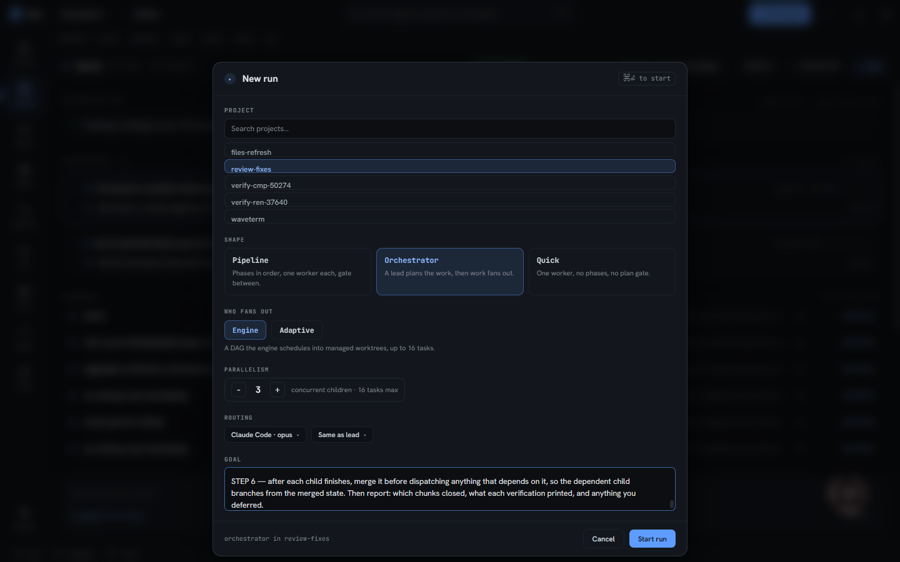

Six controls, all of them load-bearing:

| Control | Set to | Why |
|---|---|---|
| Project | `review-fixes` | The list comes from `projects.json`, not from your channels. A repo you have only talked about in Jarvis will not appear here — register it first. |
| Shape | Orchestrator | Quick is one worker, no lead, no plan. Only Orchestrator fans out. |
| Start from | A goal | A goal gets a lead that brainstorms it with you. A plan file starts the engine at once, and a lead appears only when something needs judgment (`runLauncherFace`, `runconfig.ts`). |
| Parallelism | 3 | Ceiling is `MaxParallelism = 8`. (There is no cap on plan size: `MaxDagTasks` was deleted in slice 5c — a plan is bounded by what it expresses.) 3 is a deliberate choice: enough overlap to be worth it, few enough merges to stay legible. |
| Lead route | `Claude Code · opus` | The lead writes the plan, answers the children's asks and resolves the merges the engine stops on. It is the one worker whose judgment is not recoverable by a retry. |
| Worker route | Inherit the lead | Children inherit unless told otherwise. |

The route picker is a portalled floating panel, not a `<select>`: the trigger carries
`data-testid="route-picker"` and each row `data-testid="route-option-<runtime>-<model>"`, which is
also what makes it drivable from CDP.

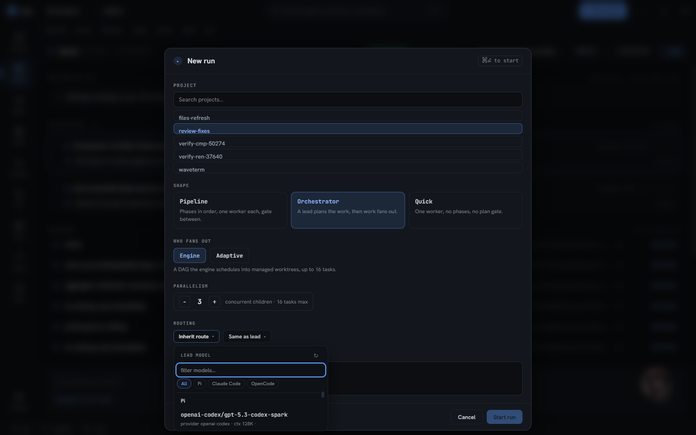

### Keep "Hold the plan for review" on

The run panel carries the gate toggle, and it is the difference between reviewing a plan and finding
out what it was. Left on, the engine parks the submitted DAG in `AwaitingPlan` and dispatches nothing
until you approve.

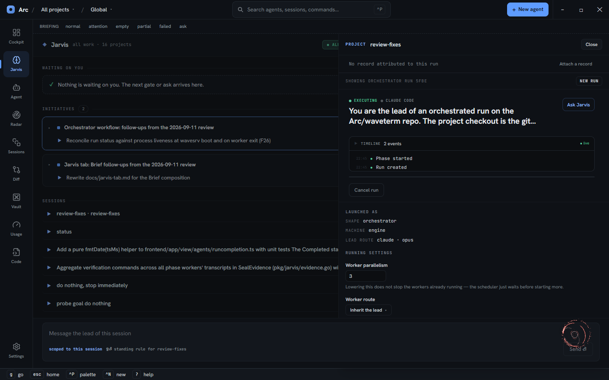

The launch summary underneath is the receipt: `SHAPE orchestrator`, `MACHINE engine`,
`LEAD ROUTE claude · opus`. If any of those three is not what you meant, cancel now — none of them
can be changed on a live run. Parallelism and the worker route can (they apply to workers dispatched
from that point on); the shape, machine and lead route cannot.

---

## Phase 2 — the plan gate

Five and a half minutes after launch the lead stopped and the Brief grew a row (run created
22:45:16, DAG submitted 22:50:46 — both from the store, not from the session row's rounded age):

> **PLAN GATE** — Approve the plan before any worker starts.
> 7 tasks planned, none dispatched. Approving is what spawns the first worker.

That second sentence is the whole design. Until you click, the engine has created nothing: no
worktrees, no branches, no child processes. The cost of sending a plan back is a few minutes of lead
time. The cost of approving a bad one is seven agents editing a repo.

### Two places show you the plan, and only one lets you act

`Open DAG` on the run gives the **Route DAG** view — the graph, which is the only place the shape is
legible at a glance:

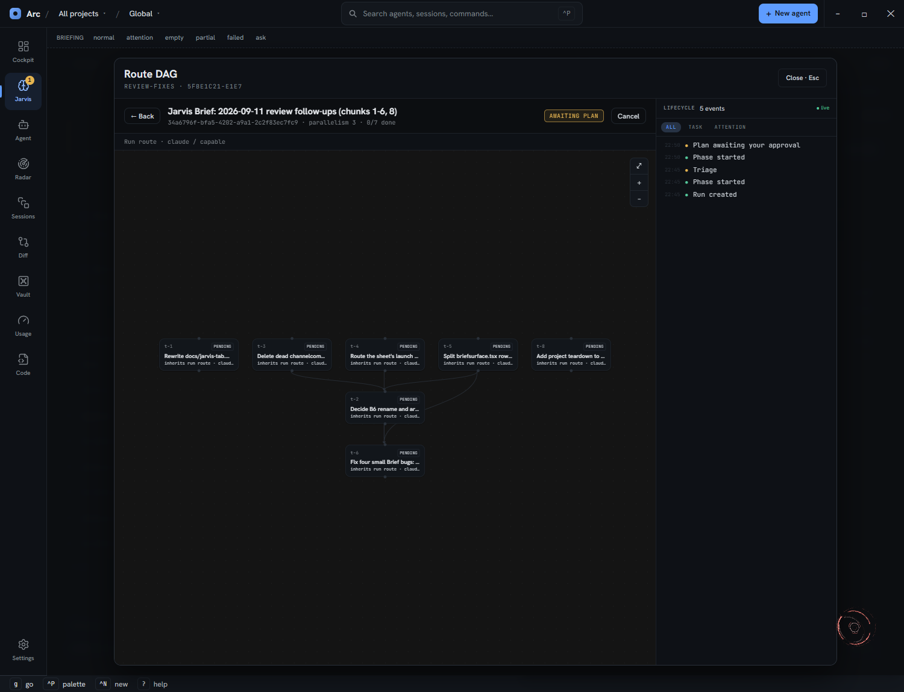

Five roots across the top, `t-2` below fed by `t-3` and `t-5`, `t-6` at the bottom fed by `t-2`,
`t-4` and `t-5`. The header carries `AWAITING PLAN`, `parallelism 3`, `0/7 done`. What it does *not*
carry is an approve button — only `Cancel`. The decision lives back in the run transcript, on the
plan gate card:

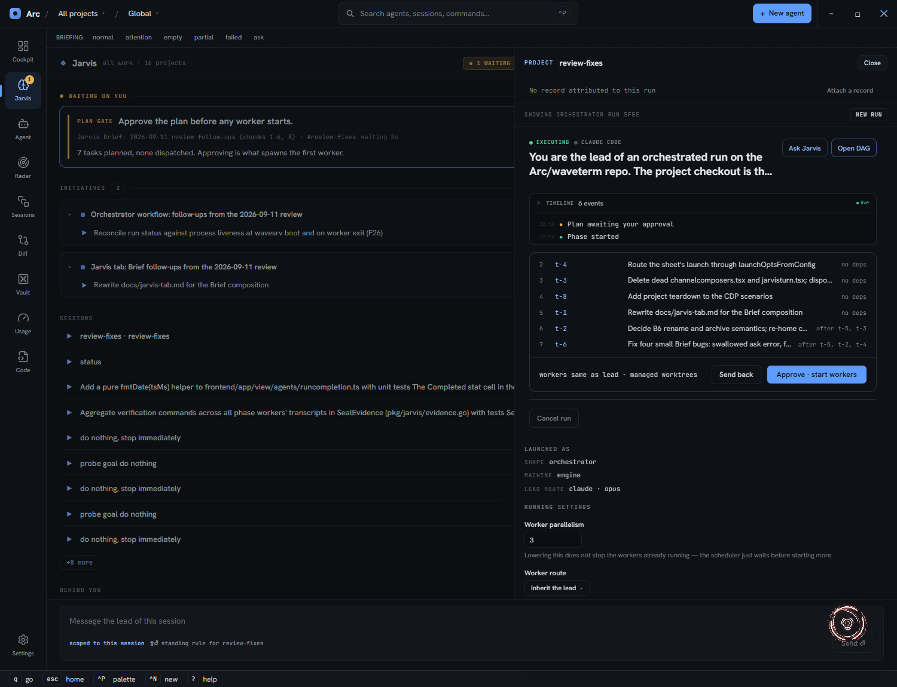

So reading the plan and approving it are two different screens, and you navigate between them with
`← Back` / `Open DAG`. Worth knowing before you go looking for a button that is not there.

Two smaller things the screenshot shows that are easy to miss:

- **The card is taller than the sheet, and the button is at the bottom.** The card itself does not
  scroll — `plangatecard.tsx:55` is `overflow-hidden` with no max-height — so the whole plan is
  rendered and it is the run sheet behind it that scrolls. Which means the natural way to reach
  `Approve · start workers` (scroll to the button, or `scrollIntoView` it, which is what produced
  the screenshot above) leaves the top of the plan behind you: task 1 of 7 is off-screen upward.
  Scroll back up to the card header before you decide. If you review only what shares a screen with
  the button, you review six of seven tasks.
- `workers same as lead · managed worktrees` in the card's footer is the last chance to catch a
  route you did not mean. After approval it is settled for every child.

### What is worth checking before you click

The gate is not a formality, and "the plan looks reasonable" is not a review. Four checks, in
increasing order of how expensive they are to get wrong:

**1. The task count and the exclusions.** The goal asked for exactly seven tasks and named the one
chunk to leave out (chunk 7 needs a live dev app, and there is one dev app). The card says
`7 tasks · 3 layers`. Count them.

**2. The dependency edges, against the ones you specified.** The card renders them as
`after t-5, t-3`, which is readable but easy to skim. The authoritative form is in the store:

```js
// scratchpad/dag.mjs, over the app's own RPC
const st = await h.rpc("dagstatus", { channelid, runid });
for (const t of st.group.tasks) console.log(t.id, JSON.stringify(t.deps ?? []));
```
```
t-5 []            t-4 []            t-3 []            t-8 []            t-1 []
t-2 ["t-5","t-3"]
t-6 ["t-5","t-2","t-4"]
```

**3. Which files two parallel tasks both name.** This is the check the UI cannot do for you, and the
one that actually prevents merge conflicts. Extract file paths from every task description and
intersect them against the tasks that can run at the same time:

```
briefsurface.tsx   t-5, t-1, t-2, t-6
docs/open-issues.md    t-3, t-2
docs/deferred.md       t-3, t-2
```

Both doc collisions are between `t-3` and `t-2`, and `t-2` depends on `t-3` — serialized, fine.
`briefsurface.tsx` is named by four tasks, but `t-2` and `t-6` both depend on `t-5`, and `t-1` is a
documentation task whose description explicitly forbids touching code. The one genuinely parallel
pair, `t-5` and `t-1`, is a writer and a reader. No conflict.

Do this before approving, not after the first merge fails.

**4. Whether the descriptions survived the goal.** A lead can restate a constraint into
uselessness. Things the goal pinned and the descriptions had to still contain: the
`task worktree:prepare` first command, the chunk's note trail quoted verbatim, the right 1-based
position in the `wsh effort chunk status` line, the `--stack-size=4000` typecheck rather than
`npx tsc`, and — for the two tasks whose line numbers a sibling task is about to invalidate — an
explicit instruction to locate by symbol. That last one survived intact:

> LINE NUMBERS ARE ARCHAEOLOGY, NOT ADDRESSES. The pointers in this chunk's notes were taken BEFORE
> the task you depend on split `briefsurface.tsx` [...] LOCATE BY SYMBOL: grep for the profile
> control, for the Brief header component, for `renameChannel` / `deleteChannel` [...] Never trust a
> line number from these notes.

### Approving, and what happens in the next thirty seconds

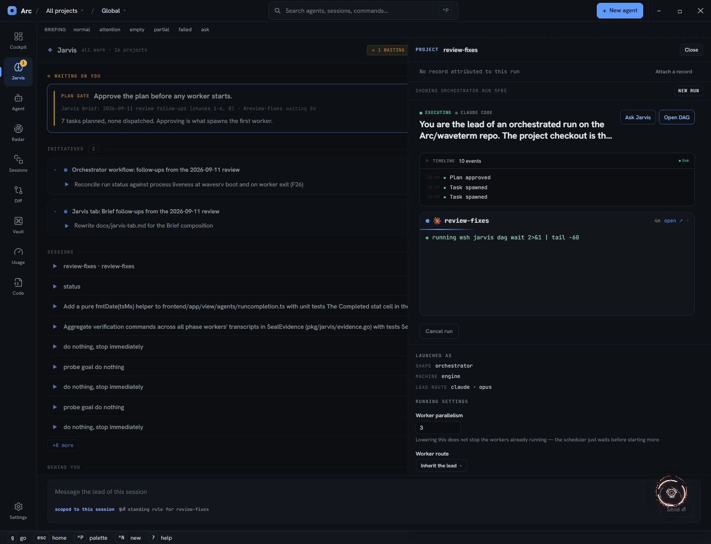

*The attention row still reads PLAN GATE / WAITING ON YOU in this frame — it trails the store by a
few seconds. The timeline underneath is already correct: `Plan approved` then `Task spawned`.*

`Approve · start workers` calls `dagaction` with `action: "approve-plan"`. The state moves
immediately:

```
before   status=awaiting-plan   counts: running 0, dependencywaiting 2   next: plan-gate
after    status=running         counts: running 3, dependencywaiting 2   next: parallelism-wait
```

Three of the five root tasks went to `running` — the parallelism ceiling, not the number of ready
tasks. `t-8` and `t-1` are ready and waiting for a slot; the digest names this honestly as
`parallelism-wait` and lists what is blocking. Three worktrees appeared:

```
.waveterm/worktrees/5fbe1c21-…-t-3   branch wave/5fbe1c21-…-t-3   at f927dea9
.waveterm/worktrees/5fbe1c21-…-t-4   branch wave/5fbe1c21-…-t-4   at f927dea9
.waveterm/worktrees/5fbe1c21-…-t-5   branch wave/5fbe1c21-…-t-5   at f927dea9
```

All three at `f927dea9`, the project branch tip — `spawnBase` resolved to project HEAD, as
Phase 1 said it would.

And within seconds each child had run `task worktree:prepare`, which is where Phase 0's second fix
stops being theoretical:

```
t-3/node_modules -> /c/Users/cktra/Projects/waveterm/node_modules
t-4/node_modules -> /c/Users/cktra/Projects/waveterm/node_modules
t-5/node_modules -> /c/Users/cktra/Projects/waveterm/node_modules
```

Note the target: the **main checkout**, not the project worktree. `worktree-junctions.mjs` resolves
its source from the first line of `git worktree list`, which is always the main checkout, so a
worktree-of-a-worktree still junctions one level — no chain. It also means three live junctions now
point at the `node_modules` the dev app running this whole exercise is loaded from, and the first
`git worktree remove --force` would have followed one. That is the run this fix was written for.

---

## Phase 3 — execution, and the two things that went wrong

Once the workers are running there is very little to click. The run sheet shows the lead's prompt,
`EXECUTING`, and a `Worker parallelism` field you can lower live; the Brief shows the initiatives and
a `WAITING ON YOU` list that should be empty. That is the steady state, and most of a run is spent
in it:

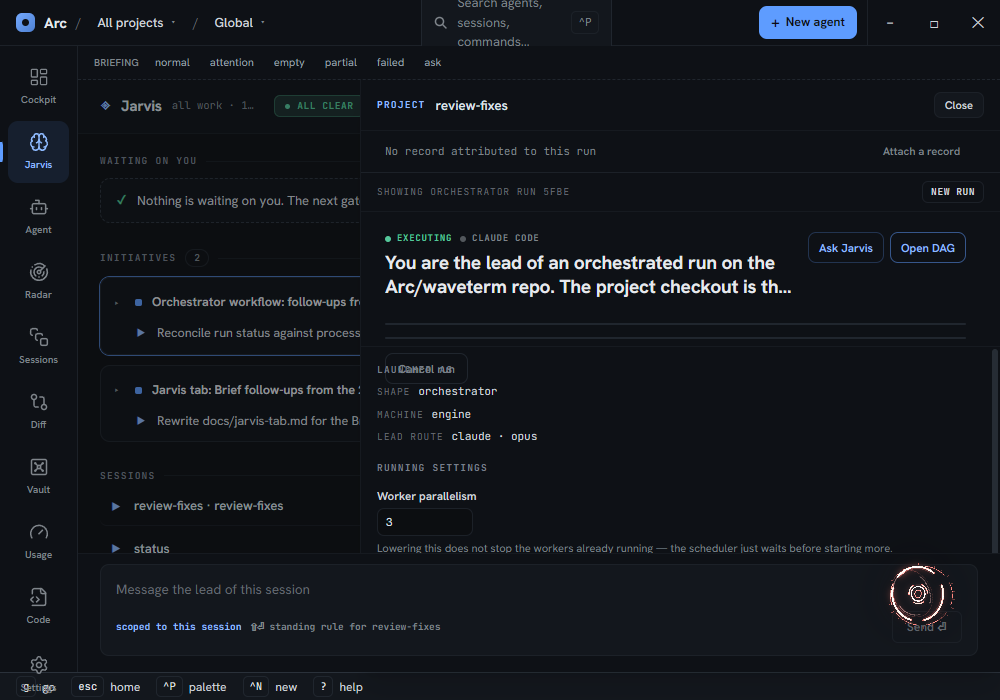

The interesting part is what you can only see from the store. Two things happened in the first
twenty minutes that the UI does not tell you, and one of them is a bug that will bite every run
until it is fixed.

### The five-minute deadline did not fire — and not for the reason I expected

All three children spawned at 22:59:10 and wrote no transcript at all. `FirstTokenDeadline` is five
minutes, so on the reasoning behind Phase 0's first fix they should all have been flagged stalled at
23:04:10. At 23:08:53 they were not:

```
t-5    running    act=22:59:10
t-4    running    act=22:59:10
t-3    running    act=22:59:10
counts: {"total":7,"done":1,"running":3,"stalled":0,"recoveredretry":0}
```

`stalled: 0`, nine minutes after spawn. I wrote this down as the payoff for `5ac53913` — the commit
that armed the deadline for pi only. Reading the code again after the run, that is not what happened,
and the truth is more interesting.

The deadline's condition (`engine.go:245`) requires `t.LastActivity == 0`:

```go
if spawned := spawnTs(runs[t.RunID]); firstTokenArmed(runs[t.RunID]) && t.State == TaskState_Running &&
    t.LastActivity == 0 && spawned > 0 && now-spawned > FirstTokenDeadline.Milliseconds() {
```

But `LastActivity` is never zero for a spawned task, because dispatch seeds it
(`engine.go:366`, `g.Tasks[taskIdx(g, taskID)].LastActivity = now`). The one branch that clears the
seed — `if !tracked { t.LastActivity = 0; continue }` — `continue`s straight past the deadline check.
So there is no path on which the condition can be true in a live run: either the seed survives and
the check is false, or the seed is cleared and the check is skipped.

**`FirstTokenDeadline` is unreachable in production.** It fires only in tests, which set
`LastActivity = 0` by hand. `5ac53913` is still correct — it stops claude being judged by a clock its
transcript never runs — but it was never what saved this run, and I should not have claimed it was.

Keep this in mind through the next section, because it is the same mechanism from the other side:
the seed that makes the five-minute deadline unreachable is the seed that makes the fifteen-minute
one fire on everything.

### The first merge, and the slot refilling

At 23:12:19 `t-4` finished and the lead merged it, and the engine dispatched `t-8` into the freed
slot within seconds. The merge is a squash, and the message is engine-generated from the task label:

```
e9584caf run 5fbe1c21-…-t-4: Route the sheet's launch through launchOptsFromConfig
 frontend/app/view/agents/userunconfig.ts   | 46 ++++++++++++++
 frontend/app/view/jarvis/briefsheet.tsx    | 43 +++-----------------
 frontend/app/view/jarvis/newruncontrol.tsx | 35 +++------------
 3 files changed, 57 insertions(+), 67 deletions(-)
```

Two things worth noticing. The child's own commit messages do not survive the squash — the merge
commit is one subject line with no body and no trailers, so whatever a child writes in its commit is
invisible downstream. And **the merge needed nothing from me**. I had expected a merge gate; with
`MergeRequired` and a live lead, the lead merges and the operator is never asked. The three operator
moments are really two: the plan gate, and anything a child asks.

After the merge the child's branch is deleted and its worktree is left checked out at the merged
tip. The worktree directory stays on disk — that is the cleanup debt the startup sweep in
`cmd/server/main-server.go` exists to retry.

### The false stall — a live bug, and the operator's correct move is to do nothing

> **Fixed 2026-09-14** (orchestrator redesign, slice 1). A readable but empty transcript now clears the
> spawn seed, so a write-less claude child stays `running` and a write-less pi child is flagged by the
> 5-minute first-token deadline. The fix differs from the one proposed below in one respect: the
> `continue` stays. The seed, not the `continue`, hid a tracked child from the deadline, and an
> untracked pi child let past it would be judged on a transcript the probe cannot read.

At 23:14:35 — the first liveness tick after `StallThreshold` (15 minutes) had elapsed since their
22:59:15 spawn — `t-5` and `t-3` flipped to `stalled`:

```
health: stalled | next: human-action  taskids=[t-5, t-3]  actions=[retry, skip, escalate]
t-5    stalled    act=22:59:10
t-3    stalled    act=22:59:10
t-8    running    act=23:11:27
```

Both were fine. `t-3` wrote `docs/open-issues.md` at **23:14:56 — 46 seconds after being declared
stalled**. `t-5` had written four files at 23:12:43–23:13:08 and produced a `test-results.xml`. The
verdict was simply wrong.

The cause is a guard that tests the wrong thing. `pkg/orchestrate/engine.go:230`:

```go
activity, tracked := lastActivityForRun(runs[t.RunID], dagSessionMarker(g.OID, t.ID))
if activity > t.LastActivity {
    t.LastActivity = activity
}
// no readable activity source: the spawn-time seed would age into a stall on its own and hand
// the lead a retry that kills a working child. Report freshness unknown (zero) instead — a
// missed stall only costs a timeout.
if !tracked {
    t.LastActivity = 0
    continue
}
if t.State == TaskState_Running && t.LastActivity > 0 && now-t.LastActivity > StallThreshold.Milliseconds() {
    t.State = TaskState_Stalled
}
```

The comment describes exactly the failure that happened, and the guard does not prevent it.
`lastActivityForRun` returns `(0, true)` when the runtime is *observable in principle* — claude is in
`livenessRuntimes`, the worktree cwd is known — but the transcript scan matched nothing. `tracked`
is true, so the `continue` is skipped; `activity` is 0, so `t.LastActivity` keeps its spawn-time
seed; and fifteen minutes later that seed ages into a stall.

The fix is to widen the condition *and drop the `continue`*:

```go
if !tracked || activity == 0 {
    t.LastActivity = 0
}
```

Widening it alone is not enough, and keeping the `continue` would be actively wrong: the `continue`
is what makes `FirstTokenDeadline` unreachable, as the previous section worked out. Dropping it
restores the deadline for pi (which is the runtime it is armed for, and which does write a transcript
per event, so "written nothing" there really does mean hung) while clearing the seed for claude, whose
`StallThreshold` check then never runs because it requires `LastActivity > 0`. One edit, both halves.

And the scan matches nothing because there is nothing on disk for it to match. This is worth stating
precisely, because I got it wrong the first time I wrote this section and the correct version is a
sharper finding than the one I replaced.

`scanSessions` (`pkg/orchestrate/liveness.go:181`) will only accept a file that is a `.jsonl`, whose
*contents* record the child's cwd, and whose opening lines mention the task marker. A claude session
writes that `.jsonl` when the session ends. For the entire life of a claude child — which is exactly
the window in which liveness matters — the file the engine is looking for does not exist yet.

Checking the disk the next morning makes the shape plain:

```
t-1  killed mid-flight   dir=yes   jsonl=0   tool-results/*.txt = 3
t-2  killed mid-flight   dir=yes   jsonl=0   tool-results/*.txt = 2
t-3  finished + merged   dir=no    jsonl=0
t-4  finished + merged   dir=no    jsonl=0
t-5  finished + merged   dir=no    jsonl=0
t-8  finished + merged   dir=no    jsonl=0
```

Only the two children that were killed left a `~/.claude/projects/<slug>/` directory at all; the four
that completed left none, and nothing in `pkg/orchestrate` deletes one, so I cannot say why. Either
way the conclusion holds in the direction that matters: **for a claude child there is never a
transcript to read while it is alive**, so `lastActivityForRun` returns `(0, true)` for its whole
life and the spawn seed ages into a stall at 15 minutes, every time.

The same listing contains the fix for the follow-up problem. A claude child spills large tool results
to `<slug>/<sessionuuid>/tool-results/*.txt` *as it works*, and those mtimes tracked both killed
children accurately — `t-1` at 23:20:48, 23:22:15, 23:22:21; `t-2` at 23:24:16 and 23:34:06. That
directory is the one `scanRoot` (`liveness.go:167`) already computes from
`agentobserve.SlugifyCwd(cwd)`. A heartbeat can stat the newest file under it instead of parsing a
`.jsonl` that will not exist until the child is gone. One caveat before trusting it: spilling depends
on tool-result size, so silence there is not proof of death — it is a positive liveness signal only.

`5ac53913` fixed the five-minute half of this. The fifteen-minute half is still live.

The cleanest way to be sure of a diagnosis is to predict with it. `t-8` spawned at 23:11:27, so if
the cause above is right it must be declared stalled at 23:26:27 and not before, regardless of what
it is doing. It wrote `scripts/cdp/scenarios.mjs` at 23:24:49, `scripts/cdp/verify.mjs` at 23:25:03
and a passing `test-results.xml` at 23:25:27 — and was declared stalled at **23:26:38**, the first
engine tick after the predicted second, roughly eighty seconds after its last write. It then finished
at 23:36:09 and merged clean at 23:38:15, ten minutes after the engine gave up on it.

By the end of the run the census was complete, and it is worse than "a bug that sometimes fires."
Six children, six spawns, five stall verdicts — **four demonstrably false, one unverifiable**:

| task | spawned  | stalled  | finished | last write | verdict                       |
|------|----------|----------|----------|------------|-------------------------------|
| t-4  | 22:59:15 | —        | 23:11:29 | —          | beat it by 2m46s              |
| t-5  | 22:59:15 | 23:14:35 | 23:21:00 | —          | false — finished after        |
| t-3  | 22:59:15 | 23:14:35 | 23:20:21 | —          | false — finished after        |
| t-8  | 23:11:29 | 23:26:38 | 23:36:09 | —          | false — finished after        |
| t-2  | 23:21:41 | 23:37:14 | killed   | 23:34:06   | false — working 3m08s before  |
| t-1  | 23:20:21 | 23:35:38 | killed   | 23:22:21   | unknown — idle 13m17s before  |

Three of those are proven by the child finishing after the engine gave up on it. `t-2` is proven by
disk: its last spilled tool result was written three minutes before it was called stalled. `t-1` is
the honest gap — its last observable act was thirteen minutes before its verdict and it produced no
file and no commit, so nothing here shows whether it was thinking or wedged. It is the one task in
this run I would not defend either way, and the reason the tracker chunk says "four confirmed, one
unknown" rather than the tidier claim I first wrote.

Every stall landed between spawn + 15m00s and spawn + 15m33s — the threshold plus one tick. The only
child that escaped was the only child that finished in under fifteen minutes, and it escaped by under
three. This is not a flaky race and not an edge case: for the claude runtime, **a stall verdict is
what the engine emits about any task that takes longer than a quarter of an hour**, which is most
real tasks.

**What the operator should do about it: none of the three things offered.** The engine presents
`retry`, `skip`, `escalate`. `retry` kills a working child and throws away its worktree. `skip`
abandons finished work. `escalate` asks a human about a thing that is not happening. The right move
is to leave it alone: a stalled task whose child later completes still derives `done`
(`DeriveTaskStates`), so the false verdict is cosmetic *as long as nobody acts on it*. The danger is
entirely that someone — the lead included — believes it.

Six minutes later, that is exactly what happened — nothing:

```
23:20:21   t-3   done        (declared stalled at 23:14:35; observed still stalled at 23:17:03)
           counts: done 2, running 2, stalled 1, mergeready 1
```

`t-3` went from `stalled` straight to `done` and queued itself for merge, with nobody touching it.
`t-5` did the same a few minutes later. Both were merged by 23:25. Had I pressed `retry` at 23:17 I
would have destroyed two finished chunks minutes before they landed — and `retry` was the first
action the engine offered me.

That is the real lesson of this section. **A stall verdict is a claim about a missing signal, not a
claim about a stopped process.** Before you act on one, check the worktree:

```bash
git -C .waveterm/worktrees/<runid>-<taskid> status --short
find .waveterm/worktrees/<runid>-<taskid> -newermt "-5 minutes" -type f
```

Files changing in the last five minutes means the child is working and the engine is wrong.

### Nobody ever woke the lead

> **Update 2026-09-14 (orchestrator redesign, slice 3):** the machinery this section describes is gone.
> `NotifyLead`, the pi control files, `PiSendControlCommand`, `dag wait` and the `lead-control-*` rows
> were deleted. The engine now types a `wake:` line into the lead's terminal when there is judgment work
> (`pkg/orchestrate/wake.go`), and the timeline shows `Lead woken` or `Lead wake failed`. The section
> stays as the record of why.

Open the DAG modal during execution and the LIFECYCLE rail on the right tells the run's story in
reverse. Most of it is what you would expect — `Task spawned`, `Task done`, `Merge started`,
`Task merged`, `Cleanup complete`. Interleaved with them, nine times, is a row that looks like
something is broken:

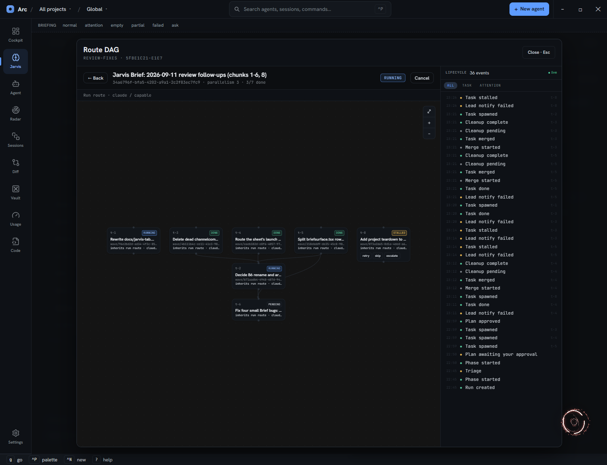

Every one of those `Lead notify failed` rows is real, and none of them is a malfunction. Pull the raw
event and it says so:

```json
{
  "kind": "lead-control-failed",
  "detail": { "cmd": "child_stalled", "taskid": "t-2", "failure": "unavailable" }
}
```

`failure: unavailable`, nine for nine — four `child_done`, five `child_stalled`, zero successes. The
reason is the first line of `NotifyLead`, `pkg/orchestrate/control.go:119`:

```go
dir := os.Getenv("WAVETERM_PI_CONTROL_DIR")
if dir == "" {
    return ControlResult{Envelope: env, FailureKind: ControlFailureUnavailable}, nil
}
```

Nothing in this repo sets `WAVETERM_PI_CONTROL_DIR`. Not for `wavesrv`, not for anything — grep the
whole tree and the only readers are `control.go:119` and the pi watcher at
`cmd/wsh/cmd/pi-tools-extension.ts:290`, which reads it out of its *own* environment because pi sets
it for the processes pi spawns. `wavesrv` is spawned by the Tauri shell, which does not. So the
correct statement is stronger than "pi-only": **`NotifyLead` is unreachable as shipped, for every
runtime, including pi.** This run's lead was claude, and it had no wake channel at all — by
construction rather than by failure.

The fix is already written a few files away, which is what makes this a defect rather than a design
gap. `PiSendControlCommand` (`pkg/wshrpc/wshserver/wshserver_picontrol.go:88`) writes the same control
protocol to the same place, and resolves the directory in-process instead of trusting the environment:

```go
dir := filepath.Join(wavebase.DataHome_VarCache, piControlDirName)
if err := os.MkdirAll(dir, 0o755); err != nil { ... }
```

Two writers of one protocol, disagreeing about how to find its directory, and only one of them works.
`NotifyLead` should fall back to that same derivation and keep the environment variable as an
override.

What that means in practice is worth being blunt about. The lead is not told when a child finishes.
It is not told when a child stalls. It is not told when a child *asks a question*. It is not told
when the plan gate opens or when the DAG completes. It finds all of that out by polling
`wsh jarvis dag status` on its own initiative, because the goal told it to.

You can see the poll interval in the merge latency:

```
t-4   done 23:11:29   merge started 23:12:18    (49s)
t-5   done 23:21:00   merge started 23:21:20    (20s)
t-3   done 23:20:21   merge started 23:21:22    (61s)
t-8   done 23:36:09   merge started 23:38:14    (2m05s)
```

Those gaps are not the engine being slow — the engine has no fixed merge tick, and a lead that was
being pushed to would not produce 20s, 49s, 61s and 2m05s. They are, as far as I can show, how long
it took the lead to look. I have to label that as inference rather than proof: the lead's own
transcript is not on disk either (same `.jsonl`-at-session-end behaviour as its children), so the
irregular latency is the evidence, not a log of the polls themselves.

The operator consequence: **a goal that does not tell the lead to poll produces a run that stops.**
Not a run that fails — a run that sits at "executing" with finished children and never merges them,
because the one component that can merge is waiting to be told something no one will tell it. Phase 1's
goal ends with "after each child finishes, merge it before dispatching anything that depends on it",
and that sentence is doing far more work than it looks like it is.

The smaller half of this is the rail itself. `frontend/app/view/agents/runtimeline.ts:112` maps
`lead-control-failed` to the label "Lead notify failed" regardless of `failure` kind, so "this
runtime has no wake channel" and "the write to the control file errored" are displayed in identical
words. An operator scanning that rail sees nine failures in a run that is working correctly.

### A third, smaller disagreement

While the digest said `next: human-action` naming two tasks, the Brief said:

> **WAITING ON YOU** — Nothing is waiting on you. The next gate or ask arrives here.

Both were rendered from the same store at the same moment. The digest's `next` and the Brief's
attention list do not agree about whether a stalled task is a human's problem. In this instance the
Brief was the more useful of the two — but it is right by accident, not because it knows the stall is
false.

---

## Phase 4 — merges, and why the dependency edges actually work

The claim Phase 1 made about `spawnBase` — that each dispatch wave re-resolves to the project's
current HEAD rather than to a base fixed at submit time — is the single load-bearing assumption
behind the whole dependency scheme. If it were false, a dependent would branch from the tree its
predecessor started with, re-derive a file that had already moved, and hand you the conflict the
edges exist to prevent.

Run 1 dispatched in four waves, and each one forked from a different commit:

```
22:59:10   t-3, t-4, t-5   forked f927dea9   (the project tip at approval)
23:11:27   t-8             forked f927dea9   (nothing merged yet)
23:20:19   t-1             forked e9584caf   (t-4's merge)
23:21:39   t-2             forked dc0f91ba   (t-3's merge, on top of t-5's)
```

Read the last line against the DAG: `t-2` depends on `t-5` and `t-3`, and `t-2` forked from
`dc0f91ba`, the commit that contains both of them. The engine did not need to be told that — it
re-resolved `spawnBase` to project HEAD at dispatch, and the lead had merged both predecessors
before the slot freed. That is the mechanism, observed rather than assumed:

```go
// pkg/orchestrate/engine.go:303
spawnBase := owner.BaseCommit
if g.MergeRequired {
    spawnBase = ProjectHeadCommit(...)
}
```

Which is also why `MergeRequired` is not an optional nicety. Turn it off and every child forks from
the same base forever, dependency edges become scheduling hints with no effect on the tree, and the
first two tasks that touch one file collide.

The practical consequence for writing a goal: **tell the lead to merge each finished child before
dispatching its dependents**, and then let line numbers be wrong. A task description that says
"change the function at `run.go:394`" is a lie by the time a dependent runs, because a predecessor
has already rewritten that file and the dependent is branching from the rewritten version. Say
"grep for `ResolveOrchestration`" instead. Phase 1's goal called this out as
"LINE NUMBERS ARE ARCHAEOLOGY, NOT ADDRESSES", and Run 1's plan gate check was partly a check that
the lead had passed that instruction down to the tasks that needed it.

---

## Phase 5 — the crash, and what a run survives

Run 1 never reached a tidy end. At 23:21:24, while four children were still in flight, the dev app's
`wavesrv` started a panic loop it never came out of. By morning the app was dead, the run was
half-merged, and the log was 293MB. This phase is what that taught, because the useful half of
driving an orchestrator is knowing what is still true after something dies.

### The crash: one leaked link, 133,710 panics

The trigger was mundane. A merge landed files in the checkout, Vite reloaded the page, and the reload
churned domain-socket connections. One of them lost a race:

```
wshrouter register link 1160#[domain]
link recvloop start for 1160#[domain]
wshrouter control-msg route=$control link=1160#[domain] command=authenticate source=
link recvloop done for 1160#[domain] (unknown)          <-- reader exits, closes the send channel
wshrouter authenticate success linkid=1160 routeid="proc:acec4524-..."
wshrouter trust link 1160#[domain] kind=leaf
wshrouter bind route "proc:acec4524-..." to 1160#[domain] <-- route bound to a dead link
[panic] in WshRpcProxy.SendRpcMessage:link: send on closed channel
```

Read the fourth line against the fifth: the reader finished *before* authentication completed, and
the router went on to trust and bind a route to a link whose channel was already closed. Its
neighbours `1157` and `1159` both show `unbind` then `unregister` in that same window. Link `1160`
has no `unregister` anywhere in the log — `grep -c` returns zero. It leaked, permanently.

After that, `processBacklog` → `processOneBacklogRound` → `drainLinkBacklog_withLock`
(`pkg/wshutil/wshrouter.go:447`) retried delivery to that dead link forever, panicking in
`WshRpcProxy.SendRpcMessage` (`pkg/wshutil/wshproxy.go:52`) on every round: **133,710 panics, 292 of
the log's 293MB.**

The cause was in `handleDomainSocketClient`. The link was registered inside one goroutine and its id
handed to the reader goroutine through an `atomic.Int32`; a reader that finished before the store
read back `0` and its unregister call did nothing. Fixed by hand as `7205a159` — register before
either goroutine starts, atomic container deleted.

What is *not* fixed, and is now its own tracker chunk: the router will still bind a route to a link
whose channel is closed, and the backlog drain still has no retry cap and no reaction to a panic.
`7205a159` closes the way this link leaked. It does not make the drain safe against the next one.

### The crash did not break the run — which is the surprising part

It would be neat to say the panic loop killed the run. It did not, and the timestamps say so plainly.
The loop began at 23:21:24. `wavesrv` kept serving: link ids climbed from 1160 to **2102**, and the
lead's last merge landed at **23:38:15**, seventeen minutes into the loop. Four of seven tasks were
merged clean while the router was panicking several times a second.

So the two failures in Run 1 are independent, and it is worth not conflating them:

- **The false stalls** (Phase 3) left `t-1` and `t-2` marked `stalled` and `t-6` never dispatched.
  That is what stopped the run's *progress*.
- **The leaked link** made the dev app unusable overnight. That is what stopped the run's *host*.

### What survives, and what only looks like it survives

After restarting the backend with the three Phase 0 fixes compiled in, I took the state before
touching anything. A stale exhibit is worth more than a tidy one:

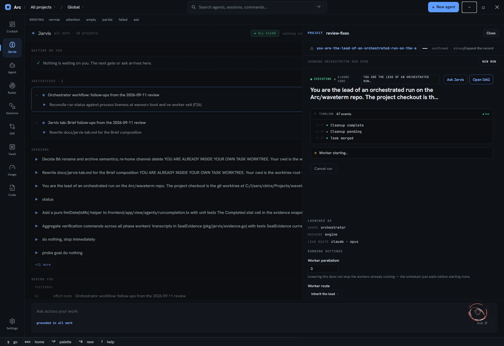

One frame, four disagreements about the same dead run:

| where | what it said | truth |
|---|---|---|
| Brief header | `ALL CLEAR · nothing running` | correct, by luck |
| Run drawer | `SHOWING ORCHESTRATOR RUN 5FBE · EXECUTING` | wrong |
| Worker row | `Worker starting…` | wrong; killed hours earlier |
| WAITING ON YOU | `Nothing is waiting on you` | wrong; the DAG wants `human-action` |

The drawer even offers `Cancel run` for a run with no process to cancel. And the DAG itself came back
intact, which is the good news — the graph, the merge state and the per-task affordances are all
persisted:

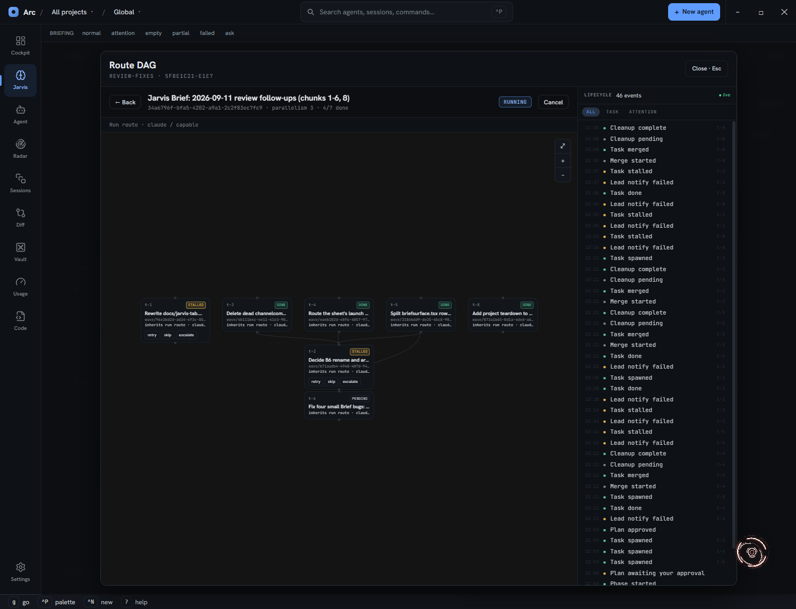

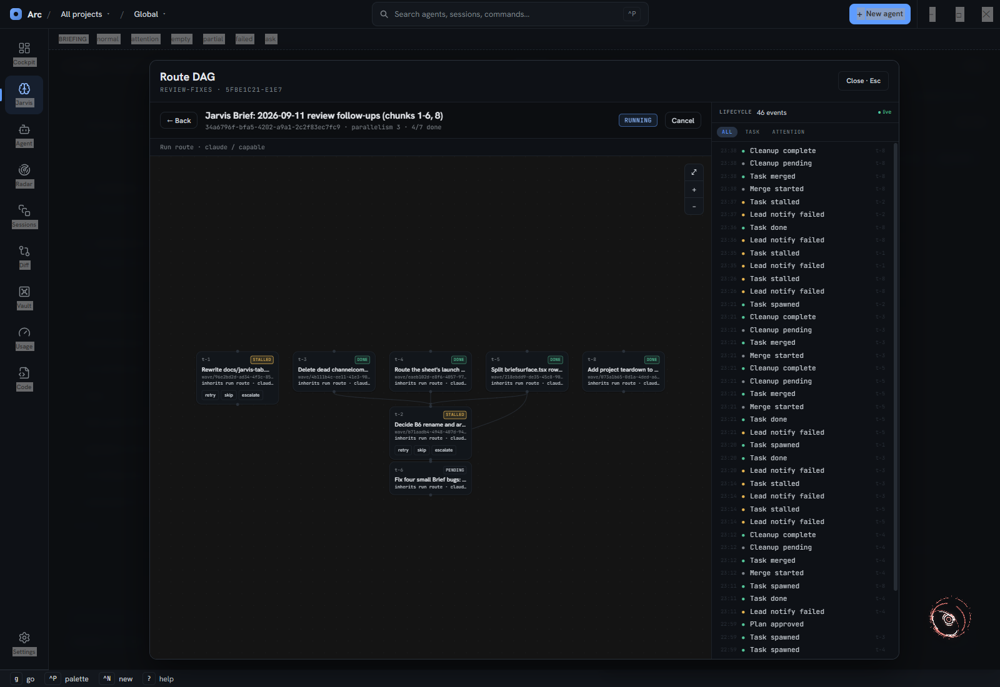

So, concretely, what a crash costs you:

- **Merged commits survive.** They are ordinary commits on the run branch. Four of them were there in
  the morning: `e9584caf` (t-4), `20eaad5b` (t-5), `dc0f91ba` (t-3), `2b223f50` (t-8).
- **Worktrees survive**, including those of children that never finished.
- **A child killed before `wsh jarvis complete --commit` loses its commit but not its work.** `t-2`
  is the exhibit: its edits sat in its worktree with no commit and no task-done event, so both the
  engine and the DAG showed it as having produced nothing. The files were fine. I committed them by
  hand as `b4ea87b6` after typecheck, vitest and eslint.
- **Run and task status do not survive in any meaningful sense.** They are simply whatever they were
  when the process died, forever.

### Nothing reconciles run state — not at boot, not ever

This is the part that generalises past one crash. The only startup sweep is
`retryCleanupDebtAtStartup` (`cmd/server/main-server.go:605`), and it retries worktree cleanup only.
No in-flight run is reconciled against whether its processes exist. I confirmed there was nothing to
reconcile *to*: a full process census after the restart found the packaged `wavesrv`, the new dev
`wavesrv`, and my own editor session — no lead, no workers.

And it is not specific to boot. The `SESSIONS` list still carries runs marked `executing` from **26
and 27 days ago** (`847eb8a7-…-t-ev-1`, `-t-ev-3`, `-t-ev-4`, `verify-dag-EaHWAE`). Nothing has ever
reconciled them, because nothing ever does. Any sweep added for this has to age out the backlog too,
or the surface stays wrong for every run that predates the fix.

The operator consequence is small and absolute: **`executing` in this UI means "nobody wrote a
terminal status", not "a process is running".** Check the process, not the badge.

---

## Phase 6 — the second run, and getting a control plane

Run 1b is the follow-up run: the same tracker, the three chunks the first run never closed (1, 6 and
9), no dependency edges because their file sets do not intersect. It is the small, well-specified
case — and it is the one that finally made the real cost visible.

### The plan gate is not where you think it is

The Brief's `WAITING ON YOU` card announces the gate, but its only control is `REVIEW`. The button
that actually approves lives in the run transcript, on the plan-gate card
(`frontend/app/view/orchestrate/plangatecard.tsx:140`). You click the card in the Brief, the run
drawer opens, and the approve control is there:

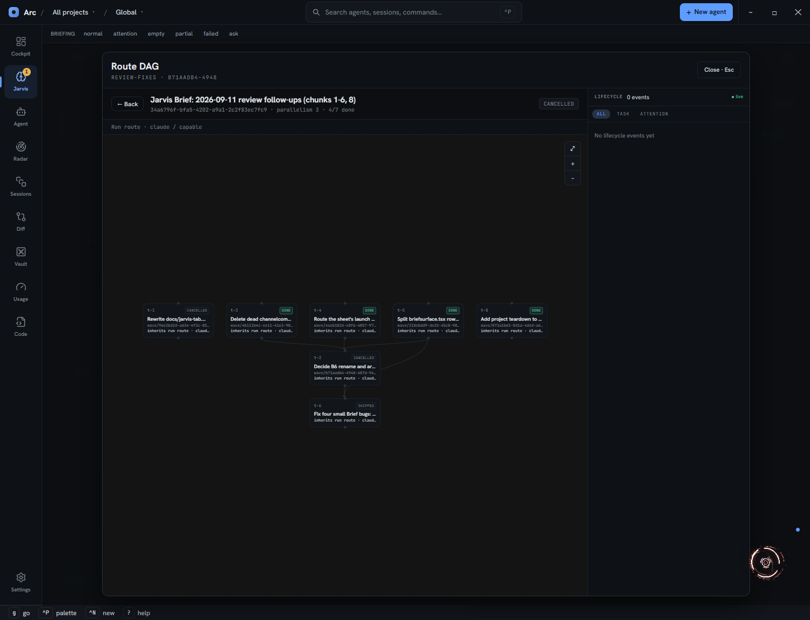

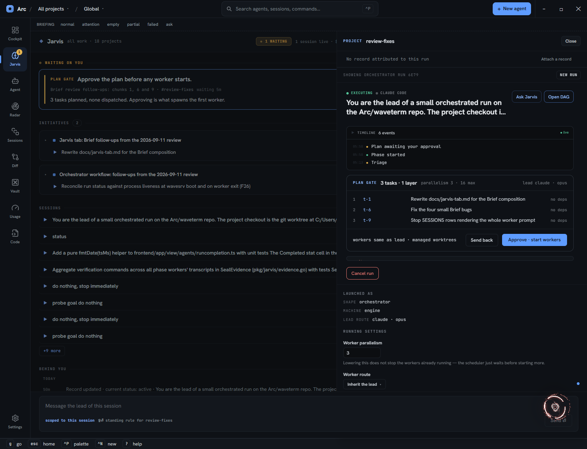

### Approving it failed, and nothing said so

I clicked approve. The button cleared. Then — read out of the DAG object over CDP, because at that
point I had no CLI; this is the state, not a transcript:

```
dag 3d1cb7e1  status=blocked
t-1  failed
t-6  failed
t-9  pending
```

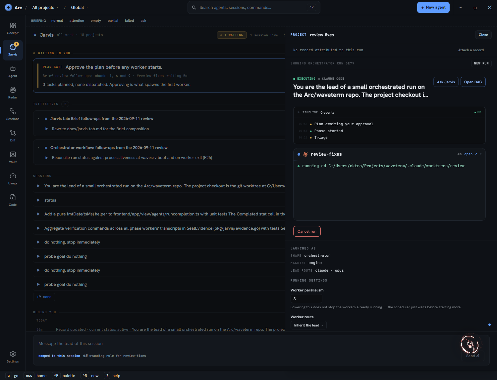

Two tasks failed on the way out of the gate and the run was blocked before a single worker did any
work. There was no explanation **anywhere**: no `task-failed` row in the lifecycle rail, no
`lastfailurekind` on either task, no line in the `wavesrv` log, nothing in the UI. The state simply
was what it was.

The cause is `cleanupScheduleFailure` (`pkg/orchestrate/engine.go:81-129`). When one dispatch in a
batch fails hard, it stops every worker already spawned in that batch, cancels their child runs,
reloads the DAG, and then:

```go
for _, sp := range spawned {
    if idx := taskIdx(fresh, sp.taskID); idx >= 0 {
        fresh.Tasks[idx].State = TaskState_Failed
        fresh.Tasks[idx].RunID = ""
    }
}
```

Compare `failDispatch` (`engine.go:137-150`), the per-task path, which sets `LastFailureKind`,
increments `Attempts`, writes a `log.Printf`, and appends a `RunEventKindTaskFailed`. The batch path
does none of the four. The joined error does travel back — up through `Schedule`, `DagActionCommand`
and the RPC — and is then dropped by the approve button itself, whose `fireAndForget` has a
`try`/`finally` and no `catch`. Clearing the `RunID` also puts those tasks outside
`DeriveTaskStates` (`dag.go:382-402`), which only maps tasks that have one, so nothing repairs the
state later either.

> **Fixed 2026-09-14** (orchestrator redesign, slice 1). The batch path now sets `LastFailureKind` to
> `dispatch-unrecorded`, increments `Attempts`, and appends a `task-failed` event carrying the cause. It
> still writes no log line, and the approve button's dropped error is not part of this fix.

Recovery took two commands and no restart: `retry` on `t-1` — which re-entered the scheduler and
dispatched `t-9` as well — then `retry` on `t-6`. All three ran. The digest went `healthy`.

**Operator reading:** if the DAG goes blocked at the moment you approve and no task carries a failure
kind, you are looking at this bug, not at a bad plan. Retry the failed tasks; they were never
attempted.

### The expensive part was never the orchestration

Here is the honest accounting for this session, because it is the thing I would most want to know
before starting.

The children's token spend is their own — each worker is a separate context, and it does not land in
the operator's session at all. What lands in the operator's session is **every act of looking and
every act of steering**. And for the whole of Run 1 and the first half of Run 1b, every one of those
went through the GUI over the Chrome DevTools Protocol: write a script, run it, screenshot, read the
PNG back, discover a label moved or the button was on a different card, rewrite. A single
`dag status` cost a script and a round trip. Approving one plan gate took three attempts and two
rewrites.

That is not orchestration overhead. That is a missing control plane.

### `wsh` is the control plane — it just could not reach the dev app

The CLI already exists and is complete:

```
wsh jarvis dag submit | approve | status | asks | answer | merge | retry | skip | escalate | wait
wsh effort show | chunk add | chunk note | chunk status | advance
```

Two things stop an ordinary terminal from using it, and they are independent.

**One: the token is pinned to one store.** `wsh` requires `WAVETERM_JWT`
(`cmd/wsh/cmd/wshcmd-root.go:84-180`) and refuses to start without it. The token's `sock` claim pins
it to one `wavesrv`'s domain socket, and the Ed25519 keypair that signs it is per-store — it lives as
a `MainServer` waveobj (`pkg/wcore/wcore.go:170-215`, table `db_mainserver`). Decoding the token my
shell had inherited showed it plainly:

```json
{"iss":"waveterm","sock":"C:\\Users\\cktra\\AppData\\Local\\dev.arc.app\\data\\wave.sock","procroute":true,"blockid":"69303ac4-..."}
```

That is the **packaged** app. The dev app listens on `...\dev.arc.app-dev\data\wave.sock` and signs
with a different key, so the inherited token is not merely wrong, it is unverifiable there. This is
the same store-separation trap as Phase 0 step 3, arriving from the other direction: it is not enough
to know which app you are driving, your CLI has to agree.

**Two: the run context comes from a block, not from flags.** Every `wsh jarvis dag` subcommand
resolves its channel and run from `WAVETERM_BLOCKID` through `ownerRunForBlock`
(`pkg/wshrpc/wshserver/wshserver_ctx.go:19-60`). With no block there is nothing to resolve and the
command stops before it looks at any flag you passed:

```
$ wsh jarvis dag status
Error: resolving block: resolving blockid: no WAVETERM_BLOCKID env var set
```

Worth knowing what that resolution does when it *does* have a block, because it is the fallback that
matters for orchestrator children: they have no phase `WorkerOrefs`, so the server matches them by
comparing the block's `CmdCwd` against `run.ProjectPath` for any run with a DAG and a running phase
(`wshserver_ctx.go:55`). A run is identified by a directory. Two candidates in the same project path
are separated only by map iteration order, and the "running" guard leans on run state that — per
Phase 5 — nothing ever reconciles.

### What I did about it, and what it bought

Two small things, both operator-side, neither in the repo:

1. Mint a token for the store I actually want. Read the dev store's `db_mainserver` row, decode its
   `jwtprivatekey`, and sign a `WaveJwtClaims{Sock: "<dev socket>", ProcRoute: true}` with
   `wavejwt.Sign` — the same call the app makes for a terminal block, pointed at the other store.
2. A wrapper that clears the inherited `WAVETERM_BLOCKID`, `WAVETERM_SWAPTOKEN`, `WAVETERM_TABID`,
   `WAVETERM_CLIENTID`, `WAVETERM_WORKSPACEID` and `WAVETERM_WSHBINDIR` — all of them minted by the
   packaged app and all of them wrong here — sets `WAVETERM_JWT` to the minted token, and runs the
   `wsh` binary built alongside the running `wavesrv` (`dist/bin/wsh-0.14.7-windows.x64.exe`, same
   mtime as `dist/bin/wavesrv.x64.exe`). Match mtimes, not version strings: the `0.14.9` binaries
   sitting next to it are older files, so the higher number is the wrong pick.

Then pass `--channel` and `--runid` explicitly on every command, which sidesteps the block resolution
entirely.

The first command proved the binding, not just the connection — the DAG id and the three task states
matched what the UI was showing at that second:

```
$ dwsh jarvis dag status --channel 6dee51e4-... --runid 6e792ac0-...
dag 3d1cb7e1-57c7-4f79-a83b-50d28201fa41  status=running  tasks=0/3  failures=0  parallelism=3
t-1  running      Rewrite docs/jarvis-tab.md for the Brief composition
t-6  running      Fix the four small Brief bugs
t-9  running      Stop SESSIONS rows rendering the whole worker prompt
```

Same store, same DAG, one line, no screenshot. Checking for a child's pending ask went from a script
and a PNG to `dwsh jarvis dag asks --channel ... --runid ...`. Adding this session's two new findings
to the orchestrator tracker — two chunks and nine notes — went from a CDP script per
mutation to `dwsh effort chunk add` and `dwsh effort chunk note`.

**This is a workaround, and it should not be one.** Reading a signing key out of a database to talk
to your own dev app is not a supported workflow, and the token and the wrapper stay outside the repo
for exactly that reason. The fix it points at is small: let `wsh jarvis dag` accept `--channel` and
`--runid` *before* it tries to resolve a block, and give the operator a supported way to obtain a
token for a chosen store. Both are now chunks on the orchestrator tracker.

**The general lesson, which is not about Wave:** if you are going to supervise agents, measure what
one act of supervision costs you before you start. If checking a status costs a script and a
screenshot, you will check less often than you should, and the run will drift while you are not
looking. A control plane you can type into is worth more than any dashboard.

### How Run 1b actually ended

Three tasks, 103 minutes wall clock from launch to sealed evidence, `+784 / -797` across fourteen files.
The run closed itself cleanly:

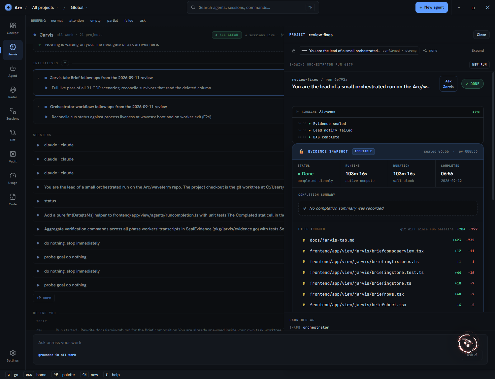

Four things in that frame are worth more than the green tick.

**The lead was never dead — it was slow, and unevenly so.** I had written it off. `t-9` finished at
06:27 and `t-6` at 06:30, and after nine minutes with neither merged I merged both myself. Then `t-1`
finished at 06:47:10 and the lead merged it on its own at 06:50:51 — three and a half minutes, no
prompting.

What I can say from that is only the latency: nine minutes with no action, then three and a half
minutes with action. What I cannot say is *why*, and the distinction matters because the plausible
causes have opposite implications. The engine's side of the wake is sound, and it is worth saying
exactly how sound. A child run reaching a terminal status calls `orchestrate.Schedule` synchronously
on the way out (`pkg/wshrpc/wshserver/wshserver_runs.go:644`), and the schedule tick publishes
`dag:child-done` scoped to both the DAG's oref and `run:<leadRunId>` (`publishDagEvent`,
`pkg/orchestrate/engine.go:554`) — which is exactly the scope `wsh jarvis dag wait` subscribes to
(`cmd/wsh/cmd/wshcmd-jarvisdag.go:158`). It is event-driven, not polled; the 30-second watchdog
(`pkg/orchestrate/watchdog.go:17`) is only the backstop for stalls that produce no event at all. So a
lead blocked in `wait` would have been woken within a second. But whether the lead was in `wait`,
polling on its own clock, or simply mid-turn on something else, nothing outside the worker can tell
you. `DagWaitDefaultTimeout` is 540 seconds — nine minutes —
and I have no way to rule out that the first gap was a `wait` timing out rather than a lead thinking.

> **Update 2026-09-14:** `dag wait` no longer exists. The lead ends its turn after submitting and is woken
> by a typed `wake:` line. A wake it does not pick up within 30 seconds is retried once; after that the
> lead is treated as dead, the timeline records `Lead wake failed`, and its events go to the human. A lead
> that stops taking wakes now shows on the timeline.

So the honest version of the "watch the merge latencies" rule is weaker than I first wrote it: a gap is
not proof of death, and you cannot tell a slow lead from a stopped one from outside. Reading the
*worktree* tells you about the child; nothing tells you about the lead.

**`COMPLETION SUMMARY — No completion summary was recorded`.** The goal's last step asked the lead to
report which chunks closed, what each verification printed, and anything it deferred. It closed the run
without writing one, and the evidence snapshot preserves that absence rather than hiding it. If you
want a report from an orchestrated run, do not assume the shape of the run produces one.

**Two of the three children closed their own tracker chunks; the third did not.** All three had the
same instruction. The difference is almost certainly ordering: `wsh jarvis complete --commit` does not
kill a worker — `StopRunWorkers` is reachable only from the cancel path — but an agent treats
`complete` as its terminal act and stops generating once it returns. Put the close line *before*
`complete` in the task description and say that `complete` is the last command it will ever run.

**`Lead notify failed` is still there, at 06:56, on a run that finished correctly.** Same structural
condition as Phase 5, still rendered in the vocabulary of a malfunction.

One thing that is *not* a finding, though I nearly wrote it down as one: the run stayed `executing` for
several minutes after its DAG went `done`, and I had already decided to close it by hand before
checking again and finding it had closed itself at 06:56. Phase 5's un-reconciled `executing` was a run
whose process had been killed. This one was a live run finishing its last turn. They look identical
from the outside, which is exactly why F26 — reconcile run status against process liveness — is the
chunk it is.

---

## Phase 7 — what a task actually costs, and what a system without a planning lead looks like

Run 1b is small and well-specified: three chunks, no dependency edges, a spec already written out
longhand in a file before the run started. It is the best case. It took 103 minutes. That number is
the reason this section exists, and the run's own event log says exactly where the time went.

### The 63/40 split

Thirty-three run events, in UTC as the store records them (the app UI shows local, UTC+7):

```
22:12:48  run-created
22:13:09  triage: verdict=plan                      21s
22:58:28  dag-plan-gated (3 tasks, parallelism 3)    45m 19s   <- the lead's planning turn
23:07:07  task-spawned t-1, t-9 + dag-blocked         8m 39s   <- waiting on the human at the gate
23:07:23  task-spawned t-6  (retry 1)
23:08:23  task-spawned t-6  (retry 2)                 1m 16s   <- recovering the dispatch bug
23:20:32  t-9 done                                   13m 25s
23:29:41  t-6 done                                   21m 18s
23:47:19  t-1 done                                   40m 12s   <- critical path
23:27:07  t-9 merged      (6m 35s after done, by hand)
23:30:17  t-6 merged      (36s, by hand)
23:50:24  t-1 merged      (3m 05s, by the lead)
23:56:04  dag-done, evidence sealed                   5m 40s
```

**Forty minutes of work inside sixty-three minutes of orchestration.** The longest child is the
critical path and everything else is overhead around it. Fan-out did earn something real — run the
three serially and you pay 13 + 21 + 40 = 74 minutes instead of 40, so the parallelism saved 34 — but
the planning turn that enabled it cost 45. Net negative by eleven minutes, before counting the 8m39s
gate wait and the dispatch-bug recovery.

The 45 minutes is the part to look at, because it is the part with no work in it. There are no events
at all between `triage` and `dag-plan-gated`, so the whole span is one uninterrupted lead turn. And
what that turn produced was a transcription: the goal file already contained the three task
descriptions, the file pins, the verification commands and the settled decisions. The lead read a
specification and rewrote it as a DAG. Forty-five minutes to move text across an agent boundary.

That is not a slow lead. It is a structural cost of having a lead at all.

### Orca: the same product category, and no planning agent anywhere

[Orca](https://github.com/stablyai/orca) is a multi-agent desktop IDE — same category as this
cockpit, Electron rather than Tauri, and it runs coordinated agents across isolated worktrees. Its
headline parallelism is best-of-N on a single prompt (fan one prompt across five agents, compare,
merge the winner) rather than DAG decomposition. But it does have a task DAG, a coordinator, and a
supervised worker loop, and the way it handles the planning problem is to not have a planner.

From `src/main/runtime/orchestration/coordinator.ts:146`:

```js
// Why: decomposition isn't implemented yet — tasks must be pre-created before run();
// AI-driven decomposition is a future phase.
private async decompose(): Promise<void> {
  this.state.phase = 'decomposing'
  const existing = this.db.listTasks()
  if (existing.length === 0) {
    throw new Error('No tasks found. Create tasks with orchestration.taskCreate before running the coordinator.')
  }
```

The coordinator refuses to start without a DAG that already exists, and there is no other
decomposition path in the product. Five differences follow from that, and each one maps onto a cost
this run paid.

**The coordinator is code, not a model.** `Coordinator.tick()` runs on a 2-second timer
(`DEFAULT_POLL_MS = 2000`) and does five things: drain the inbox, apply escalations, re-block gated
tasks, warn about stale dispatches, dispatch ready tasks. It is TypeScript in the Electron main
process. Zero tokens, zero turns, no context window to exhaust. Here the lead is a Jarvis run, and its
planning, merge polling and ask-answering all consume both.

**The decomposer is the agent already talking to the user.** Orca's canonical loop is five CLI calls
issued from that agent's own turn — `run-create`, then one `worker-start --spec` per task, then a
blocking `check --wait`. `worker-start --spec` creates the Task and its authoritative attempt in one
call. No plan artifact, no approval round-trip before work starts. The context that read the request
is the context that writes the specs, so the spec is never transcribed across a boundary.

**Dispatch is a paste into a warm terminal, not a spawn.** `dispatchTaskToWorker` builds a preamble
and calls `sendTerminalAgentPrompt(handle, preamble)`. Workers are a pool:
`listAvailableWorkerTerminals` filters out the busy ones and reuses the rest, and the coordinator
creates at most one new terminal per tick. Its guide is explicit that "folder workspaces are valid;
never require Git or assume a worktree." Here every child gets a fresh worktree and a fresh agent that
must run `task worktree:prepare` and read `CLAUDE.md` and `AGENTS.md` from nothing before it does
anything useful.

**Gates are per task and mid-flight.** A worker raises a `decision_gate` when it hits a fork it cannot
resolve; that blocks its own task and nothing else, and `reblockTasksWithPendingGates` keeps it blocked
because "the coordinator never auto-resolves gates (humans do)". `PlanGatePending` here is a property
of the whole run, which is why 8m39s of this run is the DAG sitting blocked waiting for one click.

**Merging is explicitly not the coordinator's job.** `phase: 'merging'` is declared in the state type
and never assigned; `case 'merge_ready':` in `processMessages` is a bare `break`. Merge ownership goes
to a human or a handoff owner. Here the lead merges, which is the mechanism behind the nine minutes
`t-9` spent finished and unmerged.

One more convergence worth recording, because it arrived from the opposite direction. Orca's stale
dispatch check carries this comment:

```js
// Why: warn only, never auto-fail — a false positive (slow but correct worker) costs more
// than a false negative (hung worker holding a slot)
```

and its safety floor states it as a rule: "Absence never authorizes stop, abandon, retry, or
release." That is Phase 3's false stall and Phase 5's un-reconciled `executing`, reached
independently and written down before the fact rather than after it.

### The honest counterweight

Orca's engine is *less* complete than this one on precisely the parts it declines to do. It creates no
worktrees, performs no merges, seals no evidence, and has nothing like `DeriveTaskStates` recovering a
task's real status from its merge commit. Its DAG mode is manual because decomposition was never
built. The engine here is the better engine.

The problem is narrower than the architecture: a language model sits in the place where a
`setTimeout` would do. Everything the lead does that is judgment — decomposing, answering asks,
deciding what merges — is worth a model. Everything else it does is dispatch bookkeeping, and it is
paying model latency and model tokens to do it.

### What that means for the next run

The engine already supports running without a lead, which is the thing worth knowing:

- `CommandCreateRunData.DeferStart` (`pkg/wshrpc/wshrpctypes_runs.go:39-41`) persists a run in
  `planning` without spawning phase workers (`wshserver_runs.go:344`, and the
  `if !data.DeferStart` guard at `:431`).
- `wsh jarvis dag submit --file <path>` accepts a hand-written DAG for a run in `planning` or
  `executing` and flips it to `executing` (`wshserver_dag.go:101-116`), calling `orchestrate.Schedule`
  immediately (`:137`).
- Worktrees are created for children regardless (`engine.go:324-331` gates only on
  `IsGitRepo(owner.ProjectPath)`), so nothing about the child experience changes.

So the operator writes the DAG in the context that already holds the spec, submits it, and takes the
lead's remaining jobs — answering asks, merging children, reporting at the end. In this run the
operator already did two of those three: two of the three merges were done by hand, every ask was
answered by the operator, and the lead wrote no completion summary at all. What is actually lost by
dropping it is smaller than it looks.

---

## The operator's playbook

Everything above, as the short form I would actually follow next time.

**Before you launch**

1. Get a control plane you can type into, and prove it before you need it. `wsh jarvis dag` is the
   whole interface; if it cannot reach the store your run lives in, every check costs you a script
   and a screenshot and you will stop making them. Prove the binding with `dag status` and match the
   DAG id against the UI — a connection that works against the *wrong* store looks identical.
2. Confirm the project path is the git repo you intend, and that the branch is one you can throw away.
3. Put any backend fix the run depends on *into the running backend first*. The engine is `wavesrv`;
   a fix in your working tree that is not compiled into the process does nothing for the run.
4. Confirm which `wavesrv` you are driving. A packaged app and a dev app have separate stores, and
   `wsh` binds to whichever minted its auth key.
5. Write the goal in a file, not in the modal. Include the two sentences that carry the most weight:
   merge each finished child before dispatching its dependents, and treat line numbers as archaeology.
6. Order the child's last two commands explicitly: close its tracker chunk *before*
   `wsh jarvis complete --commit`, never after. The engine does not kill a worker on completion —
   `StopRunWorkers` is reachable only from the cancel path — but an agent treats `complete` as its
   terminal act and tends to stop generating the moment it returns. In Run 1b two of three children
   closed their chunks; the third completed and went quiet with the close line unrun, and I closed
   that chunk by hand.

**Before you submit** (slice 5c removed the gate, so this is now read-the-plan-first, not approve-after)

7. Read the plan file before handing it to the engine. Submission dispatches the first layer
   immediately — there is no approval step between `dag submit --plan` and the first child, so the
   plan file itself is the last point at which a wrong decomposition is cheap.
8. Check that dependency edges match what actually shares a file, and that the lead passed your
   constraints down into the task descriptions. Task count is not capped; judge it by the per-child
   overhead in item 18, not by a ceiling.
9. Check the DAG again *after* submitting. A blocked DAG with failed tasks that carry no failure
   kind means the dispatch batch failed and said nothing (Phase 6); retry those tasks.

**During execution**

10. A stall verdict is a claim about a missing signal, not a stopped process. Before acting on one:
    ```bash
    git -C .waveterm/worktrees/<runid>-<taskid> status --short
    find .waveterm/worktrees/<runid>-<taskid> -newermt "-5 minutes" -type f
    ```
    Recent writes mean the child is working and the engine is wrong. The default move is to do nothing.
11. `Lead notify failed` in the lifecycle rail is structural, not a malfunction. Nine of them in a
    working run is the expected reading today.
12. Watch the merge latencies, but do not over-read them. Short irregular gaps are normal. A long gap
    is ambiguous — in Run 1b the lead left two finished children unmerged for nine minutes and then
    merged the third in three and a half, and nothing visible from outside distinguishes a slow lead
    from a stopped one. Merge them yourself with `dag merge` when you are tired of waiting; it is
    cheap and it is idempotent with respect to the lead.

**After a crash**

13. Screenshot the state before you touch it. It is evidence, and cancelling it destroys the evidence.
14. Trust the commits and the worktrees. Do not trust run or task status.
15. For each task the DAG says produced nothing, check its worktree for uncommitted work before you
    retry it — a child killed before `complete --commit` looks identical to a child that did nothing.
16. Re-run only what is genuinely unfinished. `DeriveTaskStates` will still resolve a task to `done`
    from its merge, so a task that merged before the crash needs nothing.

**Before you launch a lead at all**

17. Price the planning turn against the work. A lead earns its keep when decomposition is genuinely
    open — when you do not yet know what the tasks are. If you already have the task list, the lead's
    turn is a transcription and it will cost you tens of minutes (45 in Run 1b) to produce a DAG you
    could have written yourself. Write the plan in `jarvis.PlanFormat` instead and pick
    **Orchestrator → A plan file** in + Run: it parses the plan and shows its shape before start, the
    engine runs it at once, and a lead starts only if something needs judgment.
18. Size tasks by wall clock, not by chunk — and not below a per-child overhead you have not
    measured. Aim at a short critical path: Run 1b's was a single 40-minute child and nothing in the
    DAG could finish sooner. But treat the smallest child you have seen as an observation, not a
    floor — it was never decomposed, so splitting a 40-minute task into four buys four copies of a
    child's fixed cost, not four short tasks. Measure that cost before you size anything:
    `task-spawned` carries `worktreems` and `spawnms`, `task-first-activity` carries `sincespawnms`,
    which splits a child into dispatch, cold orientation and work. Phase 7 has the measured spans.
    `MaxParallelism` (8) is a ceiling, not a target.
19. Use the DAG when all three hold: the decomposition is genuinely open, the tasks touch disjoint
    subsystems, and each task is a large multiple of the per-child overhead in item 18. Do not use it
    when the spec already exists chunk by chunk (item 17), when the tasks share files — the merges
    serialise and every dependent has to be told what its predecessor changed — or when what you want
    is speed: in Run 1b the fan-out saved less than the planning turn that enabled it cost. What
    parallel agents buy is thoroughness, not speed, which is how Anthropic frames it too.
